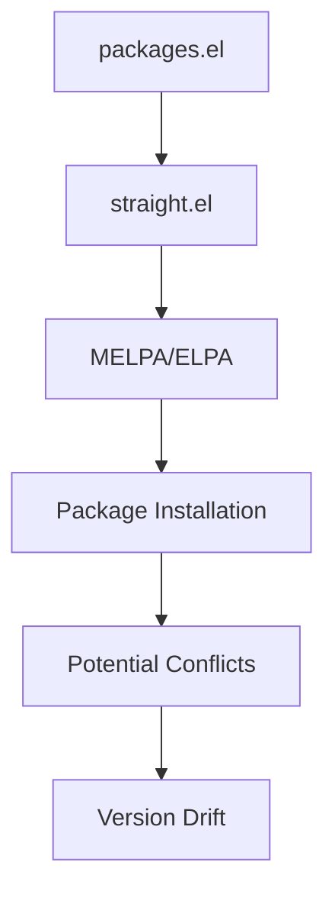
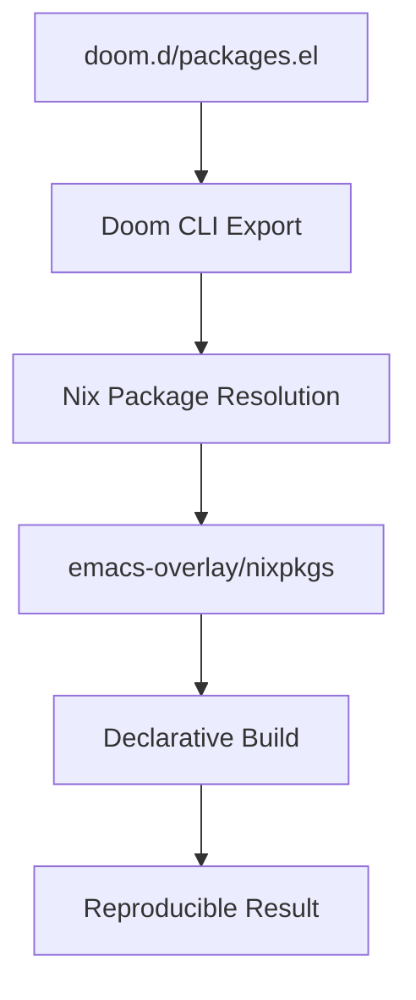

# Doom Emacs Package Management with Nix

## Overview

The `nix-doom-emacs-unstraightened` solution completely eliminates package.el and straight.el conflicts by managing all packages through Nix. This document explains how package management works in our declarative Doom Emacs setup.

## Package Management Architecture

### Traditional Doom Emacs Package Management



**Issues with Traditional Approach:**

- Multiple package managers (straight.el, package.el)
- Version conflicts between dependencies
- Non-reproducible builds
- Configuration drift between machines
- Manual package synchronization via `doom sync`

### Nix-Managed Doom Emacs Architecture



**Benefits of Nix Approach:**

- Single package manager (Nix)
- Complete dependency resolution
- Reproducible builds via flake.lock
- No version conflicts
- Automatic synchronization via rebuild
- Rollback capability

## Package Declaration Methods

### 1. Doom Module-Based Packages

Most packages are enabled through Doom modules in [`init.el`](../home/dan/doom.d/init.el):

```elisp
(doom! :lang
       nix                 ; Automatically includes nix-mode
       (python +lsp)       ; Includes python-mode, lsp-pyright
       (org +roam2)        ; Includes org-roam v2

       :tools
       (lsp +peek)         ; Includes lsp-mode, lsp-ui
       (magit +forge))     ; Includes magit, forge
```

**Advantages:**

- Curated package selections
- Pre-configured integrations
- Tested combinations
- Minimal configuration required

### 2. Explicit Package Declarations

Additional packages are declared in [`doom.d/packages.el`](../home/dan/doom.d/packages.el):

```elisp
;; Nix-specific packages
(package! nixos-options)
(package! company-nixos-options)

;; Additional productivity packages
(package! restclient)
(package! org-super-agenda)
(package! vlf)  ; View Large Files
```

**Use Cases:**

- Packages not included in Doom modules
- Specialized workflow tools
- Experimental packages
- Personal preferences

### 3. System-Level Tool Integration

Development tools and LSP servers are managed at the Nix system level in [`emacs-doom.nix`](../home/dan/features/productivity/emacs-doom.nix):

```nix
home.packages = with pkgs; [
  # LSP servers
  nixd                    # Nix LSP
  pyright                 # Python LSP
  rust-analyzer           # Rust LSP

  # Command-line tools used by Doom
  ripgrep                 # Search backend
  fd                      # File finder
  silver-searcher         # Alternative search (ag)

  # Language tools
  black                   # Python formatter
  nodePackages.js-beautify # JS formatter
];
```

**Benefits:**

- System-wide availability
- Consistent tool versions
- Better performance (native binaries)
- Integration with shell environment

## Conflict Resolution Strategy

### Eliminated Conflicts

**Package Manager Conflicts**: ❌ **ELIMINATED**

- No straight.el vs package.el conflicts
- Single source of truth (Nix)
- Consistent dependency resolution

**Version Conflicts**: ❌ **ELIMINATED**

- All packages pinned via emacs-overlay
- Reproducible via flake.lock
- Automatic dependency compatibility

**Configuration Drift**: ❌ **ELIMINATED**

- Configuration stored in Nix store
- Identical setup across machines
- Version control integration

### Remaining Considerations

**Package Availability**: ⚠️ **MANAGED**

- Most packages available via emacs-overlay
- MELPA packages generally covered
- Custom packages via Nix overlays if needed

**Update Timing**: ⚠️ **CONTROLLED**

- Updates via `nix flake update`
- Tested combinations via CI
- Manual control over update timing

## Package Management Workflows

### Adding New Packages

1. **For Doom Module Packages**:

   ```elisp
   ;; Edit doom.d/init.el
   (doom! :lang
          new-language-mode  ; Add new module
          ;; ... rest of config
   ```

2. **For Individual Packages**:

   ```elisp
   ;; Edit doom.d/packages.el
   (package! new-package-name)
   ```

3. **For System Tools**:

   ```nix
   # Edit emacs-doom.nix
   home.packages = with pkgs; [
     new-tool
     # ... existing packages
   ];
   ```

4. **Apply Changes**:
   ```bash
   darwin-rebuild switch --flake ~/dev/PRIVATE/nix-config
   ```

### Updating Packages

**Update All Packages**:

```bash
# Update flake inputs (includes Doom and emacs-overlay)
nix flake update
darwin-rebuild switch --flake ~/dev/PRIVATE/nix-config
```

**Update Specific Input**:

```bash
# Update only Doom Emacs
nix flake update nix-doom-emacs-unstraightened
darwin-rebuild switch --flake ~/dev/PRIVATE/nix-config
```

**Check Available Updates**:

```bash
nix flake show --json | jq '.packages'
```

### Removing Packages

1. **Remove from Configuration**:

   - Remove from `init.el` (modules)
   - Remove from `packages.el` (individual packages)
   - Remove from `emacs-doom.nix` (system tools)

2. **Apply Changes**:

   ```bash
   darwin-rebuild switch --flake ~/dev/PRIVATE/nix-config
   ```

3. **Clean Up** (optional):
   ```bash
   nix-collect-garbage -d
   ```

## Package Debugging

### Check Package Availability

**List Available Packages**:

```bash
nix search nixpkgs emacs
nix search nixpkgs.emacsPackages package-name
```

**Check Package Information**:

```bash
nix show-derivation nixpkgs.emacsPackages.package-name
```

### Debugging Package Issues

**Doom Doctor**:

```bash
doom doctor  # Check for common issues
```

**Check Package Loading**:

```elisp
;; In Emacs
(require 'package-name)  ; Test if package loads
```

**Inspect Load Path**:

```elisp
;; In Emacs
load-path  ; Check if package directory is included
```

### Common Issues and Solutions

**Package Not Found**:

1. Check if package exists in emacs-overlay
2. Verify correct package name in packages.el
3. Ensure nix-doom-emacs-unstraightened is updated

**Package Version Issues**:

1. Update flake inputs: `nix flake update`
2. Check emacs-overlay version compatibility
3. Pin specific package version if needed

**Configuration Not Applied**:

1. Verify package declared correctly
2. Check Doom module enables package
3. Rebuild configuration: `darwin-rebuild switch --flake .`

## Integration with Existing Workflow

### Migration from package.el

**No Migration Needed**: ✅

- nix-doom-emacs-unstraightened handles all packages
- No manual package.el cleanup required
- Existing package declarations work automatically

### Integration with Development Tools

**LSP Servers**: Managed via `home.packages`

```nix
home.packages = with pkgs; [
  nixd                    # Nix
  pyright                 # Python
  rust-analyzer           # Rust
  nodePackages.typescript-language-server  # TypeScript
];
```

**Formatters and Linters**: Available system-wide

```nix
home.packages = with pkgs; [
  black           # Python formatter
  rustfmt         # Rust formatter
  prettier        # JS/CSS/HTML formatter
];
```

**Shell Integration**: Automatic via PATH

- All tools available in terminal
- Consistent versions between Emacs and shell
- Better performance than Emacs-internal tools

## Best Practices

### Package Selection

1. **Prefer Doom Modules**: Use built-in modules when available
2. **System Tools**: Install command-line tools via Nix packages
3. **Emacs Packages**: Only for Emacs-specific functionality
4. **Avoid Redundancy**: Don't install both system and Emacs versions

### Configuration Management

1. **Version Control**: Keep all configuration in git
2. **Machine-Specific**: Use `local.el` for machine-specific settings
3. **Documentation**: Comment complex package configurations
4. **Testing**: Test changes on non-critical systems first

### Update Strategy

1. **Regular Updates**: Update monthly or quarterly
2. **Test First**: Run `doom doctor` after updates
3. **Incremental**: Update one input at a time if issues occur
4. **Rollback Ready**: Keep working configurations committed

## Conclusion

The Nix-based package management approach eliminates traditional Emacs package conflicts while providing superior reproducibility and system integration. The key benefits are:

- **Zero Conflicts**: No package manager interference
- **Complete Reproducibility**: Identical setups across machines
- **System Integration**: Seamless tool availability
- **Easy Maintenance**: Single update command for everything
- **Rollback Safety**: Instant rollback to previous configurations

This approach transforms Emacs package management from a source of frustration into a reliable, predictable system that scales across development environments.
