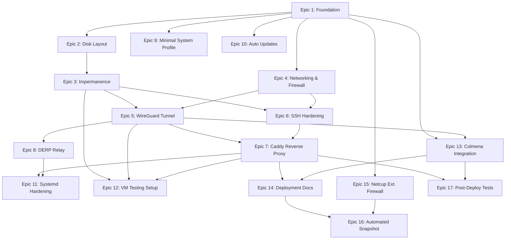

# Implementation Plan: cupix001 Edge Ingress Gateway

## Status: IN PROGRESS

## Goal

Extend the existing NixOS flake mono-repo with a new host configuration `cupix001` — a hardened, identity-aware edge ingress gateway on a netcup KVM VPS. The host runs Caddy (reverse proxy with forward_auth to Authentik), a DERP relay, WireGuard tunnel to homelab, nftables firewall, and impermanence with btrfs subvolumes. All sensitive values use a two-tier strategy: sops-nix for runtime secrets, `.gitignore`'d `private.nix` for evaluation-time values.

Source specification: `docs/edge-all.md`

## Acceptance Criteria

- [ ] `nix flake check` passes with cupix001 registered
- [ ] `nix build .#nixosConfigurations.cupix001.config.system.build.toplevel` succeeds
- [ ] All cupix001-specific assertions pass at eval-time
- [ ] All cupix001 integration tests pass (`nix build .#checks.x86_64-linux.integration-cupix001-*`)
- [ ] VM variant launches: `nix run .#nixosConfigurations.cupix001.config.system.build.vm`
- [ ] Colmena node `cupix001` is configured with tag `@edge`
- [ ] `hosts/cupix001/private.nix` is in `.gitignore`; `private.nix.example` exists with placeholders
- [ ] `README.md` updated with note that `hosts/cupix001/private.nix` must be created from template before building
- [ ] `@root-blank` btrfs snapshot creation is documented as a mandatory post-first-boot step in deployment docs AND in acceptance criteria checklist
- [ ] Post-first-boot manual step performed: `btrfs subvolume snapshot -r /mnt/@root /mnt/@root-blank` (required for impermanence root-wipe to work on second boot)
- [ ] Deployment documentation exists at `docs/cupix001-deployment.md`
- [ ] No sensitive values (IPs, gateways, tunnel config) in public git history
- [ ] Phase 2/3 items documented as TODO comments in relevant modules with exact file/section/line guidance

## Prerequisites

Before any automated steps, the user must:

1. **Gather VPS hardware info** — run reconnaissance commands from `docs/edge-all.md` on the Debian VPS
2. **Determine boot mode** — ✅ Confirmed UEFI — using systemd-boot
3. **Determine block device** — `/dev/vda` vs `/dev/sda`
4. **Determine network interface** — `ens3`, `eth0`, etc.
5. **Generate WireGuard keypair** — `wg genkey | tee wg-private.key | wg pubkey > wg-public.key`
6. **Generate age key for cupix001** — derive from SSH host key post-install
7. **Have netcup CCP DNS API credentials** ready (API key, password, customer number)
8. **Have netcup SCP REST API credentials** ready (OIDC client-id + secret)
9. **Verify Caddy >= 2.9.2 is available** in pinned nixpkgs channel: `nix eval nixpkgs#caddy.version` — if below 2.9.2, plan an overlay before implementing Epic 7 (CVE GHSA-7r4p-vjf4-gxv4)

## Two-Tier Secret Classification

All sensitive values must be classified before implementation begins:

| Secret | Tier | Storage | Rationale |
|--------|------|---------|-----------|
| WireGuard private key | Tier 1 | `sops-nix` (age-encrypted) | Runtime crypto key — opaque path at eval time |
| CrowdSec API key | Tier 1 | `sops-nix` | Runtime token — opaque path at eval time |
| SSH host keys | Tier 1 | `sops-nix` + impermanence persist | Runtime key — persisted across impermanence wipes |
| netcup CCP API key | Tier 1 | `sops-nix` | Runtime credential for Caddy DNS-01 challenge |
| netcup CCP API password | Tier 1 | `sops-nix` | Runtime credential |
| netcup CCP customer number | Tier 1 | `sops-nix` | Runtime credential |
| netcup SCP API credentials | Tier 1 | Laptop-only sops file | Grants full server lifecycle control — NEVER on VPS |
| Public IPv4 address | Tier 2 | `private.nix` (gitignored) | Needed at eval time for `networking.interfaces.*` |
| Public IPv6 address/prefix | Tier 2 | `private.nix` | Needed at eval time |
| Default gateway (v4/v6) | Tier 2 | `private.nix` | Needed at eval time |
| DNS resolver IPs | Tier 2 | `private.nix` | Needed at eval time |
| WireGuard tunnel IPs | Tier 2 | `private.nix` | Needed at eval time for routing |
| WireGuard listen port | Tier 2 | `private.nix` | Needed at eval time |
| WireGuard public key | Public | `networking.nix` (public repo) | Not sensitive |
| Block device name | Public | `disko.nix` (public repo) | Not sensitive |
| Network interface name | Public | `hardware.nix` / `networking.nix` | Not sensitive |

## Epic Dependency Graph



**Critical path**: E1 → E2 → E3 → E4 (incl. Stories 4.8–4.10: stateful/ICMP/IPv6) → E5 → E6 → E7 → E11 → E12

---

## Table of Contents

- [Epic 1: Foundation](01-foundation.md)
- [Epic 2: Disk Layout](02-disk-layout.md)
- [Epic 3: Impermanence](03-impermanence.md)
- [Epic 4: Networking & Firewall](04-networking-firewall.md)
- [Epic 5: WireGuard Tunnel](05-wireguard.md)
- [Epic 6: SSH Hardening](06-ssh-hardening.md)
- [Epic 7: Caddy Reverse Proxy](07-caddy.md)
- [Epic 8: DERP Relay](08-derp-relay.md)
- [Epic 9: Minimal System Profile](09-minimal-profile.md)
- [Epic 10: Auto Updates](10-auto-updates.md)
- [Epic 11: Systemd Hardening](11-systemd-hardening.md)
- [Epic 12: VM Testing Setup](12-vm-testing.md)
- [Epic 13: Colmena Integration](13-colmena.md)
- [Epic 14: Deployment Documentation](14-deployment-docs.md)
- [Epic 15: Netcup External Firewall](15-netcup-firewall.md)
- [Epic 16: Automated Snapshot](16-automated-snapshot.md)
- [Epic 17: Post-Deploy Tests](17-post-deploy-tests.md)

---

## Phase 2/3 Deferred TODOs

These items are from `docs/edge-all.md` and are explicitly **NOT** part of this plan. They MUST be documented as `# TODO Phase 2` / `# TODO Phase 3` comments in the exact file and section specified below. The comment placement is mandatory — implementers must be able to find the TODOs adjacent to the relevant code.

### Phase 2 — Add these comments to `hosts/cupix001/hardening.nix`

Place each TODO comment adjacent to the existing related code section:

```nix
# TODO Phase 2: Kernel sysctl hardening
# Add: boot.kernel.sysctl = { "net.ipv4.conf.all.rp_filter" = 1; "kernel.kptr_restrict" = 2; ... };
# Reference: docs/edge-all.md Phase 2 Scope

# TODO Phase 2: Full systemd sandboxing per unit
# Add to each service: ProtectSystem = "strict"; PrivateTmp = true; NoNewPrivileges = true;
#   ProtectHome = true; ReadOnlyPaths = "/";
# Reference: docs/edge-all.md Phase 2 Scope

# TODO Phase 2: CrowdSec LAPI + crowdsec-firewall-bouncer (nftables mode)
# sops.secrets."crowdsec/api-key" = {};  ← add this declaration when Phase 2 begins
# services.crowdsec.enable = true;
# /var/lib/crowdsec persist path is already reserved in impermanence.nix
# Reference: docs/edge-all.md Phase 2 Scope

# TODO Phase 2: Caddy rate limiting
# Add rate_limit directive to services.caddy.virtualHosts configuration in caddy.nix
# Reference: docs/edge-all.md Phase 2 Scope

# TODO Phase 2: Geo-blocking via CrowdSec scenarios
# Depends on CrowdSec TODO above
# Reference: docs/edge-all.md Phase 2 Scope

# TODO Phase 2: Strip all unnecessary packages from system closure
# Review environment.systemPackages after all services are stable
# Reference: docs/edge-all.md Phase 2 Scope

# TODO Phase 2 (Integration test): Multi-node nixosTest with mock Authentik backend
# Test: forward_auth returns 401 without auth header, 200 with valid header
# Add to: tests/integration/cupix001-caddy-test.nix (second test node)
# Reference: docs/edge-all.md section 15 Layer 2
```

### Phase 3 — Add these comments to `hosts/cupix001/default.nix`

Place at the bottom of the file before the closing `}`:

```nix
# TODO Phase 3: Prometheus node-exporter
# services.prometheus.exporters.node.enable = true;
# services.prometheus.exporters.node.listenAddress = config.networking.cupix001.wgTunnelIPv4; # WireGuard interface only
# Reference: docs/edge-all.md Phase 3 Scope

# TODO Phase 3: Alerting pipeline
# Configure after Prometheus exporter is in place
# Reference: docs/edge-all.md Phase 3 Scope

# TODO Phase 3: AppArmor profiles for Caddy and derper
# security.apparmor.enable = true; + custom profiles in security.apparmor.policies.*
# NixOS AppArmor support is immature — profiles must be manually written
# Reference: docs/edge-all.md Phase 3 Scope

# TODO Phase 3: Log forwarding to homelab
# services.systemd-journal-remote.enable = true; OR Loki/Promtail
# Forward only via WireGuard interface to homelab
# Reference: docs/edge-all.md Phase 3 Scope
```

## Risk Register

| # | Risk | Impact | Likelihood | Mitigation |
|---|------|--------|------------|------------|
| R1 | BIOS vs UEFI detection wrong | High — system won't boot | Low | Gather boot mode before writing disko.nix; snapshot rollback available |
| R2 | netcup DNS API rate limit (180 req/min) | Medium — ACME cert issuance fails on first deploy under burst | Medium | Implement HTTP-01 fallback; keep port 80 in firewall until DNS-01 confirmed. Caddy retries internally — real risk is first-time issuance burst; request certs during off-peak hours |
| R3 | Block device name differs (`/dev/sda` vs `/dev/vda`) | High — disko fails, no install | Low | Gather `lsblk` output first; parameterize in disko.nix |
| R4 | Network interface name differs (`ens3` vs `eth0`) | High — no network after install | Low | Gather `ip -br link` first; configured via `networking.cupix001.interfaceName` |
| R5 | sops age key not provisioned during nixos-anywhere | High — secrets fail to decrypt, services broken | High | Document `--extra-files` in deployment guide; verify after first boot |
| R6 | WireGuard tunnel doesn't come up | High — no SSH after bootstrap disabled | High | Keep `enablePublicSSH = true` until WG verified; test tunnel first |
| R7 | Caddy custom build fails (caddy-dns/netcup plugin) | High — no reverse proxy | Medium | Verify plugin compat with pinned nixpkgs; test in VM first |
| R8 | impermanence wipes needed state | High — services fail after reboot | Medium | Comprehensive persist path list; integration test with reboot cycle |
| R9 | `@root-blank` snapshot not created after first boot | High — root wipe fails on second boot | High | Document as mandatory post-install step; deployment checklist; impermanence integration test covers the mechanism |
| R10 | Colmena build on target accidentally triggered | Low — build tools not available | Low | `deployment.buildOnTarget = false`; no compilers on target |
| R11 | Private.nix with placeholder values used for real deploy | High — wrong IPs, no network | Medium | Deployment checklist; `private.nix.example` with RFC 5737 placeholder IPs; assertion removed (see F-014) |
| R12 | netcup SCP API credentials leaked to VPS | High — full server lifecycle control exposed | High | Separate laptop-only sops file; never in VPS secrets.yaml |
| R13 | Caddy < 2.9.2 in pinned nixos-25.11 channel | High — forward_auth CVE GHSA-7r4p-vjf4-gxv4 unmitigated | Medium | Check with `nix eval nixpkgs#caddy.version` before implementing Epic 7; use nixpkgs-unstable or overlay if < 2.9.2; assertion in cupix001-invariants.nix catches this at eval time |

## Validation Strategy (Phase 0)

Per `ARCH-VALID-001` rule, all validation commands are defined upfront:

### Syntax Validation

```fish
nix flake check
```

### Build Validation

```fish
nix build .#nixosConfigurations.cupix001.config.system.build.toplevel
```

### Integration Test Validation

```fish
nix build .#checks.x86_64-linux.integration-cupix001-firewall
nix build .#checks.x86_64-linux.integration-cupix001-wireguard
nix build .#checks.x86_64-linux.integration-cupix001-ssh
nix build .#checks.x86_64-linux.integration-cupix001-caddy
nix build .#checks.x86_64-linux.integration-cupix001-derper
nix build .#checks.x86_64-linux.integration-cupix001-minimal
nix build .#checks.x86_64-linux.integration-cupix001-impermanence
```

### VM Validation

```fish
nix run .#nixosConfigurations.cupix001.config.system.build.vm
```

### Apply Validation (on real host)

```fish
colmena apply --goal dry-activate --on @edge
colmena apply --on @edge
```

### Rollback Path

- **Pre-install**: Restore netcup snapshot via SCP REST API
- **Post-install NixOS**: `nixos-rebuild switch --rollback` or boot previous generation from GRUB
- **Colmena**: `colmena apply --goal switch --on @edge` with previous flake revision
- **Emergency**: netcup SCP console access + snapshot restore

## Current Status

- **Status**: IN PROGRESS
- **Current Phase**: Epic 1 complete, ready for Epic 2
- **Completed Phases**: Epic 1 (Foundation)

## Completion Log

_(to be filled during implementation)_
