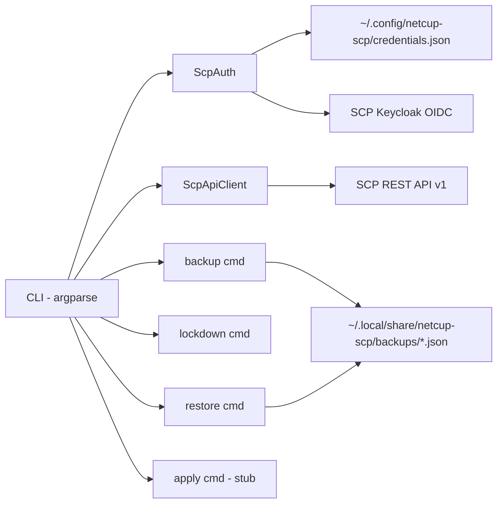
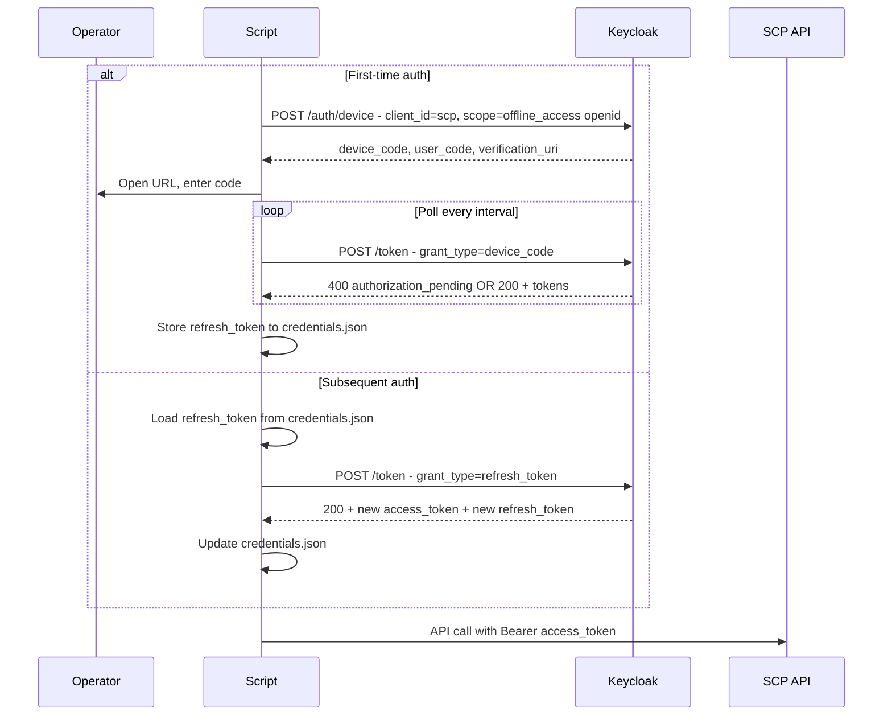
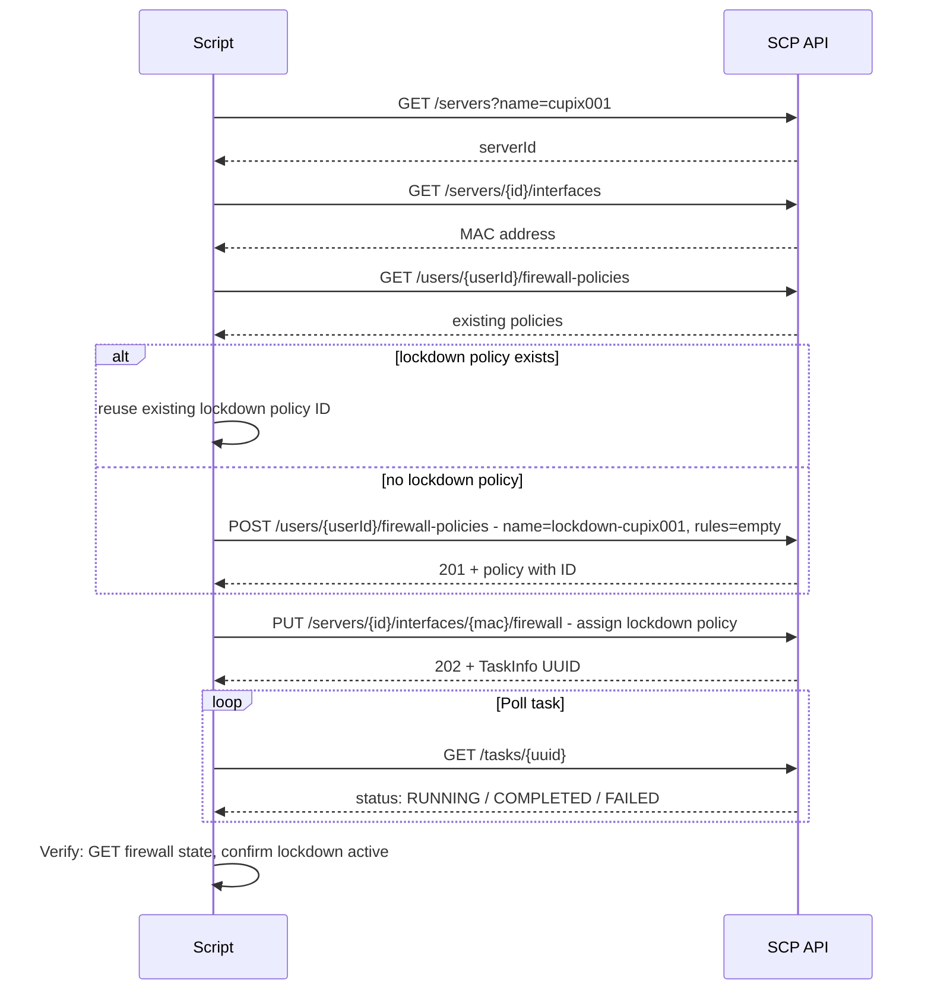

← [Back to Index](00-index.md) | Parent: [Epic 15: Netcup External Firewall](15-netcup-firewall.md)

## Epic 15a: Netcup SCP Firewall Kill Switch & Backup

**Status**: COMPLETED

**Goal**: Implement a Python CLI tool that can backup, lockdown (kill switch), and restore the netcup SCP external firewall state for cupix001. This is a **safety prerequisite** before Epic 15's full firewall policy management.

**Depends on**: Epic 1 (Foundation — cupix001 registered in flake)

### Business Context

During initial cupix001 deployment, misconfigured NixOS firewall rules could lock out SSH access. The netcup SCP external firewall operates **outside** the VPS OS — it can override any internal firewall state. Having a kill switch (block all traffic externally) and backup/restore (save/reload known-good policy state) provides a safety net independent of VPS OS state.

The kill switch runs from **thiniel** (the operator's NixOS workstation with impermanence). SCP API credentials are Tier 1 secrets that NEVER reside on the VPS.

### Acceptance Criteria

- [x] `scripts/netcup_firewall.py backup --server cupix001` exports all user firewall policies + server interface assignment to a timestamped JSON file
- [x] `scripts/netcup_firewall.py lockdown --server cupix001` creates an empty policy and assigns it, blocking all traffic (implicit DROP\_ALL)
- [x] `scripts/netcup_firewall.py restore --server cupix001 --file <backup.json>` restores policies and interface assignment from a backup file
- [x] `scripts/netcup_firewall.py apply --policy bootstrap` exits with "not implemented — see Epic 15" message
- [x] All offline unit tests pass: `python3 -m pytest scripts/tests/test_netcup_firewall.py -v`
- [x] Auth module handles device code flow (first-time) and refresh token flow (subsequent)
- [x] Credentials stored at `~/.config/netcup-scp/credentials.json` (mode 0600), never in git
- [x] Script requires only Python 3 stdlib + `requests` — no other dependencies
- [x] Code structured so Epic 15 can extend `apply` subcommand without refactoring
- [x] `~/.config/netcup-scp` and `~/.local/share/netcup-scp` added to thiniel impermanence persist paths
- [ ] Firewall policy definitions stored in `infra/firewall/` in git (not secret — infrastructure-as-code) — **DEVIATION**: lockdown policy created dynamically via API (empty rules = implicit DROP\_ALL); static policy files deferred to Epic 15 Story 15.1. See Deviation Log.

### Operator Environment

The script runs on **thiniel** (NixOS workstation with impermanence). Key implications:

- All mutable state under `~/.config/` and `~/.local/share/` is **wiped on reboot** unless persisted
- Impermanence paths must be declared in `home/dan/features/linux/impermanence.nix`
- The sops age key at `~/.config/sops/age` is already persisted (for future age-encryption of credentials if needed)

### Security Classification

| Artifact | Tier | Storage | Rationale |
|----------|------|---------|-----------|
| SCP OIDC refresh token | Tier 1 | `~/.config/netcup-scp/credentials.json` (0600) | Full server lifecycle control; persisted via impermanence |
| Backup JSON files | Sensitive | `~/.local/share/netcup-scp/backups/` | Contains firewall rule details; persisted via impermanence |
| Firewall policy definitions | Public | `infra/firewall/*.json` in git | Infrastructure-as-code — port rules are not secret |
| Script source | Public | `scripts/netcup_firewall.py` in git | No secrets embedded |

### Architecture

#### Component Diagram



#### Auth Flow



#### Kill Switch Flow



#### Backup JSON Schema

```json
{
  "version": 1,
  "timestamp": "2026-04-11T15:00:00Z",
  "server": {
    "id": 12345,
    "name": "cupix001"
  },
  "interfaces": [
    {
      "mac": "aa:bb:cc:dd:ee:ff",
      "firewall": {
        "userPolicies": [],
        "copiedPolicies": [],
        "ingressImplicitRule": "DROP",
        "egressImplicitRule": "DROP",
        "consistent": true,
        "active": true
      }
    }
  ],
  "policies": [
    {
      "id": 1234,
      "name": "my-policy",
      "description": "...",
      "rules": [
        {
          "direction": "INGRESS",
          "protocol": "TCP",
          "sourceIp": "0.0.0.0/0",
          "destinationPort": "22",
          "action": "ACCEPT"
        }
      ]
    }
  ]
}
```

### File Locations

| Artifact | Path | Notes |
|----------|------|-------|
| CLI script | `scripts/netcup_firewall.py` | Single file, executable |
| Unit tests | `scripts/tests/test_netcup_firewall.py` | pytest + unittest.mock |
| Test init | `scripts/tests/__init__.py` | Empty, enables pytest discovery |
| Policy definitions | `infra/firewall/cupix001-lockdown.json` | Empty rules → DROP ALL (in git) |
| Impermanence config | `home/dan/features/linux/impermanence.nix` | Add persist paths |
| Credentials | `~/.config/netcup-scp/credentials.json` | NOT in repo, 0600, persisted via impermanence |
| Backups | `~/.local/share/netcup-scp/backups/` | NOT in repo, persisted via impermanence |

### Dependencies

Add to devShell (in `flake.nix` or `shell.nix`):

- `python3` (3.11+)
- `python3Packages.requests`
- `python3Packages.pytest`

This aligns with Epic 17 which also needs pytest + requests.

---

### Phase 0: Validation Strategy

**Syntax validation**: `python3 -m py_compile scripts/netcup_firewall.py`

**Unit test validation**: `python3 -m pytest scripts/tests/test_netcup_firewall.py -v`

**No NixOS build validation needed** — this is a standalone Python script, not a Nix module.

**Rollback path**: Script is additive (new files only). Remove `scripts/netcup_firewall.py` and `scripts/tests/` to revert.

**Dangerous change categories**: None — this script does not modify NixOS configuration, bootloader, or filesystem. It only talks to the external netcup SCP API from thiniel.

**Impermanence validation**: `nix flake check` after adding persist paths to `home/dan/features/linux/impermanence.nix`.

---

### Phase 1: DevShell Prerequisites

#### Story 15a.1: Add Python tooling to devShell

##### Step 15a.1.1: Red — Verify Python + pytest NOT in devShell

- **Test type**: Shell check
- **What to test**: `nix develop --command python3 -c "import requests"` should fail (requests not available)
- **Verify**: Exit code non-zero
- **Expected**: FAIL

##### Step 15a.1.2: Green — Add Python packages to devShell

- **File**: `flake.nix` (devShells section) or `shell.nix`
- **What to implement**: Add `python3` with `python3Packages.requests` and `python3Packages.pytest` to devShell `nativeBuildInputs`
- **Verify**: `nix develop --command python3 -c "import requests; import pytest; print('OK')"`
- **Expected**: PASS

#### Story 15a.1b: Add impermanence persist paths for SCP credentials and backups

##### Step 15a.1b.1: Red — Verify persist paths NOT yet declared

- **Test type**: Nix eval check
- **What to test**: Grep `home/dan/features/linux/impermanence.nix` for `netcup-scp` — should not match
- **Verify**: `grep -q netcup-scp home/dan/features/linux/impermanence.nix` → FAIL (exit 1)
- **Expected**: FAIL

##### Step 15a.1b.2: Green — Add persist paths to impermanence

- **File**: `home/dan/features/linux/impermanence.nix`
- **What to implement**: Add `.config/netcup-scp` and `.local/share/netcup-scp` to `home.persistence."/persist".directories`
- **Verify**: `nix flake check` → PASS + grep confirms paths present
- **Expected**: PASS

---

### Phase 2: CLI Skeleton & Argument Parsing

#### Story 15a.2: Script skeleton with subcommand parsing

##### Step 15a.2.1: Red — Test file and CLI parsing tests

- **File**: `scripts/tests/__init__.py` (empty)
- **File**: `scripts/tests/test_netcup_firewall.py`
- **What to test**: 
  - `backup` subcommand accepted with `--server` argument
  - `lockdown` subcommand accepted with `--server` argument
  - `restore` subcommand accepted with `--server` and `--file` arguments
  - `apply` subcommand accepted with `--server` and `--policy` arguments
  - Missing required args raise `SystemExit`
- **Verify**: `python3 -m pytest scripts/tests/test_netcup_firewall.py -v` → FAIL (import error, script doesn't exist)
- **Expected**: FAIL

##### Step 15a.2.2: Green — Create script with argparse skeleton

- **File**: `scripts/netcup_firewall.py`
- **What to implement**: 
  - Shebang `#!/usr/bin/env python3`
  - `argparse` with subcommands: `backup`, `lockdown`, `restore`, `apply`
  - `backup`: requires `--server`
  - `lockdown`: requires `--server`, optional `--yes` (skip confirmation)
  - `restore`: requires `--server`, requires `--file`
  - `apply`: requires `--server`, requires `--policy` (choices: `bootstrap`, `production`)
  - `parse_args()` function returning parsed namespace
  - `main()` function dispatching to stub handlers
  - `apply` handler prints "Not implemented — see Epic 15" and exits 1
- **Verify**: `python3 -m pytest scripts/tests/test_netcup_firewall.py -v` → PASS
- **Expected**: PASS

---

### Phase 3: Auth Module

#### Story 15a.3: OIDC authentication with device code flow + refresh token

##### Step 15a.3.1: Red — Auth unit tests

- **File**: `scripts/tests/test_netcup_firewall.py` (append)
- **What to test** (all using `unittest.mock.patch` on `requests.post`):
  - `ScpAuth.device_code_flow()` → sends correct POST to device auth endpoint, returns device\_code + user\_code + verification\_uri
  - `ScpAuth.poll_for_token()` → polls token endpoint, handles `authorization_pending`, returns tokens on success
  - `ScpAuth.refresh_access_token()` → sends refresh\_token, returns new access\_token
  - `ScpAuth.get_access_token()` → loads stored refresh\_token from file, calls refresh, returns access\_token
  - `ScpAuth.get_access_token()` → when no stored token, initiates device code flow
  - Token storage: `save_credentials()` writes JSON to correct path
  - Token loading: `load_credentials()` reads JSON, returns None if missing
- **Verify**: `python3 -m pytest scripts/tests/test_netcup_firewall.py -v -k auth` → FAIL
- **Expected**: FAIL

##### Step 15a.3.2: Green — Implement ScpAuth class

- **File**: `scripts/netcup_firewall.py` (add `ScpAuth` class)
- **What to implement**:
  - Constants: `TOKEN_URL`, `DEVICE_AUTH_URL`, `USERINFO_URL`, `CLIENT_ID = "scp"`, `SCOPES = "offline_access openid"`
  - `credentials_path` property → `~/.config/netcup-scp/credentials.json`
  - `load_credentials()` → read JSON file, return dict or None
  - `save_credentials(tokens: dict)` → write JSON file, create dir with mode 0o700
  - `device_code_flow()` → POST to device auth endpoint, return response dict
  - `poll_for_token(device_code, interval, expires_in)` → loop POST to token endpoint with `grant_type=urn:ietf:params:oauth:grant-type:device_code`, handle `authorization_pending` (sleep + retry), `slow_down` (increase interval), success (return tokens), expiry (raise)
  - `refresh_access_token(refresh_token)` → POST to token endpoint with `grant_type=refresh_token`, return tokens
  - `get_access_token()` → try load + refresh, fall back to device flow, save tokens, return access\_token
  - `get_user_id(access_token)` → GET userinfo endpoint, return `response["id"]` (integer)
- **Verify**: `python3 -m pytest scripts/tests/test_netcup_firewall.py -v -k auth` → PASS
- **Expected**: PASS

---

### Phase 4: API Client

#### Story 15a.4: SCP REST API client with task polling

##### Step 15a.4.1: Red — API client unit tests

- **File**: `scripts/tests/test_netcup_firewall.py` (append)
- **What to test** (all using `unittest.mock.patch` on `requests.get`/`requests.post`/`requests.put`):
  - `ScpApiClient.find_server("cupix001")` → calls GET `/servers?name=cupix001`, returns server ID
  - `ScpApiClient.find_server("nonexistent")` → raises `ValueError` when no server found
  - `ScpApiClient.get_interfaces(server_id)` → returns list of interfaces with MAC
  - `ScpApiClient.get_firewall(server_id, mac)` → returns `ServerFirewall` dict
  - `ScpApiClient.set_firewall(server_id, mac, policy_ids)` → PUT, returns task UUID
  - `ScpApiClient.list_policies(user_id)` → returns list of policy dicts
  - `ScpApiClient.get_policy(user_id, policy_id)` → returns single policy dict
  - `ScpApiClient.create_policy(user_id, name, rules)` → POST, returns created policy
  - `ScpApiClient.delete_policy(user_id, policy_id)` → DELETE, returns None
  - `ScpApiClient.wait_for_task(task_uuid)` → polls GET `/tasks/{uuid}`, returns on COMPLETED, raises on FAILED
  - `ScpApiClient.wait_for_task()` → timeout after max polls raises `TimeoutError`
- **Verify**: `python3 -m pytest scripts/tests/test_netcup_firewall.py -v -k api_client` → FAIL
- **Expected**: FAIL

##### Step 15a.4.2: Green — Implement ScpApiClient class

- **File**: `scripts/netcup_firewall.py` (add `ScpApiClient` class)
- **What to implement**:
  - Constructor: `__init__(self, access_token: str)`, stores token, sets `BASE_URL`
  - `_headers()` → `{"Authorization": "Bearer {token}", "Content-Type": "application/json"}`
  - `_get(path)` → `requests.get(BASE_URL + path, headers=...)`, raise on non-2xx
  - `_post(path, json)` → `requests.post(...)`, handle 201/202
  - `_put(path, json)` → `requests.put(...)`, handle 200/202
  - `_delete(path)` → `requests.delete(...)`, handle 200/204
  - `find_server(name)` → GET `/servers?name={name}`, extract server ID from response list, raise `ValueError` if empty
  - `get_interfaces(server_id)` → GET `/servers/{id}/interfaces`
  - `get_firewall(server_id, mac)` → GET `/servers/{id}/interfaces/{mac}/firewall`
  - `set_firewall(server_id, mac, payload)` → PUT `/servers/{id}/interfaces/{mac}/firewall`, return task UUID from response
  - `list_policies(user_id)` → GET `/users/{userId}/firewall-policies`
  - `get_policy(user_id, policy_id)` → GET `/users/{userId}/firewall-policies/{id}`
  - `create_policy(user_id, name, rules)` → POST `/users/{userId}/firewall-policies`
  - `delete_policy(user_id, policy_id)` → DELETE `/users/{userId}/firewall-policies/{id}`
  - `wait_for_task(task_uuid, max_polls=30, interval=2)` → loop GET `/tasks/{uuid}`, sleep between, return on `COMPLETED`, raise on `FAILED`/timeout
- **Verify**: `python3 -m pytest scripts/tests/test_netcup_firewall.py -v -k api_client` → PASS
- **Expected**: PASS

---

### Phase 5: Backup Command

#### Story 15a.5: Export firewall state to JSON

##### Step 15a.5.1: Red — Backup command tests

- **File**: `scripts/tests/test_netcup_firewall.py` (append)
- **What to test** (mock `ScpAuth` and `ScpApiClient`):
  - `cmd_backup()` calls `find_server`, `get_interfaces`, `get_firewall` for each interface, `list_policies`
  - Output JSON matches expected schema (version, timestamp, server, interfaces, policies)
  - Backup file is written to `~/.local/share/netcup-scp/backups/cupix001-{timestamp}.json`
  - Backup file directory is created if missing
  - JSON file is valid and re-parseable
- **Verify**: `python3 -m pytest scripts/tests/test_netcup_firewall.py -v -k backup` → FAIL
- **Expected**: FAIL

##### Step 15a.5.2: Green — Implement backup command

- **File**: `scripts/netcup_firewall.py` (add `cmd_backup` function)
- **What to implement**:
  - Authenticate via `ScpAuth`
  - Get user ID via `auth.get_user_id()`
  - `find_server(server_name)` → get server ID
  - `get_interfaces(server_id)` → for each interface, `get_firewall(server_id, mac)`
  - `list_policies(user_id)` → get all policies with full details
  - Assemble backup dict with `version=1`, ISO timestamp, server info, interfaces with firewall state, all policies
  - Write to `~/.local/share/netcup-scp/backups/{server_name}-{YYYYMMDD-HHMMSS}.json`
  - Print backup file path to stdout
- **Verify**: `python3 -m pytest scripts/tests/test_netcup_firewall.py -v -k backup` → PASS
- **Expected**: PASS

---

### Phase 6: Lockdown Command (Kill Switch)

#### Story 15a.6: Block all traffic via empty policy assignment

##### Step 15a.6.1: Red — Lockdown command tests

- **File**: `scripts/tests/test_netcup_firewall.py` (append)
- **What to test** (mock `ScpAuth` and `ScpApiClient`):
  - `cmd_lockdown()` creates automatic backup BEFORE lockdown
  - When no existing `lockdown-cupix001` policy: creates new empty policy, assigns it
  - When existing `lockdown-cupix001` policy: reuses it (no duplicate creation)
  - Assignment triggers `wait_for_task()` for completion
  - After assignment: verifies firewall state via `get_firewall()`
  - Without `--yes`: prints confirmation prompt (test with mock input)
  - With `--yes`: skips confirmation
  - Prints clear status messages: "LOCKDOWN ACTIVE — all traffic blocked"
- **Verify**: `python3 -m pytest scripts/tests/test_netcup_firewall.py -v -k lockdown` → FAIL
- **Expected**: FAIL

##### Step 15a.6.2: Green — Implement lockdown command

- **File**: `scripts/netcup_firewall.py` (add `cmd_lockdown` function)
- **What to implement**:
  - Authenticate, get user ID, find server, get interfaces
  - **Auto-backup**: call `cmd_backup()` first (safety net)
  - Confirmation prompt unless `--yes` flag: "WARNING: This will block ALL network traffic to cupix001. Continue? [y/N]"
  - Check existing policies for one named `lockdown-{server_name}`
  - If not found: `create_policy(user_id, "lockdown-{server_name}", rules=[])` — empty rules = DROP\_ALL
  - For each interface: `set_firewall(server_id, mac, {"userPolicies": [lockdown_policy_id]})` 
  - `wait_for_task(task_uuid)`
  - Verify: `get_firewall(server_id, mac)` → confirm lockdown policy is assigned
  - Print: `"LOCKDOWN ACTIVE — all traffic to {server_name} blocked via SCP external firewall"`
  - Print: `"Backup saved to: {backup_path}"`
  - Print: `"To restore: python3 scripts/netcup_firewall.py restore --server {server_name} --file {backup_path}"`
- **Verify**: `python3 -m pytest scripts/tests/test_netcup_firewall.py -v -k lockdown` → PASS
- **Expected**: PASS

---

### Phase 7: Restore Command

#### Story 15a.7: Restore firewall state from backup JSON

##### Step 15a.7.1: Red — Restore command tests

- **File**: `scripts/tests/test_netcup_firewall.py` (append)
- **What to test** (mock `ScpAuth` and `ScpApiClient`):
  - `cmd_restore()` loads backup JSON from `--file` path
  - Validates backup version == 1
  - Validates backup server name matches `--server` argument
  - For each policy in backup: checks if exists by name → updates or creates
  - Re-assigns policies to each interface as recorded in backup
  - Waits for assignment task completion
  - Verifies final firewall state matches backup
  - Invalid JSON file → clear error message
  - Version mismatch → clear error message
  - Server name mismatch → clear error message with "did you mean?" hint
- **Verify**: `python3 -m pytest scripts/tests/test_netcup_firewall.py -v -k restore` → FAIL
- **Expected**: FAIL

##### Step 15a.7.2: Green — Implement restore command

- **File**: `scripts/netcup_firewall.py` (add `cmd_restore` function)
- **What to implement**:
  - Load and parse backup JSON from `--file` path
  - Validate: `version == 1`, `server.name == args.server`
  - Authenticate, get user ID, find server
  - For each policy in `backup["policies"]`:
    - Check if policy with same name exists (via `list_policies`)
    - If exists: `update_policy()` or skip if rules match (note: update not strictly needed for kill switch scope — can recreate)
    - If not exists: `create_policy(user_id, name, rules)`
    - Map old policy IDs to new policy IDs
  - For each interface in `backup["interfaces"]`:
    - Map `userPolicies` IDs from backup to newly created/found policy IDs
    - `set_firewall(server_id, mac, mapped_payload)`
    - `wait_for_task(task_uuid)`
  - Verify: `get_firewall()` for each interface
  - Print: `"RESTORE COMPLETE — firewall state restored from {file}"`
- **Verify**: `python3 -m pytest scripts/tests/test_netcup_firewall.py -v -k restore` → PASS
- **Expected**: PASS

---

### Phase 8: Integration Smoke Test & Documentation

#### Story 15a.8: End-to-end test with mocked API + README update

##### Step 15a.8.1: Red — Full workflow test

- **File**: `scripts/tests/test_netcup_firewall.py` (append)
- **What to test** (mock all HTTP, use `tmp_path` for files):
  - Full cycle: `backup` → `lockdown` → `restore`
  - Backup produces valid JSON
  - Lockdown changes firewall state (in mock)
  - Restore returns firewall state to pre-lockdown (in mock)
  - Verify state consistency throughout
- **Verify**: `python3 -m pytest scripts/tests/test_netcup_firewall.py -v -k workflow` → FAIL
- **Expected**: FAIL

##### Step 15a.8.2: Green — Fix any integration issues + update scripts/README.md

- **File**: `scripts/netcup_firewall.py` (fix any issues from integration test)
- **File**: `scripts/README.md` (append section documenting netcup-firewall.py usage)
- **What to implement**:
  - Fix any issues surfaced by full workflow test
  - Add `## netcup-firewall.py` section to `scripts/README.md` with usage examples for backup, lockdown, restore
  - Include security notes: laptop-only, Tier 1 credentials, never commit credentials
- **Verify**: `python3 -m pytest scripts/tests/test_netcup_firewall.py -v` → ALL PASS
- **Expected**: PASS

---

### Validation Commands Summary

| Command | Purpose |
|---------|---------|
| `python3 -m py_compile scripts/netcup_firewall.py` | Syntax check |
| `python3 -m pytest scripts/tests/test_netcup_firewall.py -v` | All unit tests |
| `python3 -m pytest scripts/tests/test_netcup_firewall.py -v -k auth` | Auth tests only |
| `python3 -m pytest scripts/tests/test_netcup_firewall.py -v -k api_client` | API client tests only |
| `python3 -m pytest scripts/tests/test_netcup_firewall.py -v -k backup` | Backup tests only |
| `python3 -m pytest scripts/tests/test_netcup_firewall.py -v -k lockdown` | Lockdown tests only |
| `python3 -m pytest scripts/tests/test_netcup_firewall.py -v -k restore` | Restore tests only |
| `python3 -m pytest scripts/tests/test_netcup_firewall.py -v -k workflow` | Full workflow test |
| `nix flake check` | Nix-level validation (impermanence persist paths) |

### Rollback Path

This epic adds files only — no existing files are modified except `scripts/README.md` (append), devShell deps, and `home/dan/features/linux/impermanence.nix` (add persist paths).

- **Full rollback**: `git rm scripts/netcup_firewall.py scripts/tests/test_netcup_firewall.py scripts/tests/__init__.py` + revert devShell + impermanence changes
- **Lockdown rollback on live system**: Use `restore` subcommand with the auto-saved backup, OR manually re-assign policies via netcup SCP web UI

### Current Status

| Phase | Status |
|-------|--------|
| Phase 0: Validation Strategy | ✅ Defined |
| Phase 1: DevShell + Impermanence | ✅ Complete |
| Phase 2: CLI Skeleton | ✅ Complete |
| Phase 3: Auth Module | ✅ Complete |
| Phase 4: API Client | ✅ Complete |
| Phase 5: Backup Command | ✅ Complete |
| Phase 6: Lockdown Command | ✅ Complete |
| Phase 7: Restore Command | ✅ Complete |
| Phase 8: Integration & Docs | ✅ Complete |

### Completion Log

| Phase | Duration | Notes |
|-------|----------|-------|
| Phase 1 | - | devShell + impermanence persist paths |
| Phase 2 | - | argparse with 4 subcommands, 10 tests |
| Phase 3 | - | ScpAuth OIDC device code + refresh, 10 tests |
| Phase 4 | - | ScpApiClient REST client, 11 tests |
| Phase 5 | - | cmd_backup to JSON, 5 tests |
| Phase 6 | - | cmd_lockdown kill switch, 8 tests |
| Phase 7 | - | cmd_restore from backup, 9 tests |
| Phase 8 | - | Workflow integration test + README, 1 test |

### Deviation Log

| Criterion | Deviation | Rationale |
|-----------|-----------|-----------|
| AC-11: `infra/firewall/` policy definitions | Not implemented — lockdown policy created dynamically via API with empty rules | The lockdown policy has zero rules (empty = implicit DROP_ALL). A static JSON file would contain `{"rules": []}` which adds no value. Static policy files for `bootstrap` and `production` are deferred to Epic 15 Story 15.1 where they have actual rules. |

### Lessons Learned

1. **Python rules must exist before implementation, not after.** The initial implementation predated rules PY-QUAL-001, PY-CLI-001, PY-TDD-001, and FUND-001. Retroactively applying rules required three full review-fix-validate cycles. Future Python tools should use the `create-python-cli-tool` skill from the start.

2. **`requests.Session` with `HTTPAdapter` + `Retry` is mandatory, not optional.** The initial implementation used bare `requests.get()`/`requests.post()` without timeouts or retry logic. PY-CLI-001 mandates `timeout=(10, 30)` on every call and `urllib3.util.retry.Retry` with `backoff_factor=1` for 5xx errors. This should be in the initial implementation, not added in review.

3. **`main()` error handling is a PY-CLI-001 requirement.** `KeyboardInterrupt` → exit 130, `Exception` → log + exit 1 (re-raise in `--verbose`). The initial implementation had no top-level exception handling. This pattern should be in every CLI tool from the start.

4. **Clean Code means extract methods, not just remove comments.** Removing inline comments without extracting descriptive helper methods makes code harder to read, not easier. The refactoring from 52/83/102-line functions to 17/25/20-line orchestrators calling 10 well-named helpers was the correct approach. Apply FUND-001 §2 (Clean Code) by writing self-documenting methods from the start.

5. **devShell must include `mypy`, `ruff`, and `types-requests` from the start.** The initial devShell only had `python3`, `requests`, and `pytest`. Quality gates could not run until `mypy` and `ruff` were added later. Include all tools from Phase 1.

6. **Test mocking must match implementation architecture.** When `ScpApiClient` was refactored from bare `requests.*` to `self._session.*` (for retry logic), all 12 API client test patches had to change from `patch("requests.get")` to `patch.object(client._session, "get")`. DI via constructor-injected session would have avoided this coupling.

7. **Backup file structure validation is a security requirement.** FUND-001 §7 (Security First) requires treating all external input as untrusted — including backup JSON files loaded from disk. Defensive key validation with clear error messages was added in the third review cycle. Include input validation from the first implementation.

8. **`@pytest.mark.parametrize` reduces test bloat.** Three separate tests for invalid argument variations (missing server, missing file, no subcommand) were consolidated into one parametrized test. Use parametrized tests for repetitive pattern testing from the start.
