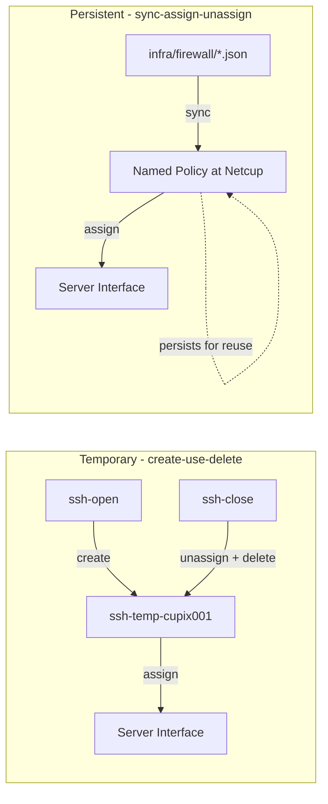
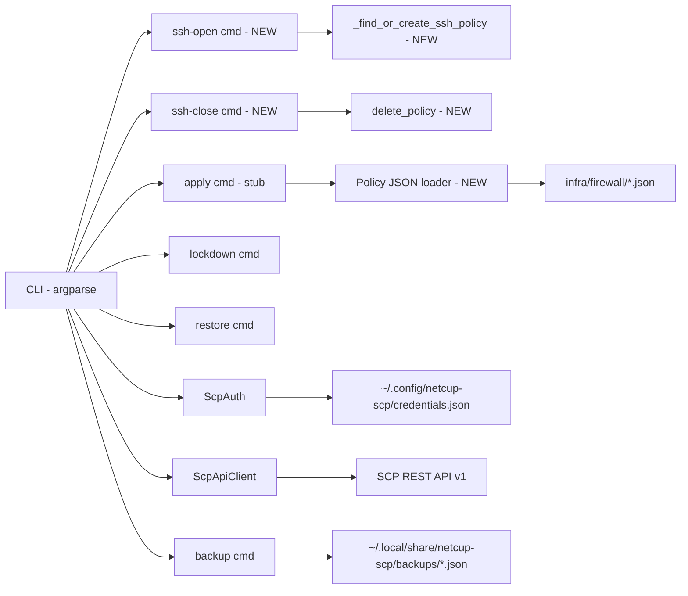
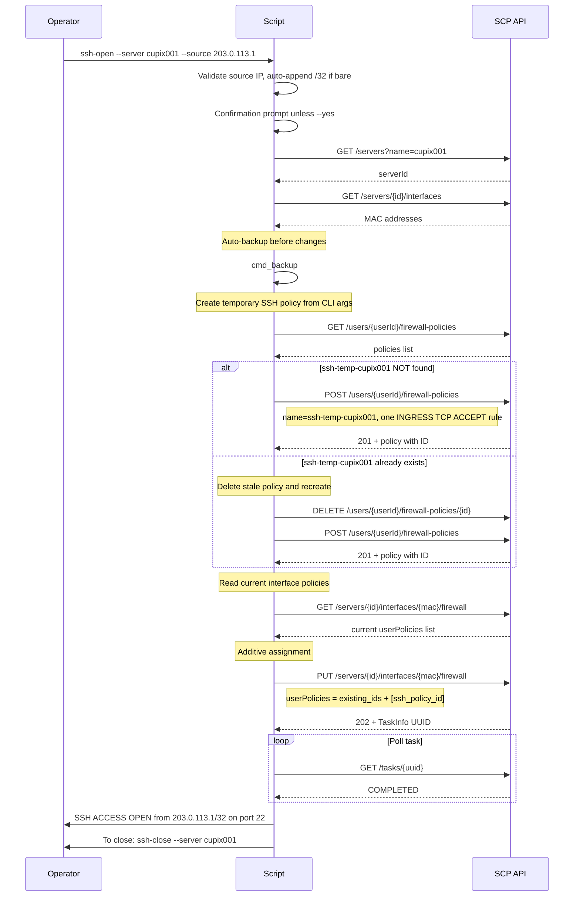
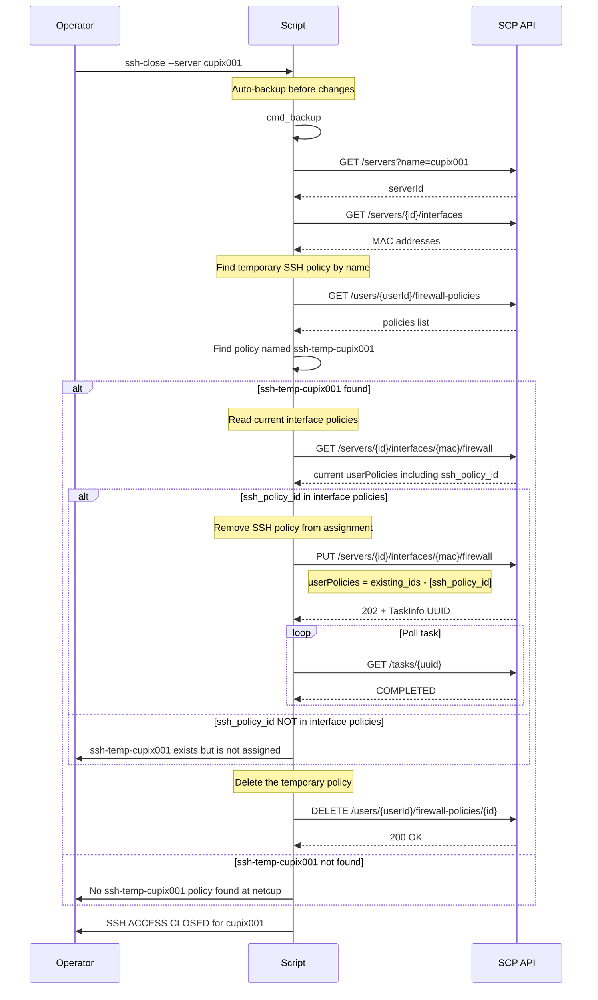

← [Back to Index](00-index.md) | Parent: [Epic 15: Netcup External Firewall](15-netcup-firewall.md) | Sibling: [Epic 15a: Kill Switch & Backup](15a-netcup-firewall-killswitch.md)

## Epic 15b: SSH Access & Shared Firewall Policies

**Status**: COMPLETED

**Goal**: Extend `scripts/netcup_firewall.py` with two independent features: (1) `ssh-open` / `ssh-close` subcommands for **temporary** SSH access via the netcup SCP external firewall using a **create-use-delete** pattern, and (2) a persistent named policy model with infrastructure-as-code policy definitions in `infra/firewall/` for future use by the `apply` subcommand (Epic 15).

**Depends on**: Epic 15a (completed — CLI tool, ScpAuth, ScpApiClient, backup/lockdown/restore)

### Business Context

During cupix001 deployment there are three phases requiring temporary SSH access through the **external** SCP firewall:

1. **Host reconnaissance** — gathering hardware info, network details from the Debian VPS before NixOS deployment
2. **nixos-anywhere deployment** — requires SSH port 22 from the operator IP to the Debian-hosted VPS
3. **Bootstrap management** — ongoing SSH access on the bootstrap high port during initial setup

The existing `lockdown` command replaces **all** interface policies with a single empty policy (DROP ALL). SSH access requires the opposite: **additively** assigning an SSH-allow policy alongside any existing policies on the interface.

#### Two Distinct Concepts

This epic introduces two **separate** concepts that must not be conflated:

1. **Temporary SSH rules** — dynamically created from CLI arguments for a **specific server**, used once, then **deleted**. Not stored as IaC. Not reusable. The policy name follows the pattern `ssh-temp-{server_name}`.

2. **Persistent shared policies** — named, reusable policy definitions stored in `infra/firewall/*.json` as IaC. Synced to netcup, assigned/unassigned to servers. Examples: `lockdown`, `bootstrap`, `production`, `web-server`. These are managed by the `apply` subcommand (Epic 15).



### Acceptance Criteria

- [ ] `netcup-firewall ssh-open --server cupix001 --source 203.0.113.1 --port 22` creates a temporary policy named `ssh-temp-cupix001` with one INGRESS TCP ACCEPT rule for the given source IP and port, then **additively** assigns it alongside existing interface policies
- [ ] `netcup-firewall ssh-open` auto-backs up before making changes (matching lockdown pattern)
- [ ] `netcup-firewall ssh-close --server cupix001` removes the `ssh-temp-cupix001` policy from the interface assignment, then **deletes** the policy at netcup (it is temporary — no reuse)
- [ ] `--source` accepts bare IPv4 (`203.0.113.1`) and auto-appends `/32`, or explicit CIDR (`203.0.113.0/24`)
- [ ] `--port` defaults to `22` when not specified
- [ ] SSH policy is named `ssh-temp-{server_name}` (per-server, temporary)
- [ ] Source IP is validated: must be a valid IPv4 address or CIDR; invalid input exits with error
- [ ] `ssh-open` with `--yes` skips confirmation prompt; without it, prompts for confirmation
- [ ] `ssh-close` with `--yes` skips confirmation prompt
- [ ] `infra/firewall/` directory exists with a `README.md` explaining the JSON format
- [ ] `infra/firewall/lockdown.json` defines the shared lockdown policy (empty rules) — for future use by Epic 15
- [ ] Policy JSON schema is documented and validated when loading files
- [ ] All offline unit tests pass: `cd scripts && python3 -m pytest tests/test_netcup_firewall.py -v`
- [ ] `mypy --strict` passes on `scripts/netcup_firewall.py`
- [ ] `ruff check` and `ruff format --check` pass on `scripts/`
- [ ] No new dependencies beyond existing devShell

### Architecture

#### Design Principle: Two Patterns

| Aspect | Temporary SSH Rules | Persistent Shared Policies |
|--------|---------------------|---------------------------|
| **Lifecycle** | Create → Assign → Unassign → Delete | Sync → Assign → Unassign (persists) |
| **Naming** | `ssh-temp-{server_name}` | Policy name from JSON (e.g. `lockdown`) |
| **Source of truth** | CLI arguments (`--source`, `--port`) | `infra/firewall/*.json` |
| **Storage at netcup** | Ephemeral (deleted on close) | Persistent (reusable across servers) |
| **Commands** | `ssh-open`, `ssh-close` | `apply` (Epic 15) |

#### Extended Component Diagram



#### ssh-open Flow



#### ssh-close Flow



#### infra/firewall/ Directory Structure

```
infra/
└── firewall/
    ├── README.md                  # Format documentation
    └── lockdown.json              # Shared lockdown policy - empty rules, DROP ALL
```

Note: No `ssh-access.json` — SSH rules are temporary and created dynamically from CLI arguments. They are not stored as IaC.

#### Policy JSON Schema

Static policy (persistent, stored as IaC):

```json
{
  "name": "lockdown",
  "description": "Drop all traffic — empty rules trigger implicit DROP on ingress and egress",
  "rules": []
}
```

Future persistent policies (deferred to Epic 15):

```json
{
  "name": "web-server",
  "description": "Allow HTTP and HTTPS ingress",
  "rules": [
    {
      "direction": "INGRESS",
      "protocol": "TCP",
      "sourceIp": "0.0.0.0/0",
      "destinationPort": "80",
      "action": "ACCEPT"
    },
    {
      "direction": "INGRESS",
      "protocol": "TCP",
      "sourceIp": "0.0.0.0/0",
      "destinationPort": "443",
      "action": "ACCEPT"
    }
  ]
}
```

The schema matches the SCP API `FirewallPolicy` payload exactly, with an additional top-level `description` field for documentation. All values are concrete — no placeholders.

### File Locations

| Artifact | Path | Notes |
|----------|------|-------|
| CLI script | `scripts/netcup_firewall.py` | Extended with ssh-open, ssh-close, IP validation, temporary policy create/delete, additive assignment |
| Unit tests | `scripts/tests/test_netcup_firewall.py` | Extended with ~30 new tests |
| Lockdown policy definition | `infra/firewall/lockdown.json` | Shared lockdown — empty rules (for future Epic 15 use) |
| Policy README | `infra/firewall/README.md` | JSON format documentation |

### Security Considerations

| Concern | Mitigation |
|---------|------------|
| SSH policy left assigned accidentally | `ssh-close` unassigns AND deletes the policy; log warning with close instructions on `ssh-open` |
| Source IP spoofing | External firewall operates at hypervisor level — spoofing is a network-layer concern, not mitigated here |
| Broad CIDR ranges | Validate input but allow operator discretion; warn on /0 or /8 |
| Stale temporary policy at netcup | `ssh-close` deletes the policy. If script crashes between create and delete, next `ssh-open` detects stale policy and recreates it |
| Multiple concurrent SSH sessions | Each server gets its own `ssh-temp-{server_name}` policy — no conflicts between servers |

---

### Phase 0: Validation Strategy

**Syntax validation**: `python3 -m py_compile scripts/netcup_firewall.py`

**Unit test validation**: `cd scripts && python3 -m pytest tests/test_netcup_firewall.py -v`

**Type checking**: `cd scripts && mypy --strict netcup_firewall.py`

**Linting**: `cd scripts && ruff check .`

**Formatting**: `cd scripts && ruff format --check .`

**No NixOS build validation needed** — this is a standalone Python script, not a Nix module.

**Rollback path**: All changes are additive to the existing script. `git checkout scripts/netcup_firewall.py scripts/tests/test_netcup_firewall.py` reverts everything. `infra/firewall/` can be removed with `git rm -r infra/firewall/`.

**Dangerous change categories**: None — this script does not modify NixOS configuration. It talks to the external netcup SCP API from thiniel. Live firewall changes are guarded by auto-backup and confirmation prompts.

---

### Phase 1: IP Address Validation Helper

#### Story 15b.1: Source IP validation and CIDR normalization

##### Step 15b.1.1: Red — IP validation tests

- **File**: `scripts/tests/test_netcup_firewall.py` (append new test class)
- **What to test**:
  - `validate_source_ip("203.0.113.1")` → returns `"203.0.113.1/32"` (bare IP auto-appended)
  - `validate_source_ip("203.0.113.0/24")` → returns `"203.0.113.0/24"` (CIDR passed through)
  - `validate_source_ip("10.0.0.1/32")` → returns `"10.0.0.1/32"`
  - `validate_source_ip("not-an-ip")` → raises `ValueError`
  - `validate_source_ip("999.999.999.999")` → raises `ValueError`
  - `validate_source_ip("")` → raises `ValueError`
  - `validate_source_ip("203.0.113.1/33")` → raises `ValueError` (invalid prefix length)
  - `validate_source_ip("2001:db8::1")` → raises `ValueError` (IPv6 not supported by SCP API)
- **Verify**: `cd scripts && python3 -m pytest tests/test_netcup_firewall.py -v -k validate_source_ip` → FAIL
- **Expected**: FAIL (function does not exist)

##### Step 15b.1.2: Green — Implement validate_source_ip

- **File**: `scripts/netcup_firewall.py` (add `validate_source_ip` function)
- **What to implement**:
  - Use `ipaddress.IPv4Network(value, strict=False)` from stdlib to parse and validate
  - If input has no `/`, append `/32`
  - Reject IPv6 (SCP API only supports IPv4 in sourceIp)
  - Return normalized CIDR string
- **Verify**: `cd scripts && python3 -m pytest tests/test_netcup_firewall.py -v -k validate_source_ip` → PASS
- **Expected**: PASS

---

### Phase 2: Additive Policy Assignment Helper

#### Story 15b.2: Read-modify-write for interface policy lists

##### Step 15b.2.1: Red — Additive assignment tests

- **File**: `scripts/tests/test_netcup_firewall.py` (append new test class)
- **What to test**:
  - `_get_current_policy_ids(client, server_id, mac)` → returns list of current userPolicy IDs from `get_firewall()` response
  - `_get_current_policy_ids()` with empty `userPolicies` → returns `[]`
  - `_get_current_policy_ids()` with `[10, 20]` → returns `[10, 20]`
- **Verify**: `cd scripts && python3 -m pytest tests/test_netcup_firewall.py -v -k get_current_policy_ids` → FAIL
- **Expected**: FAIL

##### Step 15b.2.2: Green — Implement _get_current_policy_ids

- **File**: `scripts/netcup_firewall.py` (add helper function)
- **What to implement**:
  - Call `client.get_firewall(server_id, mac)`
  - Extract and return `userPolicies` list (defaulting to `[]`)
- **Verify**: `cd scripts && python3 -m pytest tests/test_netcup_firewall.py -v -k get_current_policy_ids` → PASS
- **Expected**: PASS

---

### Phase 3: ssh-open Subcommand — Argument Parsing

#### Story 15b.3: Register ssh-open and ssh-close subcommands in argparse

##### Step 15b.3.1: Red — Argument parsing tests for ssh-open and ssh-close

- **File**: `scripts/tests/test_netcup_firewall.py` (extend `TestArgParsing`)
- **What to test**:
  - `parse_args(["ssh-open", "--server", "cupix001", "--source", "1.2.3.4"])` → `command == "ssh-open"`, `server == "cupix001"`, `source == "1.2.3.4"`, `port == "22"` (default)
  - `parse_args(["ssh-open", "--server", "s", "--source", "1.2.3.4", "--port", "55809"])` → `port == "55809"`
  - `parse_args(["ssh-open", "--server", "s"])` → `SystemExit` (missing `--source`)
  - `parse_args(["ssh-close", "--server", "cupix001"])` → `command == "ssh-close"`, `server == "cupix001"`
  - `parse_args(["ssh-open", "--server", "s", "--source", "1.2.3.4", "--yes"])` → `yes is True`
  - `parse_args(["ssh-close", "--server", "s", "--yes"])` → `yes is True`
  - `parse_args(["ssh-open", "--help"])` raises `SystemExit` with code 0
  - `parse_args(["ssh-close", "--help"])` raises `SystemExit` with code 0
- **Verify**: `cd scripts && python3 -m pytest tests/test_netcup_firewall.py -v -k "ssh_open or ssh_close" -k "arg"` → FAIL
- **Expected**: FAIL

##### Step 15b.3.2: Green — Add ssh-open and ssh-close to argparse

- **File**: `scripts/netcup_firewall.py` (extend `parse_args` function)
- **What to implement**:
  - `ssh-open` subparser: `--server` (required), `--source` (required), `--port` (default `"22"`), `--yes` (skip confirmation)
  - `ssh-close` subparser: `--server` (required), `--yes` (skip confirmation)
  - Wire `set_defaults(func=cmd_ssh_open)` and `set_defaults(func=cmd_ssh_close)`
  - Create stub `cmd_ssh_open` and `cmd_ssh_close` functions that raise `NotImplementedError`
- **Verify**: `cd scripts && python3 -m pytest tests/test_netcup_firewall.py -v -k "TestArgParsing"` → PASS
- **Expected**: PASS

##### Step 15b.3.3: Refactor — Update module docstring and help epilog

- **File**: `scripts/netcup_firewall.py`
- **What to implement**:
  - Update module docstring to list `ssh-open` and `ssh-close` subcommands
  - Add usage examples to the `epilog` string:
    ```
    netcup-firewall ssh-open --server cupix001 --source 203.0.113.1
    netcup-firewall ssh-close --server cupix001
    ```
- **Verify**: `cd scripts && python3 -m pytest tests/test_netcup_firewall.py -v` → PASS (no regressions)
- **Expected**: PASS

---

### Phase 4: ssh-open Command Implementation

#### Story 15b.4: Create temporary SSH policy and additively assign

##### Step 15b.4.1: Red — ssh-open command tests

- **File**: `scripts/tests/test_netcup_firewall.py` (add `TestSshOpenCommand` class)
- **What to test** (mock `ScpAuth`, `ScpApiClient`, `cmd_backup`):
  - `cmd_ssh_open()` validates source IP via `validate_source_ip`
  - Invalid source IP → `SystemExit` with error message containing the invalid value
  - `cmd_ssh_open()` creates automatic backup before changes
  - `cmd_ssh_open()` calls `_find_or_create_ssh_policy()` to create a temporary `ssh-temp-{server}` policy with the correct source IP and port
  - `cmd_ssh_open()` reads current `userPolicies` via `get_firewall()`
  - `cmd_ssh_open()` calls `set_firewall()` with `existing_ids + [ssh_policy_id]` (additive)
  - `cmd_ssh_open()` does NOT add `ssh_policy_id` if it is already in the existing policy list (idempotent)
  - `cmd_ssh_open()` waits for task completion
  - Without `--yes` → prompts for confirmation; abort on "n" → `SystemExit`
  - With `--yes` → skips confirmation
  - Uses DI params (auth, client, user_id) when injected
- **Verify**: `cd scripts && python3 -m pytest tests/test_netcup_firewall.py -v -k "TestSshOpenCommand"` → FAIL
- **Expected**: FAIL

##### Step 15b.4.2: Green — Implement cmd_ssh_open

- **File**: `scripts/netcup_firewall.py` (replace stub with implementation)
- **What to implement**:
  - Validate `args.source` via `validate_source_ip()`, exit on error
  - Confirmation prompt unless `--yes`: `"This will open SSH access to {server} from {source} on port {port}. Continue? [y/N]"`
  - Authenticate via `_authenticate_and_setup()`
  - Auto-backup via `cmd_backup()`
  - Find server, get interfaces
  - Create temporary SSH policy: `_find_or_create_ssh_policy(client, user_id, server_name, source_cidr, port)`
  - For each interface:
    - Read current policy IDs via `_get_current_policy_ids()`
    - If `ssh_policy_id` not already in list: additive assign via `set_firewall(server_id, mac, {"userPolicies": current_ids + [ssh_policy_id]})`
    - `wait_for_task()`
  - Print: `"SSH ACCESS OPEN — {source} can reach {server} on port {port}"`
  - Print: `"To close: netcup-firewall ssh-close --server {server}"`
- **Verify**: `cd scripts && python3 -m pytest tests/test_netcup_firewall.py -v -k "TestSshOpenCommand"` → PASS
- **Expected**: PASS

---

### Phase 5: Temporary SSH Policy Create Helper

#### Story 15b.5: Find or create temporary SSH policy from CLI arguments

##### Step 15b.5.1: Red — Temporary SSH policy creation tests

- **File**: `scripts/tests/test_netcup_firewall.py` (add test class or extend)
- **What to test**:
  - `_find_or_create_ssh_policy(client, user_id, "cupix001", "203.0.113.1/32", "22")` when no `ssh-temp-cupix001` policy exists → calls `create_policy`, returns created policy
  - When `ssh-temp-cupix001` policy already exists (stale from crashed previous run) → deletes the stale policy, creates a new one with current arguments, returns new policy
  - Created policy has `name == "ssh-temp-cupix001"`
  - Created policy has exactly one rule: `direction=INGRESS, protocol=TCP, sourceIp=203.0.113.1/32, destinationPort=22, action=ACCEPT`
  - Different server name produces different policy name: `_find_or_create_ssh_policy(..., "myserver", ...)` → `name == "ssh-temp-myserver"`
  - Different port: `_find_or_create_ssh_policy(..., "cupix001", "10.0.0.1/32", "55809")` → `destinationPort=55809` in rule
- **Verify**: `cd scripts && python3 -m pytest tests/test_netcup_firewall.py -v -k "find_or_create_ssh_policy"` → FAIL
- **Expected**: FAIL

##### Step 15b.5.2: Green — Implement _find_or_create_ssh_policy

- **File**: `scripts/netcup_firewall.py` (add helper function)
- **What to implement**:
  - Policy name: `ssh-temp-{server_name}` (per-server, temporary)
  - Build rules directly from CLI arguments (no template, no JSON file):
    ```python
    rules = [
        {
            "direction": "INGRESS",
            "protocol": "TCP",
            "sourceIp": source_cidr,
            "destinationPort": port,
            "action": "ACCEPT",
        }
    ]
    ```
  - Search existing policies by name via `client.list_policies(user_id)`
  - If found (stale): delete it via `client.delete_policy()`, then create fresh
  - Create policy via `client.create_policy()` with name and rules
  - Return policy dict (with ID)
- **Verify**: `cd scripts && python3 -m pytest tests/test_netcup_firewall.py -v -k "find_or_create_ssh_policy"` → PASS
- **Expected**: PASS

---

### Phase 6: ssh-close Command Implementation

#### Story 15b.6: Unassign and delete temporary SSH policy

##### Step 15b.6.1: Red — ssh-close command tests

- **File**: `scripts/tests/test_netcup_firewall.py` (add `TestSshCloseCommand` class)
- **What to test** (mock `ScpAuth`, `ScpApiClient`):
  - `cmd_ssh_close()` creates automatic backup before changes
  - `cmd_ssh_close()` finds `ssh-temp-{server}` policy by name
  - When SSH policy not found → logs info message "No ssh-temp-cupix001 policy found at netcup", exits cleanly (exit 0)
  - `cmd_ssh_close()` reads current `userPolicies`, removes SSH policy ID, writes back
  - `set_firewall()` called with `existing_ids - [ssh_policy_id]` (removal)
  - `wait_for_task()` called for the assignment change
  - **After** unassignment: `delete_policy()` called to remove the temporary policy from netcup
  - When SSH policy exists but is NOT assigned to the server interface → still deletes the policy (cleanup)
  - Without `--yes` → prompts for confirmation; abort on "n" → `SystemExit`
  - With `--yes` → skips confirmation
  - Uses DI params when injected
  - When SSH policy is in multiple interfaces → removes from ALL interfaces, then deletes policy
- **Verify**: `cd scripts && python3 -m pytest tests/test_netcup_firewall.py -v -k "TestSshCloseCommand"` → FAIL
- **Expected**: FAIL

##### Step 15b.6.2: Green — Implement cmd_ssh_close

- **File**: `scripts/netcup_firewall.py` (replace stub with implementation)
- **What to implement**:
  - Confirmation prompt unless `--yes`: `"This will close SSH access to {server}. Continue? [y/N]"`
  - Authenticate via `_authenticate_and_setup()`
  - Auto-backup via `cmd_backup()`
  - Find server, get interfaces
  - Find `ssh-temp-{server_name}` policy from `list_policies(user_id)`
  - If not found: log info, return (no error)
  - For each interface:
    - Read current policy IDs via `_get_current_policy_ids()`
    - If SSH policy ID in list: remove it, call `set_firewall()` with updated list, `wait_for_task()`
    - If SSH policy ID not in list: log info (not assigned to this interface)
  - **Delete the temporary policy**: `client.delete_policy(user_id, ssh_policy_id)` — it is temporary, not for reuse
  - Print: `"SSH ACCESS CLOSED for {server}"`
- **Verify**: `cd scripts && python3 -m pytest tests/test_netcup_firewall.py -v -k "TestSshCloseCommand"` → PASS
- **Expected**: PASS

---

### Phase 7: Infrastructure Policy Definitions

#### Story 15b.7: Create infra/firewall/ directory with persistent policy definitions

##### Step 15b.7.1: Red — Verify infra/firewall/ does not exist

- **Test type**: Shell check
- **What to test**: `test -d infra/firewall` → exit 1 (directory does not exist)
- **Expected**: FAIL

##### Step 15b.7.2: Green — Create infra/firewall/ with lockdown policy and README

- **File**: `infra/firewall/lockdown.json`
- **What to implement**:
  ```json
  {
    "name": "lockdown",
    "description": "Drop all traffic — empty rules trigger implicit DROP on ingress and egress",
    "rules": []
  }
  ```
- **File**: `infra/firewall/README.md`
- **What to implement**: Document the JSON schema, explain the lifecycle for persistent policies (sync-assign-unassign), clarify that SSH rules are NOT stored here (they are temporary and created from CLI arguments), list available policy files, note that rules are not secret (infrastructure-as-code)
- **Verify**: `python3 -m json.tool infra/firewall/lockdown.json` → PASS
- **Expected**: PASS

---

### Phase 8: Policy JSON Loading and Validation

#### Story 15b.8: Load and validate persistent policy definitions from infra/firewall/

##### Step 15b.8.1: Red — Policy loading tests

- **File**: `scripts/tests/test_netcup_firewall.py` (add `TestPolicyLoader` class)
- **What to test**:
  - `load_policy_file("infra/firewall/lockdown.json")` → returns dict with `name`, `description`, `rules` keys
  - `load_policy_file("nonexistent.json")` → raises `FileNotFoundError`
  - `load_policy_file(path_to_invalid_json)` → raises `ValueError` with clear message
  - `validate_policy_schema({"name": "x", "rules": []})` → passes (description optional)
  - `validate_policy_schema({"rules": []})` → raises `ValueError` (missing name)
  - `validate_policy_schema({"name": "x"})` → raises `ValueError` (missing rules)
  - `validate_policy_schema({"name": "x", "rules": [{"direction": "INGRESS", "protocol": "TCP", "sourceIp": "0.0.0.0/0", "destinationPort": "22", "action": "ACCEPT"}]})` → passes (concrete CIDR valid)
  - `validate_policy_schema({"name": "x", "rules": [{"direction": "INVALID"}]})` → raises `ValueError` (invalid direction)
  - `validate_policy_schema({"name": "x", "rules": [{"direction": "INGRESS", "protocol": "TCP", "sourceIp": "0.0.0.0/0", "destinationPort": "443", "action": "ACCEPT"}]})` → passes
- **Verify**: `cd scripts && python3 -m pytest tests/test_netcup_firewall.py -v -k "TestPolicyLoader"` → FAIL
- **Expected**: FAIL

##### Step 15b.8.2: Green — Implement load_policy_file and validate_policy_schema

- **File**: `scripts/netcup_firewall.py` (add functions)
- **What to implement**:
  - `load_policy_file(path: str) -> dict` — read JSON, parse, validate schema
  - `validate_policy_schema(policy: dict) -> None` — check required keys (`name`, `rules`), validate each rule has `direction` in `[INGRESS, EGRESS]`, `protocol` in `[TCP, UDP]`, `action` in `[ACCEPT, DROP]`, `sourceIp` is a valid CIDR string, `destinationPort` is a string
  - All `sourceIp` values must be concrete CIDRs (e.g. `0.0.0.0/0`, `203.0.113.0/24`) — no placeholders
  - Raise `ValueError` with descriptive messages on validation failure
- **Verify**: `cd scripts && python3 -m pytest tests/test_netcup_firewall.py -v -k "TestPolicyLoader"` → PASS
- **Expected**: PASS

---

### Phase 9: Quality Gates

#### Story 15b.9: Ensure all quality checks pass

##### Step 15b.9.1: Type checking

- **Command**: `cd scripts && mypy --strict netcup_firewall.py`
- **Expected**: PASS (zero errors)
- **Fix**: Add type annotations to all new functions, ensure `from __future__ import annotations` is present

##### Step 15b.9.2: Linting

- **Command**: `cd scripts && ruff check .`
- **Expected**: PASS (zero violations)
- **Fix**: Address any ruff findings

##### Step 15b.9.3: Formatting

- **Command**: `cd scripts && ruff format --check .`
- **Expected**: PASS
- **Fix**: Run `ruff format .` if needed

##### Step 15b.9.4: All tests

- **Command**: `cd scripts && python3 -m pytest tests/test_netcup_firewall.py -v`
- **Expected**: ALL PASS (existing ~76 tests + ~30 new tests)

---

### Validation Commands Summary

| Command | Purpose |
|---------|---------|
| `python3 -m py_compile scripts/netcup_firewall.py` | Syntax check |
| `cd scripts && python3 -m pytest tests/test_netcup_firewall.py -v` | All unit tests |
| `cd scripts && python3 -m pytest tests/test_netcup_firewall.py -v -k validate_source_ip` | IP validation tests |
| `cd scripts && python3 -m pytest tests/test_netcup_firewall.py -v -k get_current_policy_ids` | Additive assignment helper tests |
| `cd scripts && python3 -m pytest tests/test_netcup_firewall.py -v -k TestSshOpenCommand` | ssh-open tests |
| `cd scripts && python3 -m pytest tests/test_netcup_firewall.py -v -k find_or_create_ssh_policy` | Temporary SSH policy creation tests |
| `cd scripts && python3 -m pytest tests/test_netcup_firewall.py -v -k TestSshCloseCommand` | ssh-close tests |
| `cd scripts && python3 -m pytest tests/test_netcup_firewall.py -v -k TestPolicyLoader` | Policy loading tests |
| `cd scripts && mypy --strict netcup_firewall.py` | Type checking |
| `cd scripts && ruff check .` | Linting |
| `cd scripts && ruff format --check .` | Format verification |

### Rollback Path

- **Code rollback**: `git checkout scripts/netcup_firewall.py scripts/tests/test_netcup_firewall.py` reverts all script changes
- **infra/ rollback**: `git rm -r infra/firewall/` removes the policy definition directory
- **Live SSH policy rollback**: Run `ssh-close --server <name> --yes` to unassign and delete the temporary SSH policy from netcup. Alternatively, use `restore` with the auto-backup created by `ssh-open`.
- **Emergency**: Use netcup SCP web UI to manually edit firewall policy assignments or delete stale `ssh-temp-*` policies

### Current Status

| Phase | Status |
|-------|--------|
| Phase 0: Validation Strategy | ✅ Defined |
| Phase 1: IP Validation Helper | ✅ Complete |
| Phase 2: Additive Assignment Helper | ✅ Complete |
| Phase 3: Argument Parsing | ✅ Complete |
| Phase 4: ssh-open Command | ✅ Complete |
| Phase 5: Temporary SSH Policy Helper | ✅ Complete |
| Phase 6: ssh-close Command | ✅ Complete |
| Phase 7: infra/firewall/ Definitions | ✅ Complete |
| Phase 8: Policy JSON Loading | ✅ Complete |
| Phase 9: Quality Gates | ✅ Complete |

### Completion Log

_(to be filled during implementation)_

### Scope Boundary Notes

- The full `apply` subcommand (applying bootstrap/production policies from JSON) remains in Epic 15. This epic only introduces the policy loading infrastructure and the `ssh-open`/`ssh-close` commands.
- **Lockdown refactoring is deferred to Epic 15**: The current `cmd_lockdown` creates per-server `lockdown-{server_name}` policies. The new persistent policy model introduced here (shared `lockdown` policy in `infra/firewall/lockdown.json`) will be applied to `cmd_lockdown` in Epic 15. This epic does NOT change lockdown behavior.
- The `infra/firewall/lockdown.json` exists in this epic as the canonical definition for future use by both the refactored `cmd_lockdown` and the `apply` subcommand.
- SSH rules are **temporary**: each `ssh-open` creates a `ssh-temp-{server_name}` policy, each `ssh-close` deletes it. This is intentional — the dynamic source IP is not a reusable stored policy.
- Each server gets its own temporary SSH policy (`ssh-temp-cupix001`, `ssh-temp-myserver`), so concurrent SSH access to multiple servers is supported without conflicts.
