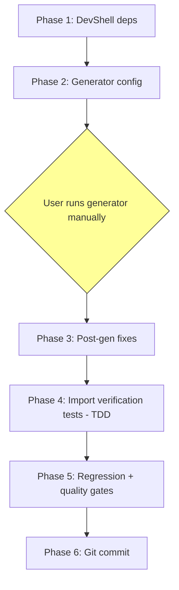

# Implementation Plan: CUP-018 Phase 2 — Generated Python API Client

**Status:** ✅ COMPLETED
**Parent Story:** [CUP-018 SCP CLI Restructuring](18-scp-cli-restructuring.md)
**Phase:** 2 of 4

---

## Goal

Generate a typed Python API client package at `scripts/scp_client/` from the netcup SCP OpenAPI 3.0.3 spec (`infra/http/netcup_SCP_OpenAPI_Spec.json`), so that Phases 3a/3b can consume typed models and API methods instead of hand-crafted HTTP calls.

## Context

Phase 1 (completed) added `openapi download` and `openapi mcp` subcommands. Phase 2 produces the generated client package that coexists alongside the existing `ScpApiClient` in `scripts/netcup_firewall.py`. The existing CLI is **not modified** in this phase — the generated client is only verified for import paths, type correctness, and quality gates.

**Key constraint:** The user runs all `openapi-python-client generate` commands manually. The AI prepares everything around the generation step (devShell deps, config, post-generation fixes, tests, quality gates) but does NOT execute the generator.

## Acceptance Criteria

| ID | Criterion | Verification |
|----|-----------|-------------|
| 2.1 | Python package at `scripts/scp_client/` with typed models for all schemas | `python -c "from scp_client.models import ServerFirewall"` |
| 2.2 | Import `from scp_client.api.servers import ...` works; function accepts `server_id`, `mac`, `httpx.Client` | Test: `test_import_server_firewall_endpoint` |
| 2.3 | Import `from scp_client.api.users import ...` works; function accepts `user_id`, `httpx.Client` | Test: `test_import_user_policy_endpoint` |
| 2.4 | `cd scripts && mypy --strict netcup_firewall.py` passes with zero errors | CI quality gate |

## Technical Analysis

### Generator Tool

`openapi-python-client` v0.28.3 (available in nixpkgs as `pkgs.openapi-python-client`).

- Generates `httpx`-based API functions grouped by OpenAPI tags
- Produces `attrs`-based model classes with full type annotations
- Creates `py.typed` marker for PEP 561 compliance
- Output structure: `<package>/api/<tag>/`, `<package>/models/`, `<package>/client.py`
- Post-generation hooks run `ruff` for formatting/linting
- Metadata option `none` skips `pyproject.toml` generation (package is not independently installable)

### Runtime Dependencies Introduced

| Package | Purpose | nixpkgs attr |
|---------|---------|-------------|
| `httpx` | HTTP client used by generated code | `pkgs.python3Packages.httpx` |
| `attrs` | Model dataclasses in generated code | `pkgs.python3Packages.attrs` |

These are **runtime** dependencies of the generated `scp_client` package. They must be in the devShell for tests and `mypy` to work. They will also be required in the eventual Nix package definition (Phase 3+).

### Generated Package Structure (Expected)

```
scripts/scp_client/
├── __init__.py
├── py.typed
├── client.py              # Client / AuthenticatedClient classes
├── errors.py              # Exception types
├── types.py               # Shared type definitions (UNSET, File, etc.)
├── api/
│   ├── __init__.py
│   ├── servers/           # Tag: Servers — firewall GET/PUT, reapply, restore
│   ├── server_firewalls/  # Tag: Server Firewalls — policy endpoints
│   ├── users/             # Tag: Users — policy CRUD
│   ├── tasks/             # Tag: Tasks — task polling
│   └── ...                # Other tags (Miscellaneous, Metrics, etc.)
└── models/
    ├── __init__.py
    ├── server_firewall.py
    ├── server_firewall_save.py
    ├── firewall_policy.py
    ├── firewall_policy_save.py
    ├── firewall_rule.py
    ├── firewall_action.py
    ├── firewall_protocol.py
    ├── firewall_rule_direction.py
    ├── implicit_rule.py
    ├── identifier_int.py
    ├── task_info.py
    ├── task_state.py
    └── ...                 # All other schemas
```

**Note:** Exact directory/file names depend on how `openapi-python-client` maps OpenAPI tags and schema names to Python module names. The actual structure will be verified after generation.

### Generator Configuration

A `config.yaml` file controls generation behavior:

```yaml
project_name_override: scp-client
package_name_override: scp_client
```

Key config decisions:
- `project_name_override` / `package_name_override`: Force predictable output path
- Metadata type `none`: Skip `pyproject.toml` — this is an in-tree package, not published to PyPI

### mypy Considerations

- The generated `scp_client` package includes `py.typed` → mypy treats it as typed
- The existing `scripts/netcup_firewall.py` does NOT import `scp_client` in Phase 2 → no `Any` leakage risk yet
- `mypy --strict` must pass on **both** the generated client and the existing CLI
- `httpx` stubs may be needed — `python3Packages.types-httpx` or inline types from httpx itself

### What the AI Does vs. What the User Does

| Step | Actor | Action |
|------|-------|--------|
| Add devShell deps | AI (Code Mode) | Edit `flake.nix` |
| Create generator config | AI (Code Mode) | Write `scripts/openapi-client-config.yaml` |
| Run `openapi-python-client generate` | **User (manual)** | Execute command in terminal |
| Post-generation fixes | AI (Code Mode) | Fix formatting, mypy issues, module structure |
| Write import verification tests | AI (Code Mode) | TDD in `scripts/tests/test_scp_client.py` |
| Run quality gates | AI (Code Mode) | Execute `mypy`, `ruff check`, `ruff format` |

---

## Phase 0: Validation Strategy

### Validation Commands

| Command | Purpose |
|---------|---------|
| `nix flake check --no-build` | Nix evaluation (after devShell changes) |
| `nix flake check` | Full check including Nix lint gates |
| `cd scripts && python3 -m pytest tests/ -v` | All Python tests (130+ existing + new) |
| `cd scripts && mypy --strict netcup_firewall.py` | Type checking existing CLI |
| `cd scripts && mypy --strict scp_client/` | Type checking generated client |
| `cd scripts && ruff check .` | Linting |
| `cd scripts && ruff format --check .` | Format verification |

### Rollback Path

- `git revert` the devShell changes in `flake.nix`
- `rm -rf scripts/scp_client/` to remove generated code
- No host configurations affected — zero deployment risk

### Dangerous Changes

None. This phase modifies only:
- `flake.nix` (devShell dependencies)
- `scripts/` (new files only; no existing file modifications)

---

## Implementation Phases

### Phase 1: DevShell Dependency Additions

Add the runtime and build-time dependencies needed for the generated client.

**Step 1.1:** Add `httpx` to devShell `nativeBuildInputs`

- File: `flake.nix` line 278–288 (devShell `nativeBuildInputs` list)
- Add: `pkgs.python3Packages.httpx`
- Reason: Generated client uses `httpx.Client` / `httpx.AsyncClient`

**Step 1.2:** Add `attrs` to devShell `nativeBuildInputs`

- File: `flake.nix` line 278–288
- Add: `pkgs.python3Packages.attrs`
- Reason: Generated models use `@attrs.define` decorators

**Step 1.3:** Add `openapi-python-client` to devShell `nativeBuildInputs`

- File: `flake.nix` line 278–288
- Add: `pkgs.openapi-python-client`
- Reason: User needs the generator CLI available in `nix develop`

**Step 1.4:** Validate flake

- Run: `nix flake check --no-build`
- Expected: PASS (devShell evaluates without errors)

**Verification:** `nix develop --command which openapi-python-client` returns a valid path.

---

### Phase 2: Generator Configuration

Create the configuration file that controls `openapi-python-client` output.

**Step 2.1:** Create `scripts/openapi-client-config.yaml`

- File: `scripts/openapi-client-config.yaml` (new)
- Content:

```yaml
project_name_override: scp-client
package_name_override: scp_client
```

**Step 2.2:** Document the generation command for the user

The user will run (inside `nix develop`):

```bash
cd scripts && openapi-python-client generate \
  --path ../infra/http/netcup_SCP_OpenAPI_Spec.json \
  --config openapi-client-config.yaml \
  --meta none \
  --output-path scp_client
```

Flags explained:
- `--path`: Local spec file (no network dependency)
- `--config`: Our config overriding package name
- `--meta none`: Skip `pyproject.toml` generation
- `--output-path scp_client`: Write directly into `scripts/scp_client/`

**This step is a USER ACTION — the AI does NOT run this command.**

---

### Phase 3: Post-Generation Verification and Fixes

After the user runs the generator, the AI inspects and fixes the output.

**Step 3.1:** Verify generated package structure

- Check `scripts/scp_client/__init__.py` exists
- Check `scripts/scp_client/py.typed` exists
- Check `scripts/scp_client/models/` contains expected model files
- Check `scripts/scp_client/api/` contains endpoint modules

**Step 3.2:** Run `ruff format` on generated code

- Run: `cd scripts && ruff format scp_client/`
- Reason: Generator's built-in ruff may use different config than project

**Step 3.3:** Run `ruff check` on generated code and fix issues

- Run: `cd scripts && ruff check scp_client/`
- Fix any linting violations (likely: import ordering, unused imports)
- Auto-fix safe issues: `cd scripts && ruff check --fix scp_client/`

**Step 3.4:** Run `mypy --strict` on generated client

- Run: `cd scripts && mypy --strict scp_client/`
- Fix type annotation issues if any (common: missing return types, `Any` usage)
- If `httpx` type stubs are missing, add `pkgs.python3Packages.types-httpx` to devShell (if available) or configure mypy to ignore httpx

**Step 3.5:** Verify key model classes exist

- `from scp_client.models import ServerFirewall` — must succeed
- `from scp_client.models import ServerFirewallSave` — must succeed
- `from scp_client.models import FirewallPolicy` — must succeed
- `from scp_client.models import FirewallPolicySave` — must succeed
- `from scp_client.models import FirewallRule` — must succeed
- `from scp_client.models import IdentifierInt` — must succeed
- `from scp_client.models import TaskInfo` — must succeed

**Step 3.6:** Verify key API functions exist

- Identify the actual module path for server firewall GET endpoint
- Identify the actual module path for user policy LIST endpoint
- Document the real import paths (may differ from acceptance criteria assumptions)

**Note:** The acceptance criteria reference `scp_client.api.servers` and `scp_client.api.users`, but `openapi-python-client` groups by OpenAPI tags. The spec uses tags `Server Firewalls`, `Users`, `Servers`, `Tasks`. Actual module names will be snake_cased versions: `server_firewalls`, `users`, `servers`, `tasks`. The test assertions must use the **actual** generated paths.

---

### Phase 4: Import Verification Tests (TDD)

Write tests that verify the acceptance criteria import paths. Follow Red-Green-Refactor.

**Step 4.1:** Create test file `scripts/tests/test_scp_client.py`

- File: `scripts/tests/test_scp_client.py` (new)
- Module docstring describing purpose

**Step 4.2:** RED — Write `test_import_server_firewall_model`

- Assert: `from scp_client.models import ServerFirewall` succeeds
- Assert: `ServerFirewall` has attributes `copied_policies`, `user_policies`, `ingress_implicit_rule`, `egress_implicit_rule`, `consistent`, `active`
- Run: `cd scripts && python3 -m pytest tests/test_scp_client.py::test_import_server_firewall_model -v` → FAIL (if scp_client not yet generated) or PASS (if generated)

**Step 4.3:** RED — Write `test_import_firewall_policy_model`

- Assert: `from scp_client.models import FirewallPolicy` succeeds
- Assert: `FirewallPolicy` has attributes for `id`, `name`, `rules`

**Step 4.4:** RED — Write `test_import_firewall_rule_model`

- Assert: `from scp_client.models import FirewallRule` succeeds
- Assert: `FirewallRule` has attributes for `direction`, `protocol`, `action`, `sources`, `destinations`, `source_ports`, `destination_ports`

**Step 4.5:** RED — Write `test_import_server_firewall_get_endpoint`

- Assert: Import of the GET server firewall API function succeeds
- Assert: Function is callable
- Note: Actual import path determined in Phase 3, Step 3.6

**Step 4.6:** RED — Write `test_import_user_policy_list_endpoint`

- Assert: Import of the LIST user firewall policies API function succeeds
- Assert: Function is callable
- Note: Actual import path determined in Phase 3, Step 3.6

**Step 4.7:** RED — Write `test_import_enum_types`

- Assert: `FirewallAction` enum has members `ACCEPT`, `DROP`
- Assert: `FirewallProtocol` enum has members `TCP`, `UDP`, `ICMP`, `ICMPV6`
- Assert: `FirewallRuleDirection` enum has members `INGRESS`, `EGRESS`
- Assert: `ImplicitRule` enum has members `ACCEPT_ALL`, `DROP_ALL`

**Step 4.8:** GREEN — All tests pass against generated code

- Run: `cd scripts && python3 -m pytest tests/test_scp_client.py -v` → ALL PASS

---

### Phase 5: Regression and Quality Gates

**Step 5.1:** Run all existing tests

- Run: `cd scripts && python3 -m pytest tests/ -v`
- Expected: All 130+ existing tests PASS; new `test_scp_client.py` tests PASS

**Step 5.2:** mypy --strict on existing CLI

- Run: `cd scripts && mypy --strict netcup_firewall.py`
- Expected: Zero errors (no changes to existing CLI)

**Step 5.3:** mypy --strict on generated client

- Run: `cd scripts && mypy --strict scp_client/`
- Expected: Zero errors

**Step 5.4:** ruff check entire scripts directory

- Run: `cd scripts && ruff check .`
- Expected: Zero violations

**Step 5.5:** ruff format check

- Run: `cd scripts && ruff format --check .`
- Expected: Zero reformatting needed

**Step 5.6:** nix flake check

- Run: `nix flake check`
- Expected: PASS (all Nix checks including lint gates)

---

### Phase 6: Git Commit and Completion

**Step 6.1:** Add generated client to git

- `git add scripts/scp_client/`
- `git add scripts/openapi-client-config.yaml`
- `git add scripts/tests/test_scp_client.py`

**Step 6.2:** Commit devShell changes

- Commit message: `feat(devshell): add httpx, attrs, openapi-python-client`
- Files: `flake.nix`

**Step 6.3:** Commit generated client and tests

- Commit message: `feat(scp-client): generate typed API client from OpenAPI spec`
- Files: `scripts/scp_client/`, `scripts/openapi-client-config.yaml`, `scripts/tests/test_scp_client.py`

---

## Execution Flow



---

## Risks and Mitigations

| Risk | Impact | Mitigation |
|------|--------|------------|
| Generator output structure differs from expected | Test import paths wrong | Phase 3 Step 3.6 inspects actual paths before writing tests |
| `mypy --strict` fails on generated code | Quality gate blocked | Post-gen fixes in Phase 3; worst case: targeted `# type: ignore` with TODO |
| `httpx` type stubs missing in nixpkgs | mypy cannot resolve httpx types | httpx ships inline types since v0.23; verify in devShell |
| Generator cannot handle all spec schemas | Missing models | Verify key schemas in Phase 3 Step 3.5; non-firewall schemas are nice-to-have |
| `--meta none` flag not supported in v0.28.3 | Extra pyproject.toml generated | Delete it in post-gen cleanup; minor inconvenience |
| `attrs` model style causes mypy issues | Strict mode failures | Consider `--literal-enums` config if enum types cause issues |

## Constraints

- Generated `scp_client/` coexists with existing `netcup_firewall.py` — no modifications to existing CLI
- No Nix package definition changes in this phase (deferred to Phase 3+)
- Generated code is committed to git (decision from user story Open Points)
- AI does NOT execute the generator — user runs it manually

## Out of Scope

- Replacing `ScpApiClient` with generated client (Phase 3)
- Wiring `scp_client` imports into `netcup_firewall.py` (Phase 3)
- Nix package definition for the CLI (Phase 3+)
- Reconciling field name discrepancies between spec and existing CLI (Phase 3)

---

## Current Status

### Current Status
- **Status**: ✅ COMPLETED
- **Completed Date**: 2026-04-15
- **Commits**: `b178637` (devShell + config), `e16a1a4` (generated client + tests)

## Completion Log

- Phase 1 (DevShell): Added `httpx`, `attrs`, `openapi-python-client` to devShell; committed `b178637`
- Phase 2 (Generator config): Created `scripts/openapi-client-config.yaml`
- Phase 3 (Post-gen fixes): Verified generated `scripts/scp_client/` (205 files); applied `ruff format` and `ruff check --fix`
- Phase 4 (Import tests): Wrote 27 import verification tests in `scripts/tests/test_scp_client.py`; all pass
- Phase 5 (Quality gates): `mypy --strict`, `ruff check`, `ruff format --check`, `nix flake check` — all PASS
- Phase 6 (Commit): Generated client + tests committed `e16a1a4`
