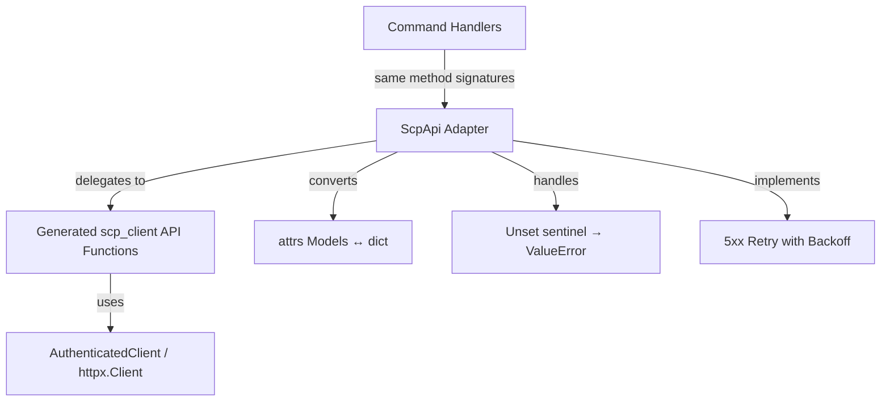

# Implementation Plan: CUP-018 Phase 4 — Generated Client Migration & Legacy Cleanup

**Status:** NOT STARTED
**Parent Story:** [CUP-018 SCP CLI Restructuring](18-scp-cli-restructuring.md)
**Prerequisite:** [Phase 3 — Server Firewall & Policy CRUD Commands](18-phase3-implementation.md) (COMPLETED)

---

## Goal

Migrate ALL commands in [`scripts/netcup_firewall.py`](../../scripts/netcup_firewall.py) from the hand-written [`ScpApiClient`](../../scripts/netcup_firewall.py:341) (using `requests.Session` + `urllib3.Retry`) to the generated [`scp_client`](../../scripts/scp_client/__init__.py) package (using `httpx.Client` + `AuthenticatedClient`). Delete `ScpApiClient` and remove the `cmd_apply` stub.

## Business Context

CUP-018 Phases 1–3 are complete. The generated client exists at [`scripts/scp_client/`](../../scripts/scp_client/) with 205 fully typed files, but is not used by any command. All 14 command handlers still route through the hand-written `ScpApiClient`. This phase completes the migration: every API call goes through the generated client, the legacy HTTP plumbing is deleted, and the dead `cmd_apply` stub is removed.

## Acceptance Criteria

- [ ] AC-1: All command handlers use the new `ScpApi` adapter (no direct `ScpApiClient` usage remains)
- [ ] AC-2: `ScpApiClient` class is deleted from [`netcup_firewall.py`](../../scripts/netcup_firewall.py:341)
- [ ] AC-3: `cmd_apply` stub, its parser entry, and its tests are deleted
- [ ] AC-4: `from requests.adapters import HTTPAdapter` and `from urllib3.util.retry import Retry` imports are removed
- [ ] AC-5: All existing tests pass (count adjusted for removed `cmd_apply` tests)
- [ ] AC-6: `mypy --strict`, `ruff check`, `ruff format --check` all pass
- [ ] AC-7: Generated client retry behavior matches legacy: connection-level retries (3 attempts) + 5xx retry with backoff for idempotent operations (GET/PUT/DELETE)
- [ ] AC-8: `wait_for_task` uses [`TaskState.FINISHED`](../../scripts/scp_client/models/task_state.py:7) / [`TaskState.ERROR`](../../scripts/scp_client/models/task_state.py:6) (not legacy string `"COMPLETED"`/`"FAILED"`)
- [ ] AC-9: Backup file format unchanged (camelCase keys, same JSON structure)

---

## Technical Analysis

### Scope Decisions

| Decision | Choice | Rationale |
|----------|--------|-----------|
| Remove `cmd_apply` stub? | **YES** | Dead code — always `sys.exit(1)`. References obsolete "Epic 15" |
| Test strategy? | **Rewrite in-place** | Adapter has identical method signatures; most tests only need `spec=ScpApi` |
| Adapter layer? | **YES — `ScpApi` class** | Encapsulates verbose import paths, retry logic, `Unset` handling, model→dict conversion |

### Architecture: `ScpApi` Adapter



The `ScpApi` adapter class replaces `ScpApiClient` at the same location in [`netcup_firewall.py`](../../scripts/netcup_firewall.py:341). It preserves **identical method signatures** so command handlers require only a type annotation change.

### `ScpApi` Constructor

```python
class ScpApi:
    def __init__(self, access_token: str) -> None:
        self._client = AuthenticatedClient(
            base_url="https://www.servercontrolpanel.de/scp-core",
            token=access_token,
            timeout=httpx.Timeout(30.0, connect=10.0),
            raise_on_unexpected_status=True,
            httpx_args={"transport": httpx.HTTPTransport(retries=3)},
        )
```

Key differences from `ScpApiClient`:

| Aspect | Legacy `ScpApiClient` | New `ScpApi` |
|--------|----------------------|--------------|
| HTTP library | `requests.Session` | `httpx.Client` via `AuthenticatedClient` |
| Base URL | `BASE_URL` = `".../scp-core/api/v1"` | `".../scp-core"` (generated URLs include `/api/v1/`) |
| Auth header | Manual `Authorization: Bearer` header | `AuthenticatedClient` adds it automatically |
| Retry (connection) | `urllib3.Retry(total=3)` | `httpx.HTTPTransport(retries=3)` |
| Retry (5xx) | `urllib3.Retry(status_forcelist=[500,502,503,504])` for GET/PUT/DELETE | Custom `_retry_on_5xx` wrapper catching `UnexpectedStatus` |
| Response type | `resp.json()` → `dict` | Generated model → `.to_dict()` → `dict` |
| Error model | `resp.raise_for_status()` raises `requests.HTTPError` | `raise_on_unexpected_status=True` raises `UnexpectedStatus` on undocumented codes; documented errors (404, 422) return typed error models |

### 5xx Retry Strategy

The legacy `urllib3.Retry(total=3, backoff_factor=1, status_forcelist=[500,502,503,504])` retries 5xx responses for GET/PUT/DELETE but NOT for POST (urllib3 default `allowed_methods` excludes POST).

The adapter replicates this with a `_retry_on_5xx` helper method:

```python
def _retry_on_5xx(self, fn: Callable[..., T], *args: Any, **kwargs: Any) -> T:
    """Retry on 5xx UnexpectedStatus, up to 3 retries with backoff."""
    for attempt in range(4):  # initial + 3 retries
        try:
            return fn(*args, **kwargs)
        except UnexpectedStatus as exc:
            if exc.status_code < 500 or attempt == 3:
                raise
            time.sleep(attempt)  # 0s, 1s, 2s
```

Applied to GET/PUT/DELETE adapter methods. NOT applied to `create_policy` or `post_openapi_mcp` (POST operations).

### Method Mapping: `ScpApiClient` → `ScpApi`

| `ScpApiClient` Method | Generated API Module | Key Conversion |
|----------------------|---------------------|----------------|
| [`find_server(name)`](../../scripts/netcup_firewall.py:400) | [`get_api_v1_servers.sync(name=name)`](../../scripts/scp_client/api/servers/get_api_v1_servers.py) | `ServerListMinimal` → check `.name`/`.id`, handle `Unset` |
| [`get_interfaces(server_id)`](../../scripts/netcup_firewall.py:426) | [`get_api_v_1_servers_server_id_interfaces.sync(server_id)`](../../scripts/scp_client/api/server_networking/get_api_v_1_servers_server_id_interfaces.py) | `list[Interface]` → `[iface.to_dict() for iface]` |
| [`get_firewall(server_id, mac)`](../../scripts/netcup_firewall.py:438) | [`get_api_v_1_servers_server_id_interfaces_mac_firewall.sync(server_id, mac)`](../../scripts/scp_client/api/server_firewalls/get_api_v_1_servers_server_id_interfaces_mac_firewall.py) | `ServerFirewall` → `.to_dict()` |
| [`set_firewall(server_id, mac, policy_ids)`](../../scripts/netcup_firewall.py:451) | [`put_api_v_1_servers_server_id_interfaces_mac_firewall.sync(server_id, mac, body=ServerFirewallSave(...))`](../../scripts/scp_client/api/server_firewalls/put_api_v_1_servers_server_id_interfaces_mac_firewall.py) | Build `ServerFirewallSave` with `IdentifierInt` list; extract `TaskInfo.uuid` |
| [`wait_for_task(uuid)`](../../scripts/netcup_firewall.py:562) | [`get_api_v1_tasks_uuid.sync(uuid)`](../../scripts/scp_client/api/tasks/get_api_v1_tasks_uuid.py) | Check `TaskInfo.state` enum: `FINISHED`→return, `ERROR`→raise |
| [`list_policies(user_id)`](../../scripts/netcup_firewall.py:481) | [`get_api_v_1_users_user_id_firewall_policies.sync(user_id)`](../../scripts/scp_client/api/server_firewalls/get_api_v_1_users_user_id_firewall_policies.py) | `list[FirewallPolicy]` → `[p.to_dict() for p]` |
| [`get_policy(user_id, pid)`](../../scripts/netcup_firewall.py:493) | [`get_api_v_1_users_user_id_firewall_policies_id.sync(user_id, pid)`](../../scripts/scp_client/api/server_firewalls/get_api_v_1_users_user_id_firewall_policies_id.py) | `FirewallPolicy` → `.to_dict()` |
| [`create_policy(user_id, name, rules)`](../../scripts/netcup_firewall.py:506) | [`post_api_v_1_users_user_id_firewall_policies.sync(user_id, body=FirewallPolicySave(...))`](../../scripts/scp_client/api/server_firewalls/post_api_v_1_users_user_id_firewall_policies.py) | Convert rule dicts → `FirewallRule` objects; **NO 5xx retry** (POST) |
| [`update_policy(user_id, pid, name, rules)`](../../scripts/netcup_firewall.py:528) | [`put_api_v_1_users_user_id_firewall_policies_id.sync(user_id, pid, body=FirewallPolicySave(...))`](../../scripts/scp_client/api/server_firewalls/put_api_v_1_users_user_id_firewall_policies_id.py) | Returns `FirewallPolicyUpdateResult`; extract `.firewall_policy.to_dict()` |
| [`delete_policy(user_id, pid)`](../../scripts/netcup_firewall.py:553) | [`delete_api_v_1_users_user_id_firewall_policies_id.sync(user_id, pid)`](../../scripts/scp_client/api/server_firewalls/delete_api_v_1_users_user_id_firewall_policies_id.py) | Returns `None` on success (204) |
| [`get_openapi_spec()`](../../scripts/netcup_firewall.py:471) | [`get_api_v_1_openapi.sync()`](../../scripts/scp_client/api/miscellaneous/get_api_v_1_openapi.py) | Response → dict |
| [`post_openapi_mcp(message)`](../../scripts/netcup_firewall.py:476) | [`post_api_v_1_openapi_mcp.sync(body=...)`](../../scripts/scp_client/api/miscellaneous/post_api_v_1_openapi_mcp.py) | **NO 5xx retry** (POST) |

### Critical Migration Gaps

#### 1. TaskState Mismatch (HIGH)

Legacy [`wait_for_task`](../../scripts/netcup_firewall.py:562) checks string `"COMPLETED"`/`"FAILED"`. The generated [`TaskState`](../../scripts/scp_client/models/task_state.py) enum uses `FINISHED`/`ERROR`. Additionally, the legacy code reads `data.get("status")` but the API field is `"state"` (per the OpenAPI spec and generated [`TaskInfo`](../../scripts/scp_client/models/task_info.py:47)). The adapter fixes both issues by using `TaskInfo.state == TaskState.FINISHED`.

#### 2. FirewallRule Field Mapping (HIGH)

Legacy commands construct rules with `sourceIp` (single string) and `destinationPort` (string). The generated [`FirewallRule`](../../scripts/scp_client/models/firewall_rule.py:21) uses `sources` (`list[str]`) and `destination_ports` (`str`). The adapter needs a conversion helper:

```python
def _legacy_rule_to_firewall_rule(rule: dict[str, Any]) -> FirewallRule:
    sources: list[str] | Unset = UNSET
    if "sourceIp" in rule and rule["sourceIp"]:
        sources = [rule["sourceIp"]]
    elif "sources" in rule:
        sources = rule["sources"]

    dest_ports: str | Unset = UNSET
    if "destinationPort" in rule:
        dest_ports = rule["destinationPort"]
    elif "destinationPorts" in rule:
        dest_ports = rule["destinationPorts"]

    return FirewallRule(
        direction=FirewallRuleDirection(rule["direction"]),
        protocol=FirewallProtocol(rule["protocol"]),
        action=FirewallAction(rule["action"]),
        sources=sources,
        destination_ports=dest_ports,
    )
```

This accepts BOTH legacy (`sourceIp`/`destinationPort`) and new (`sources`/`destinationPorts`) field names, maintaining backward compatibility with user policy files.

#### 3. `Unset` Sentinel Handling (MEDIUM)

Generated model fields use the [`Unset`](../../scripts/scp_client/types.py:10) sentinel instead of `None`. The adapter's `find_server` must guard: `if isinstance(server.id, Unset): raise ValueError(...)`. All model-to-dict conversions use `.to_dict()` which handles `Unset` internally.

#### 4. Error Model Return Types (MEDIUM)

Generated `sync()` functions may return error model objects (e.g., `ValidationError`, `NotFoundError`) for documented error status codes (404, 422). The adapter must type-check results: `if isinstance(result, ValidationError): raise ValueError(...)`.

#### 5. `update_policy` Return Type (MEDIUM)

The PUT policy endpoint returns [`FirewallPolicyUpdateResult`](../../scripts/scp_client/models/firewall_policy_update_result.py) containing both `firewall_policy` and `task_info`. The adapter extracts `.firewall_policy.to_dict()` to match the legacy return format.

### Test Impact Analysis

**32 test classes** in [`test_netcup_firewall.py`](../../scripts/tests/test_netcup_firewall.py) (187 methods, 3690 lines):

| Category | Classes | Change Required |
|----------|---------|----------------|
| Mock `spec=ScpApiClient` → `spec=ScpApi` | `TestServerFirewallGetCommand`, `TestServerFirewallSetCommand`, `TestPolicyListCommand`, `TestPolicyCreateCommand`, `TestPolicyUpdateCommand`, `TestPolicyDeleteCommand`, `TestBackupCommand`, `TestLockdownCommand`, `TestRestoreCommand`, `TestSshOpenCommand`, `TestSshCloseCommand`, `TestGetCurrentPolicyIds`, `TestFindOrCreateSshPolicy`, `TestOpenApiDownloadCommand`, `TestOpenApiMcpCommand`, `TestWorkflow` | Mechanical `spec=` change only (~16 classes) |
| Full rewrite (test `ScpApi` internals) | `TestScpApiClient`, `TestScpApiClientOpenapi` | Rewrite: mock generated API functions instead of `requests.Session` |
| Update auth helper references | `TestAuthenticateNoUser`, `TestMain`, `TestErrorPaths` | Update `ScpApiClient` references to `ScpApi` |
| Remove entirely | `TestApplyCommand` | `cmd_apply` deleted |
| No change | `TestArgParsing`, `TestOutputFlagArgParsing`, `TestServerFirewallArgParsing`, `TestPolicyArgParsing`, `TestOpenApiArgParsing`, `TestScpAuth`, `TestValidateSourceIp`, `TestCamelToSnake`, `TestKeyringCredentials`, `TestPolicyLoading` | Pure functions / unrelated to API client (~10 classes) |

### Files Changed

| File | Change |
|------|--------|
| [`scripts/netcup_firewall.py`](../../scripts/netcup_firewall.py) | Replace `ScpApiClient` with `ScpApi`; add generated client imports; update type annotations; delete `cmd_apply`; remove `HTTPAdapter`/`Retry` imports |
| [`scripts/tests/test_netcup_firewall.py`](../../scripts/tests/test_netcup_firewall.py) | Update mock specs; rewrite `TestScpApiClient`/`TestScpApiClientOpenapi`; delete `TestApplyCommand`; update imports |

No other files are modified. The generated [`scp_client/`](../../scripts/scp_client/) package is read-only.

### Helper Functions Requiring Type Annotation Update

All helper functions that take `client: ScpApiClient` need annotation change to `client: ScpApi`. Method calls remain identical.

- [`_gather_interface_firewall_state`](../../scripts/netcup_firewall.py:646)
- [`_find_policy_by_name`](../../scripts/netcup_firewall.py:799)
- [`_get_current_policy_ids`](../../scripts/netcup_firewall.py:1068)
- [`_find_or_create_lockdown_policy`](../../scripts/netcup_firewall.py:1085)
- [`_find_or_create_ssh_policy`](../../scripts/netcup_firewall.py:1118)
- [`_apply_lockdown_to_interfaces`](../../scripts/netcup_firewall.py:1166)
- [`_restore_policies`](../../scripts/netcup_firewall.py:1267)
- [`_reassign_firewall_interfaces`](../../scripts/netcup_firewall.py:1308)

### Import Changes

**Added imports** (in [`netcup_firewall.py`](../../scripts/netcup_firewall.py)):

```python
import httpx
from scp_client.client import AuthenticatedClient
from scp_client.errors import UnexpectedStatus
from scp_client.types import Unset, UNSET
from scp_client.models.server_list_minimal import ServerListMinimal
from scp_client.models.interface import Interface
from scp_client.models.server_firewall import ServerFirewall
from scp_client.models.server_firewall_save import ServerFirewallSave
from scp_client.models.identifier_int import IdentifierInt
from scp_client.models.firewall_policy import FirewallPolicy
from scp_client.models.firewall_policy_save import FirewallPolicySave
from scp_client.models.firewall_policy_update_result import FirewallPolicyUpdateResult
from scp_client.models.firewall_rule import FirewallRule
from scp_client.models.firewall_rule_direction import FirewallRuleDirection
from scp_client.models.firewall_protocol import FirewallProtocol
from scp_client.models.firewall_action import FirewallAction
from scp_client.models.task_info import TaskInfo
from scp_client.models.task_state import TaskState
from scp_client.models.not_found_error import NotFoundError
from scp_client.models.validation_error import ValidationError
from scp_client.api.servers import get_api_v1_servers
from scp_client.api.server_networking import get_api_v_1_servers_server_id_interfaces
from scp_client.api.server_firewalls import (
    get_api_v_1_servers_server_id_interfaces_mac_firewall,
    put_api_v_1_servers_server_id_interfaces_mac_firewall,
    get_api_v_1_users_user_id_firewall_policies,
    get_api_v_1_users_user_id_firewall_policies_id,
    post_api_v_1_users_user_id_firewall_policies,
    put_api_v_1_users_user_id_firewall_policies_id,
    delete_api_v_1_users_user_id_firewall_policies_id,
)
from scp_client.api.tasks import get_api_v1_tasks_uuid
from scp_client.api.miscellaneous import get_api_v_1_openapi, post_api_v_1_openapi_mcp
```

**Removed imports:**

```python
from requests.adapters import HTTPAdapter
from urllib3.util.retry import Retry
```

Note: `import requests` stays — [`ScpAuth`](../../scripts/netcup_firewall.py:62) still uses `requests.get()` / `requests.post()` for OIDC endpoints.

---

## Phase 0: Validation Strategy

### Validation Commands

| Check | Command |
|-------|---------|
| Python tests | `cd scripts && python3 -m pytest tests/test_netcup_firewall.py -v` |
| Type checking | `cd scripts && mypy --strict netcup_firewall.py` |
| Linting | `cd scripts && ruff check .` |
| Formatting | `cd scripts && ruff format --check .` |
| scp_client smoke | `cd scripts && python3 -m pytest tests/test_scp_client.py -v` |

### Rollback Path

All changes are in two files. `git checkout -- scripts/netcup_firewall.py scripts/tests/test_netcup_firewall.py` reverts to pre-migration state.

### Dangerous Change Categories

None. This phase changes only Python CLI code. No Nix config, networking, boot, or filesystem changes.

---

## Implementation Phases

### Phase 1: `ScpApi` Adapter — Constructor + Retry Helper

Build the adapter class skeleton with constructor and retry mechanism. All generated API function calls are mocked in tests.

**Location:** [`scripts/netcup_firewall.py`](../../scripts/netcup_firewall.py), replacing `ScpApiClient` at line ~341. During migration, BOTH classes coexist temporarily.

#### Cycle 1.1 — Constructor creates `AuthenticatedClient`

- **Red:** Test that `ScpApi(access_token="tok")` creates an `AuthenticatedClient` with `base_url="https://www.servercontrolpanel.de/scp-core"`, `token="tok"`, `raise_on_unexpected_status=True`, and `httpx.Timeout(30.0, connect=10.0)`
- **Green:** Implement `ScpApi.__init__` with `AuthenticatedClient` construction
- **Verify:** `pytest -v -k test_scpapi_constructor`

#### Cycle 1.2 — 5xx Retry Helper

- **Red:** Test that `_retry_on_5xx` retries up to 3 times on `UnexpectedStatus` with status 500, then succeeds; test that it re-raises on 4th failure; test that non-5xx `UnexpectedStatus` is NOT retried
- **Green:** Implement `_retry_on_5xx` method with `time.sleep(attempt)` backoff
- **Verify:** `pytest -v -k test_retry_on_5xx`

#### Cycle 1.3 — `httpx.HTTPTransport(retries=3)` for connection retries

- **Red:** Test that `ScpApi` constructor passes `httpx_args` containing `transport` with `retries=3`
- **Green:** Add `httpx_args={"transport": httpx.HTTPTransport(retries=3)}` to constructor
- **Verify:** `pytest -v -k test_scpapi_transport_retries`

**Commit after Phase 1**

### Phase 2: `ScpApi` — Server + Interface Operations

#### Cycle 2.1 — `find_server` success path

- **Red:** Test `ScpApi.find_server("cupix001")` with mocked `get_api_v1_servers.sync` returning `[ServerListMinimal(id=123, name="cupix001")]` → returns `123`
- **Green:** Implement `find_server`, calling generated function, iterating results, matching by `.name`, returning `.id`
- **Verify:** `pytest -v -k test_scpapi_find_server_success`

#### Cycle 2.2 — `find_server` not found

- **Red:** Test `find_server("nonexistent")` with mocked empty list → raises `ValueError`
- **Green:** Raise `ValueError` when no matching server found
- **Verify:** `pytest -v -k test_scpapi_find_server_not_found`

#### Cycle 2.3 — `find_server` missing ID

- **Red:** Test `find_server` when server has `name` match but `id` is `UNSET` → raises `ValueError`
- **Green:** Guard against `isinstance(server.id, Unset)`
- **Verify:** `pytest -v -k test_scpapi_find_server_missing_id`

#### Cycle 2.4 — `get_interfaces`

- **Red:** Test `get_interfaces(123)` with mocked `get_api_v_1_servers_server_id_interfaces.sync` returning `[Interface(mac="aa:bb:cc:dd:ee:ff")]` → returns `[{"mac": "aa:bb:cc:dd:ee:ff"}]`
- **Green:** Implement `get_interfaces`, calling generated function, converting `Interface` models to dicts via `.to_dict()`
- **Verify:** `pytest -v -k test_scpapi_get_interfaces`

**Commit after Phase 2**

### Phase 3: `ScpApi` — Firewall Read/Write + Task Polling

#### Cycle 3.1 — `get_firewall`

- **Red:** Test `get_firewall(123, "aa:bb:cc:dd:ee:ff")` with mocked `get_api_v_1_servers_server_id_interfaces_mac_firewall.sync` returning `ServerFirewall(user_policies=[...], active=True)` → returns equivalent dict
- **Green:** Implement `get_firewall`, handle `ValidationError` return type (→ `ValueError`), call `.to_dict()`
- **Verify:** `pytest -v -k test_scpapi_get_firewall`

#### Cycle 3.2 — `set_firewall`

- **Red:** Test `set_firewall(123, "mac", [42, 99])` with mocked PUT returning `TaskInfo(uuid="task-uuid-1")` → returns `"task-uuid-1"`
- **Green:** Implement `set_firewall`: build `ServerFirewallSave(user_policies=[IdentifierInt(id=42), IdentifierInt(id=99)], copied_policies=[])`, call generated PUT, extract `TaskInfo.uuid`
- **Verify:** `pytest -v -k test_scpapi_set_firewall`

#### Cycle 3.3 — `wait_for_task` success (FINISHED)

- **Red:** Test `wait_for_task("uuid")` with mocked task endpoint returning `TaskInfo(state=TaskState.RUNNING)` then `TaskInfo(state=TaskState.FINISHED)` → returns without error
- **Green:** Implement `wait_for_task` polling loop using `TaskState.FINISHED`
- **Verify:** `pytest -v -k test_scpapi_wait_for_task_finished`

#### Cycle 3.4 — `wait_for_task` failure (ERROR)

- **Red:** Test `wait_for_task` with `TaskInfo(state=TaskState.ERROR)` → raises `RuntimeError`
- **Green:** Check `state == TaskState.ERROR` → raise
- **Verify:** `pytest -v -k test_scpapi_wait_for_task_error`

#### Cycle 3.5 — `wait_for_task` timeout

- **Red:** Test `wait_for_task` with `max_polls=2` and state always `RUNNING` → raises `TimeoutError`
- **Green:** Raise `TimeoutError` after exhausting polls
- **Verify:** `pytest -v -k test_scpapi_wait_for_task_timeout`

**Commit after Phase 3**

### Phase 4: `ScpApi` — Policy CRUD

#### Cycle 4.1 — `list_policies`

- **Red:** Test `list_policies(42)` with mocked GET returning `[FirewallPolicy(id=1, name="pol1")]` → returns `[{"id": 1, "name": "pol1"}]`
- **Green:** Implement `list_policies`, convert models to dicts
- **Verify:** `pytest -v -k test_scpapi_list_policies`

#### Cycle 4.2 — `get_policy`

- **Red:** Test `get_policy(42, 1)` with mocked GET returning `FirewallPolicy(id=1, name="pol1", rules=[...])` → returns dict
- **Green:** Implement `get_policy`, handle `NotFoundError` / `ValidationError` return types
- **Verify:** `pytest -v -k test_scpapi_get_policy`

#### Cycle 4.3 — Rule Dict Conversion Helper

- **Red:** Test `_legacy_rule_to_firewall_rule` with legacy dict `{"direction": "INGRESS", "protocol": "TCP", "sourceIp": "1.2.3.4/32", "destinationPort": "22", "action": "ACCEPT"}` → returns `FirewallRule(direction=INGRESS, protocol=TCP, action=ACCEPT, sources=["1.2.3.4/32"], destination_ports="22")`
- **Green:** Implement conversion helper, mapping `sourceIp` → `sources` (list), `destinationPort` → `destination_ports`
- **Verify:** `pytest -v -k test_legacy_rule_to_firewall_rule`

#### Cycle 4.4 — Rule conversion with new-format fields

- **Red:** Test `_legacy_rule_to_firewall_rule` with new-format dict `{"direction": "INGRESS", "protocol": "TCP", "sources": ["1.2.3.4/32"], "destinationPorts": "22", "action": "ACCEPT"}` → returns correct `FirewallRule`
- **Green:** Handle `sources`/`destinationPorts` field names in the conversion helper
- **Verify:** `pytest -v -k test_legacy_rule_new_format`

#### Cycle 4.5 — `create_policy`

- **Red:** Test `create_policy(42, "ssh-access", [{"direction": "INGRESS", ...}])` with mocked POST returning `FirewallPolicy(id=99, name="ssh-access")` → returns `{"id": 99, "name": "ssh-access"}`
- **Green:** Implement `create_policy`: convert rule dicts to `FirewallRule` objects, build `FirewallPolicySave`, call generated POST, convert response to dict. **NO `_retry_on_5xx` wrapper** (POST method)
- **Verify:** `pytest -v -k test_scpapi_create_policy`

#### Cycle 4.6 — `update_policy`

- **Red:** Test `update_policy(42, 99, "ssh-access", rules)` with mocked PUT returning `FirewallPolicyUpdateResult(firewall_policy=FirewallPolicy(id=99))` → returns dict
- **Green:** Implement `update_policy`: build `FirewallPolicySave`, call generated PUT, extract `firewall_policy` from `FirewallPolicyUpdateResult`, return `.to_dict()`
- **Verify:** `pytest -v -k test_scpapi_update_policy`

#### Cycle 4.7 — `delete_policy`

- **Red:** Test `delete_policy(42, 99)` calls generated DELETE with correct args
- **Green:** Implement `delete_policy`, call generated function
- **Verify:** `pytest -v -k test_scpapi_delete_policy`

**Commit after Phase 4**

### Phase 5: `ScpApi` — OpenAPI Operations

#### Cycle 5.1 — `get_openapi_spec`

- **Red:** Test `get_openapi_spec()` calls generated GET → returns dict
- **Green:** Implement `get_openapi_spec`
- **Verify:** `pytest -v -k test_scpapi_get_openapi_spec`

#### Cycle 5.2 — `post_openapi_mcp`

- **Red:** Test `post_openapi_mcp("hello")` calls generated POST → returns dict. **NO `_retry_on_5xx`** (POST)
- **Green:** Implement `post_openapi_mcp`
- **Verify:** `pytest -v -k test_scpapi_post_openapi_mcp`

**Commit after Phase 5**

### Phase 6: Migrate Auth Helpers

Update [`_authenticate_and_setup`](../../scripts/netcup_firewall.py:591) and [`_authenticate_and_setup_no_user`](../../scripts/netcup_firewall.py:620) to create `ScpApi` instead of `ScpApiClient`.

#### Cycle 6.1 — `_authenticate_and_setup` returns `ScpApi`

- **Red:** Test that `_authenticate_and_setup(None, None, None)` creates and returns `ScpApi` (not `ScpApiClient`)
- **Green:** Change `_client = ScpApiClient(access_token)` → `_client = ScpApi(access_token)` in auth helper; update return type annotation
- **Verify:** `pytest -v -k test_authenticate_and_setup_creates_scpapi`

#### Cycle 6.2 — `_authenticate_and_setup_no_user` returns `ScpApi`

- **Red:** Test that `_authenticate_and_setup_no_user(None, None)` creates and returns `ScpApi`
- **Green:** Same change in no-user variant
- **Verify:** `pytest -v -k test_authenticate_no_user_creates_scpapi`

**Commit after Phase 6**

### Phase 7: Migrate Command Handlers — Type Annotations

Update ALL command handler signatures and helper functions from `ScpApiClient` to `ScpApi`. Update corresponding test mocks from `MagicMock(spec=ScpApiClient)` to `MagicMock(spec=ScpApi)`.

This is a mechanical find-and-replace. No behavioral changes.

#### Cycle 7.1 — Structured command handlers

- **Red:** Change `spec=ScpApiClient` → `spec=ScpApi` in tests for:
  - `TestServerFirewallGetCommand`
  - `TestServerFirewallSetCommand`
  - `TestPolicyListCommand`, `TestPolicyCreateCommand`, `TestPolicyUpdateCommand`, `TestPolicyDeleteCommand`
  - `TestOpenApiDownloadCommand`, `TestOpenApiMcpCommand`
  
  Tests fail because command handler type annotations still reference `ScpApiClient`.

- **Green:** Update type annotations in:
  - [`cmd_server_firewall_get`](../../scripts/netcup_firewall.py:858) — `client: ScpApiClient | None` → `client: ScpApi | None`
  - [`cmd_server_firewall_set`](../../scripts/netcup_firewall.py:893)
  - [`cmd_policy_list`](../../scripts/netcup_firewall.py:939), [`cmd_policy_create`](../../scripts/netcup_firewall.py:966), [`cmd_policy_update`](../../scripts/netcup_firewall.py:996), [`cmd_policy_delete`](../../scripts/netcup_firewall.py:1033)
  - [`cmd_openapi_download`](../../scripts/netcup_firewall.py:1333), [`cmd_openapi_mcp`](../../scripts/netcup_firewall.py:1353)

- **Verify:** `pytest -v` — all structured command tests pass

#### Cycle 7.2 — Legacy command handlers + helpers

- **Red:** Change `spec=ScpApiClient` → `spec=ScpApi` in tests for:
  - `TestBackupCommand`, `TestLockdownCommand`, `TestRestoreCommand`
  - `TestSshOpenCommand`, `TestSshCloseCommand`
  - `TestGetCurrentPolicyIds`, `TestFindOrCreateSshPolicy`
  - `TestWorkflow`
  
  Tests fail because handler/helper type annotations still reference `ScpApiClient`.

- **Green:** Update type annotations in:
  - [`cmd_backup`](../../scripts/netcup_firewall.py:1367), [`cmd_lockdown`](../../scripts/netcup_firewall.py:1411), [`cmd_restore`](../../scripts/netcup_firewall.py:1461)
  - [`cmd_ssh_open`](../../scripts/netcup_firewall.py:1512), [`cmd_ssh_close`](../../scripts/netcup_firewall.py:1593)
  - All helper functions listed in Technical Analysis section

- **Verify:** `pytest -v` — all legacy command tests pass

#### Cycle 7.3 — Remaining references

- **Red:** Update `TestMain`, `TestErrorPaths`, `TestAuthenticateNoUser` mocks/references
- **Green:** Fix remaining `ScpApiClient` references; update test imports
- **Verify:** `pytest -v` — full suite green

**Commit after Phase 7**

### Phase 8: Rewrite `TestScpApiClient` → `TestScpApi`

Replace the test class that tested `ScpApiClient` HTTP internals with tests that verify `ScpApi` adapter methods against mocked generated API functions.

Note: Phase 1–5 already added unit tests for each `ScpApi` method. This phase replaces the EXISTING `TestScpApiClient` and `TestScpApiClientOpenapi` test classes to ensure no test count regression.

#### Cycle 8.1 — Replace `TestScpApiClient`

- **Red:** Delete `TestScpApiClient` class body; replace with tests that mock generated API modules (not `requests.Session`)
- **Green:** Write equivalent tests verifying `ScpApi.find_server`, `get_firewall`, `set_firewall`, `wait_for_task`, `list_policies`, `create_policy`, `delete_policy` via mocked generated functions
- **Verify:** `pytest -v -k TestScpApi`

#### Cycle 8.2 — Replace `TestScpApiClientOpenapi`

- **Red:** Delete `TestScpApiClientOpenapi` class body
- **Green:** Write `TestScpApiOpenapi` testing `get_openapi_spec` and `post_openapi_mcp` via mocked generated functions
- **Verify:** `pytest -v -k TestScpApiOpenapi`

**Commit after Phase 8**

### Phase 9: Delete Dead Code

#### Cycle 9.1 — Remove `cmd_apply` stub

- **Red:** Delete [`cmd_apply`](../../scripts/netcup_firewall.py:1499) function, its parser entry (lines ~1745–1757), `TestApplyCommand` test class, and `cmd_apply` from test imports
- **Green:** Verify no remaining references to `cmd_apply` or the `apply` subcommand
- **Verify:** `pytest -v` — all tests pass (test count drops by ~2)

#### Cycle 9.2 — Delete `ScpApiClient`

- **Red:** Remove the entire `ScpApiClient` class (lines ~341–588), remove `ScpApiClient` from test imports
- **Green:** Verify no remaining references to `ScpApiClient`
- **Verify:** `pytest -v` — all tests pass

#### Cycle 9.3 — Clean up imports

- **Red:** Remove `from requests.adapters import HTTPAdapter` and `from urllib3.util.retry import Retry`
- **Green:** Verify `import requests` remains (needed by `ScpAuth`)
- **Verify:** `pytest -v && mypy --strict`

#### Cycle 9.4 — Update module docstring

- **Red:** Module docstring at line 2 still references old architecture
- **Green:** Update docstring to reflect generated client usage
- **Verify:** `ruff check`

**Commit after Phase 9**

### Phase 10: Quality Gates

#### Step 10.1 — Full test suite

```bash
cd scripts && python3 -m pytest tests/test_netcup_firewall.py tests/test_scp_client.py -v
```

All tests must pass.

#### Step 10.2 — Type checking

```bash
cd scripts && mypy --strict netcup_firewall.py
```

Zero errors.

#### Step 10.3 — Linting

```bash
cd scripts && ruff check .
```

Zero violations.

#### Step 10.4 — Formatting

```bash
cd scripts && ruff format --check .
```

Already formatted.

#### Step 10.5 — Smoke test: import verification

```bash
cd scripts && python3 -c "from netcup_firewall import ScpApi, parse_args, main; print('OK')"
```

**Final commit after Phase 10**

---

## Validation Strategy

| Validation | Command | When |
|-----------|---------|------|
| Unit tests (per cycle) | `cd scripts && python3 -m pytest tests/test_netcup_firewall.py -v -k <test_name>` | After each Red-Green step |
| Full test suite | `cd scripts && python3 -m pytest tests/ -v` | After each phase |
| Type safety | `cd scripts && mypy --strict netcup_firewall.py` | After Phases 5, 7, 9, 10 |
| Lint + format | `cd scripts && ruff check . && ruff format --check .` | After Phases 7, 9, 10 |
| scp_client smoke | `cd scripts && python3 -m pytest tests/test_scp_client.py -v` | After Phase 10 |

---

## Risk Register

| Risk | Likelihood | Impact | Mitigation |
|------|-----------|--------|------------|
| Generated model `.to_dict()` produces different camelCase keys than raw API JSON | Low | High — breaks backup format | Compare `.to_dict()` output with actual API response in first adapter test |
| `httpx.HTTPTransport(retries=3)` has different retry semantics than `urllib3.Retry` | Medium | Low — connection retry edge cases | Accept minor behavioral difference; document in test |
| `validate_policy_schema` rejects new-format rule fields (`sources` instead of `sourceIp`) | Medium | Medium — breaks restore from new-format backups | Keep `_REQUIRED_RULE_FIELDS` unchanged for now; adapter handles conversion internally |
| `mypy --strict` fails on generated `scp_client` imports | Low | Medium — blocks quality gate | Generated package includes `py.typed`; should work |
| Test count regression after removing `TestApplyCommand` | Low | Low | Document expected count delta |

---

## Current Status

| Phase | Status | Notes |
|-------|--------|-------|
| Phase 0: Validation Strategy | NOT STARTED | |
| Phase 1: Constructor + Retry | NOT STARTED | |
| Phase 2: Server + Interface | NOT STARTED | |
| Phase 3: Firewall + Task | NOT STARTED | |
| Phase 4: Policy CRUD | NOT STARTED | |
| Phase 5: OpenAPI | NOT STARTED | |
| Phase 6: Auth Helpers | NOT STARTED | |
| Phase 7: Type Annotations | NOT STARTED | |
| Phase 8: Rewrite ScpApiClient Tests | NOT STARTED | |
| Phase 9: Delete Dead Code | NOT STARTED | |
| Phase 10: Quality Gates | NOT STARTED | |

---

## Completion Log

_To be filled during implementation._
