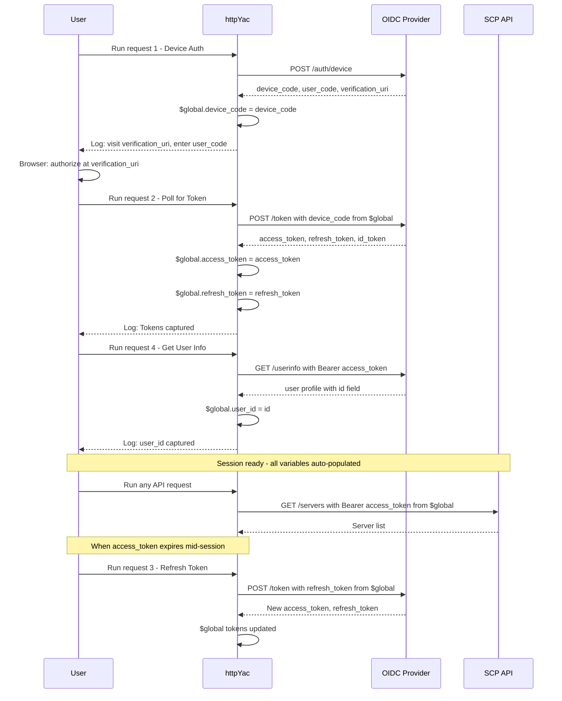

# HTTP Client Token Automation Plan

## Business Context

The OIDC Device Code Flow for the netcup SCP API requires frequent `access_token` renewal. Currently, the user must manually copy tokens from auth responses into `http-client.private.env.json` after every expiration. This is tedious, error-prone, and interrupts workflow.

## Acceptance Criteria

- [ ] Running "Poll for Token" auto-captures `access_token`, `refresh_token`, `id_token` into `$global` variables
- [ ] Running "Refresh Token" auto-captures the same three tokens
- [ ] Running "Get User Info" auto-captures `user_id`
- [ ] Running "Initiate Device Authorization" auto-captures `device_code` for use in request 2
- [ ] All subsequent `.http` files can reference `{{access_token}}` without manual env file edits
- [ ] `http-client.private.env.json` retains only semi-static values
- [ ] `http-client.private.env.json.example` documents which values are auto-captured vs manual
- [ ] The workflow is documented in `00-auth.http` header comments

## Technical Analysis

### HTTP Client: httpYac (VS Code Extension)

httpYac uses a different response handler syntax than IntelliJ HTTP Client:

| Feature | IntelliJ Syntax | httpYac Syntax |
|---------|----------------|----------------|
| Response handler block | `> ` | `{{ ... }}` |
| Set global variable | `client.global.set("key", val)` | `$global.key = val` |
| Get global variable | `client.global.get("key")` | `$global.key` |
| Response body access | `response.body.field` | `response.parsedBody.field` |
| Variable reference | `{{key}}` | `{{key}}` |

### Variable Resolution Precedence (httpYac)

1. **`$global`** — highest priority; session-scoped, set via response handler scripts
2. **`http-client.private.env.json`** — user-specific overrides (gitignored)
3. **`http-client.env.json`** — shared project defaults (committed)

Key implication: once `$global.access_token` is set by a response handler, it **overrides** any stale value in `http-client.private.env.json` for the remainder of the session. No file edits needed.

### `$global` Lifetime

`$global` variables persist for the duration of the VS Code session (until the window is closed). On session restart, they are cleared. This is acceptable because:
- Token lifetime is shorter than a typical work session
- The user re-authenticates at session start anyway
- Semi-static values (server_id, etc.) remain in the env file as fallback

## Implementation Phases

### Phase 1: Add response handlers to `infra/http/00-auth.http`

#### Step 1.1 — Device Authorization response handler

Capture `device_code` from request 1 so request 2 can reference `{{device_code}}` instead of requiring manual `REPLACE_WITH_DEVICE_CODE`.

```
### 1 — Initiate Device Authorization
POST {{oidc_base}}/auth/device
Content-Type: application/x-www-form-urlencoded

client_id={{client_id}}&scope=offline_access%20openid

{{
  $global.device_code = response.parsedBody.device_code;
  console.info("device_code captured — visit:", response.parsedBody.verification_uri_complete || response.parsedBody.verification_uri);
  console.info("user_code:", response.parsedBody.user_code);
}}
```

#### Step 1.2 — Poll for Token response handler

Capture `access_token`, `refresh_token`, `id_token` from request 2. Only capture on success (when `access_token` is present — the polling response returns `{"error": "authorization_pending"}` while waiting).

```
### 2 — Poll for Token
POST {{oidc_base}}/token
Content-Type: application/x-www-form-urlencoded

client_id={{client_id}}&grant_type=urn:ietf:params:oauth:grant-type:device_code&device_code={{device_code}}

{{
  if (response.parsedBody.access_token) {
    $global.access_token = response.parsedBody.access_token;
    $global.refresh_token = response.parsedBody.refresh_token;
    $global.id_token = response.parsedBody.id_token;
    console.info("Tokens captured. access_token, refresh_token, id_token are now available.");
  } else {
    console.warn("authorization_pending — poll again in 5s");
  }
}}
```

Key change: `device_code=REPLACE_WITH_DEVICE_CODE` → `device_code={{device_code}}` (uses auto-captured value from step 1).

#### Step 1.3 — Refresh Token response handler

Same token capture logic as step 1.2. The refresh response has the same structure.

```
### 3 — Refresh Token
POST {{oidc_base}}/token
Content-Type: application/x-www-form-urlencoded

client_id={{client_id}}&grant_type=refresh_token&refresh_token={{refresh_token}}

{{
  if (response.parsedBody.access_token) {
    $global.access_token = response.parsedBody.access_token;
    $global.refresh_token = response.parsedBody.refresh_token;
    $global.id_token = response.parsedBody.id_token;
    console.info("Tokens refreshed. access_token, refresh_token, id_token updated.");
  }
}}
```

Key change: `refresh_token=REPLACE_WITH_REFRESH_TOKEN` is already correct (`{{refresh_token}}`), which now resolves from `$global` after initial auth.

#### Step 1.4 — UserInfo response handler

Capture `user_id` (the `id` field from the userinfo response).

```
### 4 — Get User Info
GET {{oidc_base}}/userinfo
Authorization: Bearer {{access_token}}

{{
  $global.user_id = response.parsedBody.id;
  console.info("user_id captured:", response.parsedBody.id);
}}
```

#### Step 1.5 — Update header comments in `00-auth.http`

Replace the current header block (lines 1–10) with updated documentation explaining:
- The auto-capture behavior
- That `$global` variables are session-scoped
- The recommended workflow sequence: run requests 1 → 2 → 4 once per session
- That `http-client.private.env.json` is only needed for semi-static values

New header:

```
# Netcup SCP — OIDC Authentication (Device Code Flow)
#
# Workflow (run once per VS Code session):
#   1. Run "Initiate Device Authorization" → device_code auto-captured
#   2. Visit verification_uri in browser, enter user_code
#   3. Run "Poll for Token" → access_token, refresh_token, id_token auto-captured
#   4. Run "Get User Info" → user_id auto-captured
#
# All captured values are stored in $global (session-scoped).
# Subsequent .http files use {{access_token}} etc. without manual env file edits.
#
# When access_token expires mid-session, run "Refresh Token" (request 3).
#
# Semi-static values (server_id, server_name, interface_mac, policy_id)
# remain in http-client.private.env.json.
```

### Phase 2: Update `infra/http/http-client.private.env.json.example`

Remove auto-captured fields and document the separation clearly.

New content:

```json
{
  "development": {
    "_comment_auto_captured": "access_token, refresh_token, id_token, user_id are auto-captured by 00-auth.http response handlers into $global. Do NOT add them here.",
    "server_id": "PASTE_SERVER_ID_FROM_SERVERS_RESPONSE",
    "server_name": "YOUR_SERVER_NAME",
    "interface_mac": "PASTE_MAC_FROM_INTERFACES_RESPONSE",
    "policy_id": "PASTE_POLICY_ID_FROM_POLICIES_RESPONSE",
    "task_uuid": "PASTE_TASK_UUID_FROM_ASYNC_RESPONSE"
  }
}
```

### Phase 3: Validate

- [ ] Open VS Code with httpYac extension
- [ ] Run request 1 → verify `device_code` appears in httpYac output
- [ ] Complete browser authorization
- [ ] Run request 2 → verify `access_token` captured (check console output)
- [ ] Run any API request (e.g., `02-servers.http` → List All Servers) → verify `{{access_token}}` resolves
- [ ] Run request 4 → verify `user_id` captured
- [ ] Restart VS Code → verify `$global` is cleared (expected behavior)
- [ ] Verify semi-static values still resolve from `http-client.private.env.json`

## Variable Mapping Summary

| Variable | Source | Lifetime | File |
|----------|--------|----------|------|
| `base_url` | `http-client.env.json` | permanent | committed |
| `oidc_base` | `http-client.env.json` | permanent | committed |
| `client_id` | `http-client.env.json` | permanent | committed |
| `device_code` | `$global` (auto) | session | — |
| `access_token` | `$global` (auto) | session | — |
| `refresh_token` | `$global` (auto) | session | — |
| `id_token` | `$global` (auto) | session | — |
| `user_id` | `$global` (auto) | session | — |
| `server_id` | `private.env.json` | manual | gitignored |
| `server_name` | `private.env.json` | manual | gitignored |
| `interface_mac` | `private.env.json` | manual | gitignored |
| `policy_id` | `private.env.json` | manual | gitignored |
| `task_uuid` | `private.env.json` | manual | gitignored |

## Workflow Diagram



## Risks and Mitigations

| Risk | Impact | Mitigation |
|------|--------|------------|
| `$global` cleared on VS Code restart | Must re-authenticate | Document in header; expected OIDC behavior |
| httpYac version incompatibility with `$global` | Scripts fail silently | Test with current extension version; pin minimum version in README if needed |
| `response.parsedBody` undefined on non-JSON | Script error | Only auth endpoints return JSON; guard with `if` check |
| User has stale tokens in `private.env.json` | Confusion about which value is used | Remove token fields from env file; document precedence |

## Files Changed

| File | Action |
|------|--------|
| [`infra/http/00-auth.http`](../../infra/http/00-auth.http) | Add response handler blocks to all 4 requests; update header comments; replace REPLACE_WITH_DEVICE_CODE placeholder |
| [`infra/http/http-client.private.env.json.example`](../../infra/http/http-client.private.env.json.example) | Remove auto-captured fields; add explanatory comment |

## Completion Summary

- **Status**: PLANNED
- **Deviations**: Original task referenced IntelliJ `> ` syntax; corrected to httpYac `{{ }}` syntax based on actual tool in use
- **Next steps**: Delegate Phase 1 and Phase 2 to Code Mode via Orchestrator
