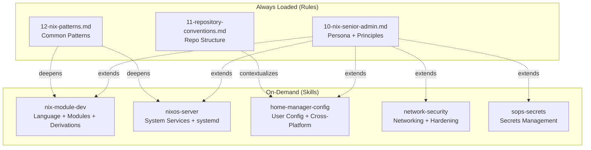

# Design Plan: Nix Skills for `.roo/skills/`

## Business Context

This nix-config repository uses `.roo/` rules to define workflow conventions and repository structure. The existing global rules ([`10-nix-senior-admin.md`](.roo/rules/10-nix-senior-admin.md), [`11-repository-conventions.md`](.roo/rules/11-repository-conventions.md), [`12-nix-patterns.md`](.roo/rules/12-nix-patterns.md)) provide **persona, principles, and patterns** — they tell modes *how to behave* and *what conventions to follow*.

Skills fill a different role: they provide **deep domain expertise** loaded on-demand when a mode encounters a task requiring specialized knowledge. Rules are always loaded; skills are loaded only when the task matches the skill description.

## Gap Analysis: Rules vs. Skills

| What rules cover (CONVENTIONS) | What skills should cover (EXPERTISE) |
|---|---|
| "Use `services.<svc>.enable = true`" | How to configure nginx reverse proxy with ACME DNS-01 |
| "Never commit plaintext secrets; use sops-nix" | How age key management works, `.sops.yaml` rule syntax, key rotation |
| 5-line networking summary (firewall, WireGuard, SSH) | Firewall rule composition, SSH cipher selection, fail2ban tuning |
| "disko" and "impermanence" mentioned in tech stack | Btrfs subvolume strategy, what to persist, disko partition layouts |
| Feature module pattern with `programs.*` | Program-specific config depth (git conditional includes, shell init, browser extensions) |
| Module option definitions (basic example) | Custom module authoring, submodule types, `freeformType`, type composition |
| Overlay `final: prev:` pattern | Derivation writing, `wrapProgram`, `makeWrapper`, build phases |

## Skill Design

### Skill Architecture



### Trigger Logic

Skills are selected by the mandatory skill check in each mode. The `description` field in `SKILL.md` determines when a skill matches. Each skill should trigger for specific task types:

| Task type | Triggered skill |
|---|---|
| "Create a custom NixOS module with options" | `nix-module-dev` |
| "Write a derivation for package X" | `nix-module-dev` |
| "Add a new overlay" | `nix-module-dev` |
| "Enable service X on host Y" | `nixos-server` |
| "Configure nginx reverse proxy" | `nixos-server` |
| "Add systemd timer for backup" | `nixos-server` |
| "Add program Z to Home Manager" | `home-manager-config` |
| "Configure fish/zsh shell" | `home-manager-config` |
| "Set up macOS defaults" | `home-manager-config` |
| "Configure firewall rules" | `network-security` |
| "Harden SSH on server" | `network-security` |
| "Set up ACME certificates" | `network-security` |
| "Add a new secret to sops" | `sops-secrets` |
| "Rotate age keys" | `sops-secrets` |
| "Debug secret decryption failure" | `sops-secrets` |

---

## Skill 1: `nix-module-dev`

- **Directory**: `.roo/skills/nix-module-dev/SKILL.md`
- **Applies to**: architect, code, debug, nix-expert
- **Description**: "Apply when writing custom Nix modules with options, creating derivations, authoring overlays, managing flake inputs, or working with advanced Nix language features (functors, fixed-points, type composition)."

### Content Outline

1. **Scope & Trigger**
   - When to load this skill vs. using rules alone
   - NOT for: simple `programs.*.enable` or `home.packages` changes (covered by rules)

2. **Custom Module Authoring**
   - Full module anatomy: `options` + `config` separation
   - `mkEnableOption` vs. `mkOption` with `types.bool`
   - Option types deep dive: `types.attrsOf`, `types.listOf`, `types.submodule`, `types.oneOf`, `types.enum`, `types.nullOr`, `types.either`
   - `freeformType` for pass-through configuration
   - `mkMerge` with multiple conditions
   - `mkOrder` / `mkBefore` / `mkAfter` for ordering
   - Module imports: `disabledModules`, conditional imports
   - Module arguments: `_module.args`, `specialArgs` vs. `extraSpecialArgs`

3. **Derivation Writing**
   - `stdenv.mkDerivation` full structure: phases (`unpackPhase`, `configurePhase`, `buildPhase`, `installPhase`, `fixupPhase`)
   - `buildInputs` vs. `nativeBuildInputs` (cross-compilation awareness)
   - Source fetchers: `fetchFromGitHub`, `fetchurl`, `fetchgit`, `fetchzip`
   - `wrapProgram` and `makeWrapper` for runtime dependencies
   - `patchelf` and `autoPatchelfHook` for prebuilt binaries
   - `buildFHSEnv` for FHS-dependent software
   - Language-specific builders: `buildPythonPackage`, `buildGoModule`, `buildNpmPackage`, `buildRustPackage`

4. **Overlay Authoring**
   - `final: prev:` semantics (why not `self: super:`)
   - Override vs. overrideAttrs vs. overlay
   - Overlay composition order and debugging
   - Adding new packages to `pkgs` namespace
   - Version pinning via overlay

5. **Flake Input Management**
   - Adding inputs: `url`, `flake = false`, `follows`
   - Updating: `nix flake update`, selective update `nix flake lock --update-input <name>`
   - Pinning: editing `flake.lock`, `rev` pinning
   - Input access patterns: `inputs.<name>.packages`, `inputs.<name>.nixosModules`
   - Multi-system support: `flake-utils`, `systems`, or manual `genAttrs`

6. **Advanced Nix Language**
   - Fixed-point evaluation (`lib.fix`, `lib.extends`)
   - Recursive attribute sets and `rec` pitfalls
   - `builtins.readFile` vs. `builtins.readDir` vs. IFD
   - String interpolation and multi-line strings
   - Path handling (`./.` vs string paths, store path creation)
   - Lazy evaluation implications for debugging

### Differentiation from Rules

| Rule | Skill |
|---|---|
| `12-nix-patterns.md` shows basic `mkOption`/`mkIf` | Skill covers full type system, submodules, freeformType |
| `12-nix-patterns.md` shows `final: prev:` overlay | Skill covers override strategies, composition debugging |
| `10-nix-senior-admin.md` lists derivation attributes | Skill covers build phases, language-specific builders, wrapping |
| `12-nix-patterns.md` shows input declaration | Skill covers input lifecycle, selective updates, pinning |

---

## Skill 2: `nixos-server`

- **Directory**: `.roo/skills/nixos-server/SKILL.md`
- **Applies to**: architect, code, debug, nix-expert
- **Description**: "Apply when configuring NixOS system services (systemd units, nginx, databases, monitoring), disk management (disko, btrfs, LUKS), impermanence, or boot configuration. Covers service orchestration, state management, and system lifecycle."

### Content Outline

1. **Scope & Trigger**
   - System-level NixOS configuration tasks
   - NOT for: user-level Home Manager config, secrets (separate skill), network security (separate skill)

2. **Service Configuration Patterns**
   - `services.<name>.enable` + required options lookup via MCP
   - Services with state directories: `StateDirectory`, `CacheDirectory`, `RuntimeDirectory`
   - `DynamicUser = true` implications (no persistent UID, state in `/var/lib/private`)
   - Service dependencies: `after`, `wants`, `requires`, `bindsTo`
   - Socket activation: `systemd.sockets.*`
   - Timer units: `systemd.timers.*` with calendar expressions
   - Service hardening: `ProtectSystem`, `ProtectHome`, `PrivateDevices`, `CapabilityBoundingSet`, `SystemCallFilter`

3. **Reverse Proxy with nginx**
   - `services.nginx.virtualHosts` structure
   - `proxyPass` with WebSocket support (`proxyWebsockets`)
   - ACME integration: `enableACME`, `forceSSL`, DNS-01 vs HTTP-01
   - Security headers via `commonHttpConfig`
   - Rate limiting zones
   - Upstream health checks
   - Access restriction patterns (`allow`/`deny`)
   - ACME prerequisite: `security.acme.acceptTerms`, `defaults.email`, credential files

4. **Disk Management (disko)**
   - Partition table types: GPT, MBR
   - Filesystem types: ext4, btrfs, xfs, vfat (ESP)
   - Btrfs subvolume strategy for impermanence (ephemeral `/`, persistent `/nix`, `/persist`)
   - LUKS encryption: `type = "luks"`, `passwordFile`, unattended boot trade-offs
   - LVM: `type = "lvm_vg"`, volume groups, thin provisioning
   - Mount options: `compress=zstd`, `noatime`, `fmask`/`dmask` for ESP
   - `fileSystems.*.neededForBoot` for early-mount requirements

5. **Impermanence**
   - Philosophy: ephemeral root, explicit persistence
   - `environment.persistence."/persist"` structure
   - Directories vs. files persistence
   - `hideMounts = true` for clean `df` output
   - initrd cleanup: btrfs subvolume deletion script
   - What MUST persist: `/var/lib/nixos`, `/var/lib/systemd`, `/etc/machine-id`, `/etc/ssh`, service state dirs
   - Home directory persistence via Home Manager impermanence module
   - Interaction with sops-nix key storage (age key in `/persist`)

6. **Boot Configuration**
   - `boot.loader.systemd-boot` vs. `boot.loader.grub`
   - Kernel selection: `boot.kernelPackages`
   - initrd modules: `boot.initrd.availableKernelModules`
   - Kernel parameters: `boot.kernelParams`
   - `boot.initrd.postDeviceCommands` for pre-mount operations
   - DANGEROUS: Always document rollback path for boot changes

7. **System Lifecycle**
   - `system.autoUpgrade` configuration
   - Garbage collection: `nix.gc.automatic`, retention policies
   - Store optimization: `nix.settings.auto-optimise-store`
   - `system.stateVersion` — NEVER change without explicit migration plan
   - Activation scripts: `system.activationScripts.*`

### Differentiation from Rules

| Rule | Skill |
|---|---|
| `12-nix-patterns.md` has `services.<svc>.enable = true` | Skill covers systemd hardening, state dirs, dependencies, timers |
| `10-nix-senior-admin.md` mentions disko | Skill covers partition layouts, btrfs strategy, LUKS trade-offs |
| `10-nix-senior-admin.md` mentions impermanence | Skill covers persistence decisions, initrd scripts, HM integration |
| `11-repository-conventions.md` shows host file structure | Skill covers service orchestration across those files |

---

## Skill 3: `home-manager-config`

- **Directory**: `.roo/skills/home-manager-config/SKILL.md`
- **Applies to**: architect, code, nix-expert
- **Description**: "Apply when configuring Home Manager programs (git, shell, editor, browser, terminal), managing XDG directories, writing cross-platform features (Linux + macOS), or integrating with macOS specifics (Homebrew, launchd, system defaults)."

### Content Outline

1. **Scope & Trigger**
   - User-level configuration via Home Manager
   - NOT for: system services (nixos-server), secrets (sops-secrets), firewall/networking (network-security)

2. **Program Configuration Patterns**
   - `programs.<name>.enable` + `programs.<name>.settings` vs. `programs.<name>.extraConfig`
   - When to use `programs.*` vs. `home.file.*` vs. `xdg.configFile.*`
   - Decision matrix:

     | Approach | When to use |
     |---|---|
     | `programs.<name>.*` | HM has a program module for it |
     | `xdg.configFile."<path>"` | HM has no module; app uses XDG config |
     | `home.file."<path>"` | Non-XDG config path |
     | `home.packages` + manual config | Last resort; no structured config needed |

3. **Shell Configuration**
   - `programs.zsh` — `initContent`, `shellAliases`, `plugins`, `oh-my-zsh`
   - `programs.fish` — `interactiveShellInit`, `shellAliases`, `plugins`
   - `programs.bash` — `bashrcExtra`, `profileExtra`
   - `programs.starship` — `settings` for prompt configuration
   - Shell integration ordering: profile → rc → plugins → aliases
   - Cross-shell patterns: aliases that work in both zsh and fish

4. **Git Configuration**
   - `programs.git.enable` + `userName`, `userEmail`
   - Conditional includes: `programs.git.includes` with `condition = "gitdir:~/work/"`
   - Multi-identity setup: personal + company + client identities via sops secrets
   - Git aliases, delta/diff-so-fancy integration
   - `programs.git.signing` for GPG/SSH commit signing

5. **Editor Integration**
   - `programs.vim`/`programs.neovim` — config, plugins, LSP setup
   - `programs.emacs` — package management, doom-emacs integration
   - `programs.vscode` — extensions via overlay, `settings.json` via `userSettings`
   - Editor config generation vs. `home.file` for complex configs (doom.d/)

6. **Terminal Emulator Configuration**
   - `programs.kitty` — settings, keybindings, themes
   - macOS Homebrew cask override: `programs.kitty.package = pkgs.emptyDirectory`
   - `programs.alacritty`, `programs.wezterm` alternatives

7. **Browser Configuration**
   - `programs.firefox` — profiles, extensions (via NUR or overlay), policies
   - Extension management patterns (this repo uses `lib/firefox-extensions.nix`)
   - Multiple profiles (personal, company)
   - Chromium/Brave via `programs.chromium`

8. **Cross-Platform Patterns**
   - Feature files in `features/cli/` (cross-platform) vs. `features/linux/` vs. `features/macos/`
   - `pkgs.stdenv.isDarwin` / `pkgs.stdenv.isLinux` conditionals inside feature modules
   - macOS-specific: `targets.darwin.copyApps`, `launchd.agents.*`
   - Linux-specific: `systemd.user.services.*`, `xdg.portal.*`
   - Home directory differences: `/home/dan` (Linux) vs. `/Users/daniel.kressner` (macOS)
   - Package availability differences: some packages don't build on Darwin

9. **macOS Integration**
   - `targets.darwin.defaults.*` — macOS system preferences (this repo: `features/macos/defaults.nix`)
   - Homebrew cask integration: when to use Nix package vs. Homebrew cask (signed apps, MDM)
   - `programs.<name>.package = pkgs.emptyDirectory` pattern for HM config without Nix package
   - launchd agent customization (PATH fixes for sops-nix)
   - `enableChecks` for JAMF MDM environments

10. **XDG and File Management**
    - `xdg.enable` and standard directories
    - `xdg.configFile`, `xdg.dataFile` for structured config
    - `home.file` for arbitrary paths
    - `home.activation` for post-deploy scripts
    - `home.sessionVariables` and `home.sessionPath`

### Differentiation from Rules

| Rule | Skill |
|---|---|
| `12-nix-patterns.md` shows feature toggle pattern | Skill covers program-specific configuration depth |
| `11-repository-conventions.md` shows feature directory layout | Skill covers cross-platform decision logic within features |
| `10-nix-senior-admin.md` lists Home Manager option namespaces | Skill covers program module usage patterns, conditional includes |
| `12-nix-patterns.md` shows `home.packages` usage | Skill covers `programs.*` vs `xdg.configFile` vs `home.file` decisions |

---

## Skill 4: `network-security`

- **Directory**: `.roo/skills/network-security/SKILL.md`
- **Applies to**: architect, code, debug, nix-expert
- **Description**: "Apply when configuring networking (firewall rules, DNS, interfaces), security hardening (SSH, fail2ban, AppArmor, audit), TLS certificates (ACME, Let's Encrypt), or VPN/mesh networking (WireGuard, Headscale/Tailscale)."

### Content Outline

1. **Scope & Trigger**
   - Network and security configuration at system level
   - NOT for: general service config (nixos-server), secrets (sops-secrets), HM user config (home-manager-config)

2. **Firewall Configuration**
   - `networking.firewall.enable` + `allowedTCPPorts` / `allowedUDPPorts`
   - Per-interface rules: `networking.firewall.interfaces.<iface>.allowedTCPPorts`
   - `extraCommands` for iptables rules (rate limiting, connection tracking)
   - iptables vs. nftables: `networking.nftables.enable` trade-offs
   - Service-managed firewall: `services.<name>.openFirewall` auto-rule
   - Firewall debugging: `iptables -L -v -n`, `journalctl` for refused connections
   - `logRefusedConnections` and `logRefusedPackets` diagnostics

3. **SSH Hardening**
   - `services.openssh.settings` — recommended ciphers, KEX algorithms, MACs
   - Authentication: key-only (`PasswordAuthentication = false`), authorized keys management
   - Root login: `PermitRootLogin = "no"` (or `"prohibit-password"` for deployment)
   - Rate limiting: `MaxAuthTries`, `MaxSessions`, `ClientAliveInterval`
   - Forwarding: `AllowTcpForwarding`, `X11Forwarding`, `AllowAgentForwarding` — disable unless needed
   - Host key algorithms: ed25519 preferred
   - SSH port change trade-offs

4. **Fail2ban**
   - `services.fail2ban.enable` + `maxretry`, `bantime`
   - `bantime-increment` for escalating bans
   - `ignoreIP` for trusted networks
   - Custom jails for nginx, specific services
   - Interaction with firewall (iptables/nftables backend)

5. **TLS/ACME Certificate Management**
   - `security.acme.acceptTerms` + `defaults.email`
   - DNS-01 challenge: `dnsProvider`, `credentialFiles` from sops secrets
   - HTTP-01 challenge: requires port 80 open, webroot or standalone
   - Per-domain certificates vs. wildcard certificates
   - Certificate renewal: automatic via systemd timer
   - nginx integration: `enableACME = true; forceSSL = true;`
   - Debugging: `systemctl status acme-<domain>.service`, certificate paths in `/var/lib/acme/`

6. **Security Hardening**
   - AppArmor: `security.apparmor.enable`, `killUnconfinedConfinables`
   - Audit: `security.auditd.enable`, audit rules for execve tracking
   - Kernel lockdown: `security.lockKernelModules`
   - PAM hardening: `security.pam.services`, `requireWheel` for su
   - Sudo: `security.sudo.wheelNeedsPassword`, `execWheelOnly`
   - Login: `security.loginDefs.settings.UMASK`
   - Disable unnecessary services: avahi, printing, xserver on servers
   - Nix daemon restriction: `nix.settings.allowed-users`, `trusted-users`

7. **VPN / Mesh Networking**
   - WireGuard: `networking.wg-quick.interfaces.*` or `networking.wireguard.interfaces.*`
   - WireGuard key management: private keys via sops, public keys in config
   - Headscale (self-hosted Tailscale control):
     - `services.headscale` configuration pattern (this repo uses it)
     - DERP server setup
     - DNS configuration: `magic_dns`, `base_domain`
     - ACL policy management
     - nginx reverse proxy integration
   - Tailscale client: `services.tailscale.enable`

8. **Network Configuration**
   - `networking.hostName`, `networking.domain`
   - NetworkManager vs. systemd-networkd: when to use which
   - Static IP assignment
   - DNS: `networking.nameservers`, `services.resolved`
   - `/etc/hosts` via `networking.hosts`
   - IPv6: enable/disable, SLAAC vs. static

### Differentiation from Rules

| Rule | Skill |
|---|---|
| `12-nix-patterns.md` has 5-line networking section | Skill covers firewall composition, iptables rules, nftables trade-offs |
| `10-nix-senior-admin.md` says "restrict root login + authorizedKeys" | Skill covers full SSH hardening (ciphers, KEX, MACs, rate limits) |
| `10-nix-senior-admin.md` mentions WireGuard | Skill covers WireGuard + Headscale topology, DERP, ACLs |
| Rules mention ACME nowhere in detail | Skill covers DNS-01 vs HTTP-01, credential management, debugging |

---

## Skill 5: `sops-secrets`

- **Directory**: `.roo/skills/sops-secrets/SKILL.md`
- **Applies to**: architect, code, debug, nix-expert
- **Description**: "Apply when managing secrets with sops-nix: adding/removing secrets, configuring `.sops.yaml` rules, managing age keys, rotating keys, debugging decryption failures, or setting up sops for new hosts. Covers both NixOS and Home Manager (macOS) secret paths."

### Content Outline

1. **Scope & Trigger**
   - Any task involving secrets: adding, modifying, encrypting, key management
   - Cross-cutting: applies to both system config and Home Manager config
   - NOT for: general service config (unless the secret aspect is the primary concern)

2. **sops-nix Architecture**
   - How it works: sops encrypts YAML → age decrypts at activation → files in `/run/secrets/`
   - NixOS: `sops.secrets.<name>` → decrypted to `/run/secrets/<name>` at system activation
   - Home Manager: `sops.secrets.<name>` → decrypted to `$XDG_RUNTIME_DIR/secrets/<name>` via user service
   - `defaultSopsFile` — points to the host's `secrets.yaml`
   - `age.keyFile` — location of the age private key (host-specific)

3. **`.sops.yaml` Configuration**
   - Creation rules: regex-based path matching
   - Key groups: which age public keys can decrypt which files
   - Per-host key assignment
   - Example structure for this repo's multi-host setup
   - Adding a new host: generate age key, add public key to `.sops.yaml`, re-encrypt affected files

4. **Secret Declaration Patterns**
   - Basic: `sops.secrets."path/to/secret" = {};`
   - With ownership: `owner`, `group`, `mode` for service-specific secrets
   - `neededForUsers = true` — for secrets needed during user creation (e.g., `hashedPasswordFile`)
   - Path nesting: `"users/dan/password"` creates nested path in YAML
   - Referencing secrets: `config.sops.secrets."name".path` (returns `/run/secrets/<name>`)
   - Templated secrets: `sops.templates.*` for generated config files

5. **Age Key Management**
   - Generating host age key: `age-keygen -o key.txt`
   - Extracting public key: `age-keygen -y key.txt`
   - Key storage locations:
     - NixOS: `/persist/var/lib/sops-nix/key.txt` (with impermanence)
     - NixOS (no impermanence): `/var/lib/sops-nix/key.txt`
     - macOS: `~/Library/Application Support/sops/age/keys.txt`
   - SSH host key to age key conversion: `ssh-to-age`

6. **Adding/Modifying Secrets**
   - Creating secrets YAML: `sops hosts/<host>/secrets.yaml`
   - Adding a key: edit YAML, sops encrypts on save
   - Accessing secrets in Nix: `config.sops.secrets."key".path`
   - Using secrets with services: `passwordFile`, `credentialFiles`, `environmentFile`
   - Testing decryption: `sops -d hosts/<host>/secrets.yaml`

7. **Key Rotation**
   - When to rotate: compromised key, host decommission, periodic policy
   - Steps: generate new key → update `.sops.yaml` → `sops updatekeys <file>` for each affected file
   - Bulk rotation: script to re-encrypt all files
   - Removing old keys: remove from `.sops.yaml`, updatekeys

8. **macOS Differences**
   - Home Manager sops-nix uses launchd agent (not systemd)
   - PATH issue: launchd agent needs `/usr/bin` in PATH for `getconf`
   - Fix pattern: `launchd.agents.sops-nix.config.EnvironmentVariables.PATH`
   - Key file location: `~/Library/Application Support/sops/age/keys.txt`
   - No `/run/secrets/` — secrets go to user-specific runtime directory

9. **Troubleshooting**
   - "Failed to decrypt" — wrong age key, key not in `.sops.yaml` rule
   - "No key found" — `age.keyFile` path wrong or file missing
   - "Permission denied" — check `owner`, `group`, `mode` on secret
   - Activation order issues: secret needed before service that creates the user
   - Verify: `sops -d --verbose <file>` to check which key decrypts
   - NixOS: `systemctl status sops-nix.service`
   - macOS: `launchctl list | grep sops`

### Differentiation from Rules

| Rule | Skill |
|---|---|
| `10-nix-senior-admin.md` says "use sops-nix or agenix" | Skill covers full sops-nix lifecycle: create, declare, manage, rotate |
| `11-repository-conventions.md` shows `secrets.yaml` placement | Skill covers `.sops.yaml` rules, multi-host key assignment |
| Rules mention `sops.secrets` in code examples | Skill covers `neededForUsers`, templates, macOS PATH fix, debugging |

---

## Implementation Plan

### Phase 0: Validation Strategy

- **Syntax validation**: Each `SKILL.md` is Markdown — no Nix syntax to check
- **Functional validation**: Load each skill via `skill` tool in a test conversation, verify it triggers correctly for matching tasks and does NOT trigger for unrelated tasks
- **Content validation**: Cross-reference each skill section against rules to confirm zero duplication of conventions (only deepening of expertise)

### Phase 1: Create Skill Files

| Step | File | Action |
|---|---|---|
| 1.1 | `.roo/skills/nix-module-dev/SKILL.md` | CREATE |
| 1.2 | `.roo/skills/nixos-server/SKILL.md` | CREATE |
| 1.3 | `.roo/skills/home-manager-config/SKILL.md` | CREATE |
| 1.4 | `.roo/skills/network-security/SKILL.md` | CREATE |
| 1.5 | `.roo/skills/sops-secrets/SKILL.md` | CREATE |

### Phase 2: Verify Integration

- [ ] Each skill `description` triggers correctly (test with sample task descriptions)
- [ ] No skill triggers for tasks outside its scope
- [ ] Skills reference rules (link to them) rather than duplicating conventions
- [ ] Each skill explicitly states what it does NOT cover (boundary with other skills)

### Skill File Format

Each `SKILL.md` should follow this structure (derived from the deleted Python skill):

```markdown
# Skill: <Name>

## Metadata
- **Applies to**: <mode list>
- **Description**: "<trigger description for skill matching>"

## Scope
- What this skill covers
- What this skill does NOT cover (→ which other skill)
- Relationship to existing rules (extends, not replaces)

## Domain Knowledge
<sections from content outline above>

## Mandatory Practices
- MUST do X
- MUST NOT do Y

## Decision Trees
<flowcharts for common decisions in this domain>

## Reference Patterns
<code examples for common tasks in this domain>

## Verification
<how to verify changes in this domain are correct>
```

## Current Status

- **Phase**: Design complete
- **Next Step**: Get human approval, then delegate skill file creation to Code Mode via Orchestrator
