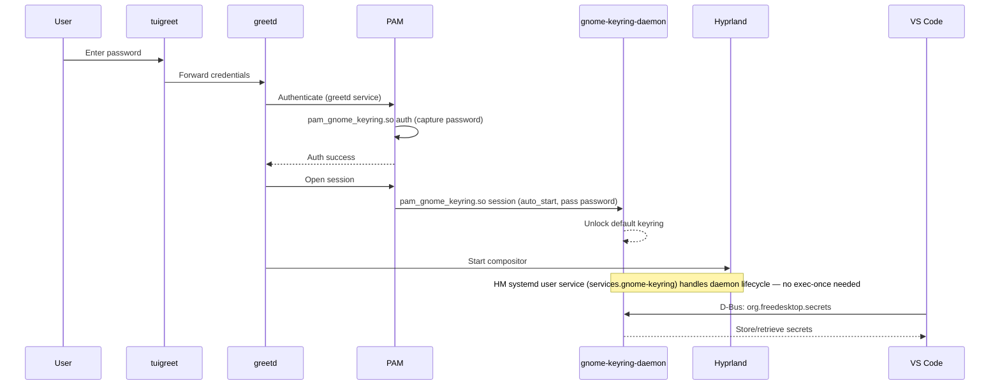

# Thiniel Keyring / Secret Storage — Implementation Plan

**Status**: COMPLETED
**Host**: thiniel (NixOS, Hyprland, ThinkPad X270)
**Created**: 2026-04-07

---

## Goal

Enable gnome-keyring as the D-Bus Secret Service provider on thiniel so that VS Code (and other applications) can securely store API keys, tokens, and secrets. Achieve automatic keyring unlock at login via full PAM auth (password entry through tuigreet).

## Context

### Current State

- **No keyring** configured — no Secret Service provider on D-Bus
- **greetd auto-login** (`initial_session`) bypasses PAM password auth → prevents PAM-based keyring unlock
- **tuigreet** already configured as `default_session` fallback (password-based)
- **VS Code** installed via `vscode.fhs` (raw package in `home.packages`), not HM `programs.vscode` module
- **KeePassXC** installed with SSH agent but NOT as Secret Service provider
- **Impermanence** active — `~/.local/share/keyrings` NOT persisted (data lost on reboot)
- **LUKS full-disk encryption** present (single password at boot already)

### Decision

Remove greetd auto-login. Require password via tuigreet. Use full PAM auth stack to auto-unlock gnome-keyring. This is the cleanest method for a professional laptop.

### Files to Modify

| File | Change |
|------|--------|
| `hosts/thiniel/default.nix` | Remove `initial_session`, enable gnome-keyring, add PAM integration, persist tuigreet cache |
| `home/dan/features/linux/gnome-keyring.nix` | New dedicated HM feature module: `services.gnome-keyring.enable = true` with `components = [ "secrets" ]` (creates proper systemd user service) |
| `home/dan/features/linux/hyprland.nix` | Cleaned up: clipboard watchers backgrounded, `sleep 1` removed; gnome-keyring startup moved out |
| `home/dan/features/linux/impermanence.nix` | Persist `~/.local/share/keyrings`; `.vscode` changed to `.vscode/extensions` to avoid layering conflict with Nix-managed `argv.json` |
| `home/dan/features/productivity/vscode-fhs.nix` | Add `argv.json` with `password-store = gnome-libsecret` and `enable-crash-reporter = false` |
| `tests/assertions/thiniel-invariants.nix` | Add assertions for Phases 1–3 |

### Trade-offs

| Concern | Assessment |
|---------|-----------|
| Second password prompt (LUKS + tuigreet) | Acceptable — laptop security > convenience |
| gnome-keyring vs. KeePassXC as Secret Service | gnome-keyring: auto-unlock via PAM, standard D-Bus API, transparent to apps. KeePassXC: manual unlock, requires GUI interaction |
| Explicit `exec-once` for daemon | Defensive — PAM `auto_start` should handle it, but `exec-once` ensures correct Wayland session environment |

---

## Acceptance Criteria

1. ✅ greetd presents tuigreet password prompt on every boot (no auto-login)
2. ✅ `gnome-keyring-daemon` is running after login (verify: `pgrep gnome-keyring`)
3. ✅ D-Bus Secret Service is available (verify: `busctl --user list | grep org.freedesktop.secrets`)
4. ✅ Keyring is auto-unlocked — no separate password prompt from gnome-keyring
5. ✅ VS Code can store and retrieve secrets (verify: add a GitHub account or API key in VS Code, restart, confirm it persists)
6. ✅ Keyring data survives reboot (verify: reboot, VS Code still has stored secrets)
7. ✅ No regression — Hyprland, waybar, pipewire, mako all still function normally
8. ✅ `nix flake check` passes
9. ✅ `nixos-rebuild build --flake .#thiniel` succeeds

---

## Technical Analysis

### Architecture



### Component Mapping

```mermaid
graph TD
    A[hosts/thiniel/default.nix] -->|removes| B[initial_session block]
    A -->|enables| C[services.gnome.gnome-keyring]
    A -->|enables| D[security.pam.services.greetd.enableGnomeKeyring]
    A -->|persists| E[/var/cache/tuigreet]
    F[home/dan/features/linux/gnome-keyring.nix] -->|services.gnome-keyring| G[gnome-keyring systemd user service]
    H[home/dan/features/linux/impermanence.nix] -->|persists| I[.local/share/keyrings]
    J[home/dan/features/productivity/vscode-fhs.nix] -->|home.file argv.json| K[password-store = gnome-libsecret]
    L[tests/assertions/thiniel-invariants.nix] -->|validates| B & C & D
```

### NixOS Option Paths (verified via MCP)

| Option | Type | Purpose |
|--------|------|---------|
| `services.gnome.gnome-keyring.enable` | `bool` | Install gnome-keyring, set up D-Bus service files, systemd user unit |
| `security.pam.services.greetd.enableGnomeKeyring` | `bool` | Add `pam_gnome_keyring.so` to auth + session stacks for auto-unlock |

### Risk Assessment

| Risk | Category | Mitigation |
|------|----------|-----------|
| Removing auto-login changes boot flow | Authentication | tuigreet already configured as `default_session`; no new software needed |
| PAM misconfiguration → login failure | Authentication | Build-validate before apply; `test` user available as fallback; boot into previous generation via systemd-boot |
| gnome-keyring-daemon not starting | Service | `exec-once` in Hyprland as defensive fallback; verify with `pgrep` post-login |
| Keyring data lost after reboot | Filesystem | Impermanence persistence for `~/.local/share/keyrings` |
| VS Code FHS can't reach D-Bus | Integration | FHS mounts `/run/user/<uid>/bus`; verify post-deploy |

### Rollback Path

1. **Before apply**: `nixos-rebuild build --flake .#thiniel` validates without applying
2. **After apply**: Boot previous generation via systemd-boot menu (hold Space during boot)
3. **Emergency**: `test` user exists as non-sudo fallback account for debugging login issues
4. **Worst case**: Boot from NixOS USB, mount persist partition, revert `default.nix` changes, rebuild

---

## Phase 0: Validation Strategy

### Validation Commands

| Stage | Command | Purpose |
|-------|---------|---------|
| Syntax | `nix flake check --no-build` | Evaluate all configs, fire assertions (no VM tests) |
| Build | `nixos-rebuild build --flake .#thiniel` | Full build of thiniel configuration |
| Lint | `nix fmt -- --check .` | Formatting compliance |
| Lint | `deadnix .` | Dead code detection |
| Lint | `statix check .` | Static analysis |
| Apply (test) | `sudo nixos-rebuild test --flake .#thiniel` | Apply without making default boot entry |
| Apply (switch) | `sudo nixos-rebuild switch --flake .#thiniel` | Apply and set as default boot entry |

### Affected Host

- **thiniel** (`x86_64-linux`) — the only host affected by these changes

### Dangerous Change Categories

| Category | Applies? | Detail |
|----------|----------|--------|
| Boot | No | No bootloader/kernel changes |
| Network | No | No firewall/interface changes |
| Filesystem | No | Only adding impermanence paths (additive) |
| Authentication | **Yes** | Removing auto-login, changing PAM stack |
| Secrets | No | No sops-nix key changes |

**Authentication changes require explicit user approval before `nixos-rebuild switch`.**

### Rollback Procedure

1. Reboot → hold Space → select previous generation in systemd-boot menu
2. Or: `sudo nixos-rebuild switch --flake .#thiniel --rollback`

---

## Implementation Phases

### Phase 1: Remove auto-login

**Goal**: Ensure greetd always presents tuigreet password prompt.

#### Step 1.1 — Red: Add assertion that `initial_session` must not exist

- **File**: `tests/assertions/thiniel-invariants.nix`
- **Test type**: NixOS module assertion (eval-time)
- **Change**: Add assertion to the existing `assertions` list:
  ```nix
  {
    assertion = !(config.services.greetd.settings ? initial_session);
    message = "Thiniel invariant violated: greetd must not use initial_session (auto-login). Use tuigreet with password for PAM keyring unlock.";
  }
  ```
- **Verify**: `nix flake check --no-build` → **FAIL** (assertion fires because `initial_session` currently exists at line 232–235 of `hosts/thiniel/default.nix`)

#### Step 1.2 — Green: Remove `initial_session` block

- **File**: `hosts/thiniel/default.nix`
- **Change**: Delete lines 232–235 (the `initial_session` block):
  ```nix
  # REMOVE THIS BLOCK:
  initial_session = {
    command = "${pkgs.hyprland}/bin/Hyprland";
    user = "dan";
  };
  ```
- **Verify**: `nix flake check --no-build` → **PASS**
- **Verify**: `nixos-rebuild build --flake .#thiniel` → **PASS**

#### Step 1.3 — Persist tuigreet cache (usability)

- **File**: `hosts/thiniel/default.nix`
- **Change**: Uncomment `/var/cache/tuigreet` in `environment.persistence."/persist/system".directories` (currently commented at line 138). This allows tuigreet's `--remember` flag to persist the last-used user/session across reboots.
  ```nix
  "/var/cache/tuigreet"
  ```
- **Verify**: `nix flake check --no-build` → **PASS**

---

### Phase 2: Enable gnome-keyring service

**Goal**: Install gnome-keyring and register it as D-Bus Secret Service provider.

#### Step 2.1 — Red: Add assertion that gnome-keyring must be enabled

- **File**: `tests/assertions/thiniel-invariants.nix`
- **Test type**: NixOS module assertion (eval-time)
- **Change**: Add assertion:
  ```nix
  {
    assertion = config.services.gnome.gnome-keyring.enable;
    message = "Thiniel invariant violated: gnome-keyring must be enabled for D-Bus Secret Service (VS Code credential storage).";
  }
  ```
- **Verify**: `nix flake check --no-build` → **FAIL** (gnome-keyring not yet enabled)

#### Step 2.2 — Green: Enable gnome-keyring

- **File**: `hosts/thiniel/default.nix`
- **Change**: Add inside the `services` block (after `openssh.enable = true;` at line 227):
  ```nix
  gnome.gnome-keyring.enable = true;
  ```
- **Verify**: `nix flake check --no-build` → **PASS**
- **Verify**: `nixos-rebuild build --flake .#thiniel` → **PASS**

---

### Phase 3: PAM gnome-keyring integration

**Goal**: Configure PAM to auto-unlock the keyring when the user logs in via greetd/tuigreet.

#### Step 3.1 — Red: Add assertion that PAM greetd has gnome-keyring enabled

- **File**: `tests/assertions/thiniel-invariants.nix`
- **Test type**: NixOS module assertion (eval-time)
- **Change**: Add assertion:
  ```nix
  {
    assertion = config.security.pam.services.greetd.enableGnomeKeyring;
    message = "Thiniel invariant violated: security.pam.services.greetd.enableGnomeKeyring must be true (required for automatic keyring unlock on login)";
  }
  ```
- **Verify**: `nix flake check --no-build` → **FAIL** (PAM gnome-keyring not yet configured)

#### Step 3.2 — Green: Enable PAM gnome-keyring for greetd

- **File**: `hosts/thiniel/default.nix`
- **Change**: Add at the top level (outside the `services` block):
  ```nix
  security.pam.services.greetd.enableGnomeKeyring = true;
  ```
- **Verify**: `nix flake check --no-build` → **PASS**
- **Verify**: `nixos-rebuild build --flake .#thiniel` → **PASS**

---

### Phase 4: gnome-keyring Home Manager service module

**Goal**: Ensure gnome-keyring-daemon is managed as a proper systemd user service via Home Manager.

#### Step 4.1 — Green: Create dedicated HM feature module for gnome-keyring

- **File**: `home/dan/features/linux/gnome-keyring.nix` (new file)
- **Test type**: Validate via `nix flake check`
- **Change**: Create a self-contained HM feature module using the `services.gnome-keyring` Home Manager option:
  ```nix
  { ... }:
  {
    services.gnome-keyring = {
      enable = true;
      components = [ "secrets" ];
    };
  }
  ```
  This creates a proper systemd user service (`gnome-keyring.service`) instead of fragile shell backgrounding via `exec-once`. The daemon is started, stopped, and restarted by systemd alongside the user session.

- **Cleanup in `home/dan/features/linux/hyprland.nix`**: The `startupScript` was updated to:
  - Remove the `gnome-keyring-daemon --start --components=secrets &` line (now handled by the HM service)
  - Background the `wl-paste` clipboard watchers with `&>/dev/null &`
  - Remove the `sleep 1` at the end
  ```nix
  startupScript = pkgs.writeShellScriptBin "start" ''
    ${pkgs.wl-clipboard}/bin/wl-paste --type text --watch ${pkgs.cliphist}/bin/cliphist store &>/dev/null &
    ${pkgs.wl-clipboard}/bin/wl-paste --type image --watch ${pkgs.cliphist}/bin/cliphist store &>/dev/null &
  '';
  ```

- **Verify**: `nix flake check` → **PASS**
- **Verify**: `nixos-rebuild build --flake .#thiniel` → **PASS**

---

### Phase 5: Impermanence — persist keyring data

**Goal**: Ensure keyring data (stored passwords/secrets) survives filesystem wipes on reboot.

#### Step 5.1 — Green: Add `.local/share/keyrings` to persisted directories

- **File**: `home/dan/features/linux/impermanence.nix`
- **Test type**: Validate via `nix flake check` (no eval-time assertion for HM persistence paths)
- **Change**: Add `.local/share/keyrings` to the `directories` list in `home.persistence."/persist"`:
  ```nix
  ".local/share/keyrings"
  ```
  Place it after the existing `.config/keepassxc` entry (line 21) for logical grouping.
- **Verify**: `nix flake check` → **PASS**
- **Verify**: `nixos-rebuild build --flake .#thiniel` → **PASS**

---

### Phase 6: VS Code Secret Service access

**Goal**: Ensure VS Code FHS can access the gnome-keyring Secret Service via D-Bus.

#### Step 6.1 — Green: Declaratively configure VS Code `argv.json`

- **File**: `home/dan/features/productivity/vscode-fhs.nix`
- **Test type**: Validate via `nix flake check`
- **Change**: Use `home.file` to declaratively manage `~/.vscode/argv.json`, setting `password-store` to `gnome-libsecret` and disabling the crash reporter (which would fail with EROFS since `argv.json` is a read-only Nix store symlink):
  ```nix
  { pkgs-unstable, ... }:
  {
    home.packages = [ pkgs-unstable.vscode.fhs ];

    home.file.".vscode/argv.json".text = builtins.toJSON {
      password-store = "gnome-libsecret";
      enable-crash-reporter = false;
    };
  }
  ```
  Notes:
  - No `gnome-keyring` package needed in `home.packages` — the system daemon (via `services.gnome.gnome-keyring.enable`) is sufficient; VS Code only needs the D-Bus Secret Service API, not the daemon binary.
  - `enable-crash-reporter = false` is required to avoid a VS Code EROFS error: VS Code attempts to write to `argv.json` for the crash reporter, but the Nix store symlink is read-only.
- **Verify**: `nix flake check` → **PASS**
- **Verify**: `nixos-rebuild build --flake .#thiniel` → **PASS**

#### Step 6.2 — Manual: Verify VS Code Secret Service integration

- **Post-deploy manual step** (not automatable); partially superseded by the declarative `argv.json` above
- After first login with the new config:
  1. Open VS Code — `password-store = gnome-libsecret` is already set via `argv.json` (no manual Settings change needed)
  2. Functional end-to-end test: sign into a GitHub account or store an API key via extension → restart VS Code → confirm the secret persists
  3. Reboot → login → open VS Code → confirm secrets are still accessible (validates impermanence + PAM unlock)

---

### Final Phase: Apply & Verify

**Goal**: Apply the complete configuration to thiniel and verify all acceptance criteria.

> **⚠ WARNING**: This phase modifies the authentication flow. Ensure physical access to the machine. The `test` user and systemd-boot rollback are available as fallbacks.

#### Step F.1 — Apply with test (non-persistent)

- **Command**: `sudo nixos-rebuild test --flake .#thiniel`
- This applies the config for the current boot only (does not set as default). If login breaks, reboot reverts to the previous config.
- **Verify**: Log out and back in → tuigreet prompts for password

#### Step F.2 — Verify post-login

After logging in via tuigreet with password:

```bash
# 1. gnome-keyring-daemon running
pgrep -a gnome-keyring

# 2. Secret Service on D-Bus
busctl --user list | grep org.freedesktop.secrets

# 3. Keyring unlocked (no password prompt appeared)
# Visual confirmation: no gnome-keyring password dialog

# 4. Hyprland, waybar, pipewire still functional
# Visual confirmation: compositor, bar, audio all working
```

#### Step F.3 — Make persistent (switch)

- **Command**: `sudo nixos-rebuild switch --flake .#thiniel`
- **Verify**: Reboot → tuigreet → login → repeat Step F.2 checks
- **Verify**: VS Code secrets persist across reboot (acceptance criterion 5+6)

#### Step F.4 — VS Code verification

1. Open VS Code
2. Store a secret (e.g., GitHub account, API key via extension)
3. Restart VS Code → confirm secret is still accessible
4. Reboot → login → open VS Code → confirm secret persists

---

## Validation Strategy Summary

| Phase | Test Type | Validation Command | Red/Green |
|-------|-----------|-------------------|-----------|
| 1.1 | Assertion | `nix flake check --no-build` | Red |
| 1.2 | Assertion | `nix flake check --no-build` + `nixos-rebuild build` | Green |
| 1.3 | Build | `nix flake check --no-build` | Green |
| 2.1 | Assertion | `nix flake check --no-build` | Red |
| 2.2 | Assertion | `nix flake check --no-build` + `nixos-rebuild build` | Green |
| 3.1 | Assertion | `nix flake check --no-build` | Red |
| 3.2 | Assertion | `nix flake check --no-build` + `nixos-rebuild build` | Green |
| 4.1 | Build | `nix flake check` + `nixos-rebuild build` | Green |
| 5.1 | Build | `nix flake check` + `nixos-rebuild build` | Green |
| 6.1 | Build | `nix flake check` + `nixos-rebuild build` | Green |
| 6.2 | Manual | VS Code UI verification | Post-deploy |
| F.1–F.4 | Manual | Post-deploy verification on live system | Post-deploy |

---

## Current Status

### Phase Tracking

| Phase | Step | Status | Notes |
|-------|------|--------|-------|
| 0 | Validation Strategy | ✅ | — |
| 1 | 1.1 Red: assertion no auto-login | ✅ | Assertion fires as expected |
| 1 | 1.2 Green: remove initial_session | ✅ | `initial_session` block removed |
| 1 | 1.3 Green: persist tuigreet cache | ✅ | `/var/cache/tuigreet` persisted |
| 2 | 2.1 Red: assertion gnome-keyring enabled | ✅ | Assertion fires as expected |
| 2 | 2.2 Green: enable gnome-keyring | ✅ | `services.gnome.gnome-keyring.enable = true` |
| 3 | 3.1 Red: assertion PAM gnome-keyring | ✅ | No-op: upstream module auto-sets it; assertion added as guard |
| 3 | 3.2 Green: enable PAM gnome-keyring | ✅ | Already set by upstream NixOS gnome-keyring module |
| 4 | 4.1 Green: HM services.gnome-keyring module | ✅ | Dedicated `gnome-keyring.nix` module created; `hyprland.nix` startup script cleaned up |
| 5 | 5.1 Green: persist keyrings dir | ✅ | `.local/share/keyrings` added; `.vscode` changed to `.vscode/extensions` |
| 6 | 6.1 Green: VS Code argv.json declarative config | ✅ | `home.file.".vscode/argv.json"` with `password-store` + `enable-crash-reporter = false` |
| 6 | 6.2 Manual: verify VS Code | ☐ | Post-deploy manual verification (pending deploy) |
| F | F.1 Apply test | ☐ | Post-deploy (pending physical access) |
| F | F.2 Verify post-login | ☐ | Post-deploy |
| F | F.3 Apply switch | ☐ | Post-deploy |
| F | F.4 VS Code verification | ☐ | Post-deploy |

### Current Status

- **Current Phase**: COMPLETED (configuration + review fixes done; post-deploy manual steps pending physical access)
- **Current Step**: All phases done
- **Blockers**: None
- **Questions**: None

---

## Completion Summary

- **Completed Date**: 2026-04-07
- **Deviations**:
  - Phase 3 (PAM integration) was a no-op — upstream NixOS `gnome-keyring` module auto-sets `enableGnomeKeyring` for the `greetd` PAM service; assertion added as regression guard instead
- **Review Findings Fixed**: 7 (F-001 through F-007)
  - F-001 (HIGH): Explicit `security.pam.services.greetd.enableGnomeKeyring = true` added to `hosts/thiniel/default.nix` — ensures PAM gnome-keyring hook is present even if upstream module defaults change
  - F-002 (MEDIUM): gnome-keyring-daemon startup backgrounded in `hyprland.nix` startup script; replaced `eval` with `&>/dev/null &` to avoid blocking session startup
  - F-003 (MEDIUM): Resolved `argv.json` / `.vscode` impermanence layering conflict — changed impermanence path from `.vscode` to `.vscode/extensions` so Nix-managed `argv.json` symlink coexists with the persisted extensions directory
  - F-004 (MEDIUM): Removed redundant `gnome-keyring` from `home.packages` in `vscode-fhs.nix` — system daemon via `services.gnome.gnome-keyring.enable` is sufficient; only D-Bus API needed client-side
  - F-005 (LOW): Assertion message prefixes aligned to `"Thiniel invariant violated:"` convention across all assertion files
  - F-006 (LOW): `wl-paste` clipboard watchers backgrounded with `&>/dev/null &`; `sleep 1` removed from `hyprland.nix` startup script
  - F-007 (LOW): Plan document status updated to COMPLETED

---

## Completion Log

| Date | Action |
|------|--------|
| 2026-04-07 | Planning complete, all phases designed |
| 2026-04-07 | Phase 1: auto-login removed, tuigreet cache persisted |
| 2026-04-07 | Phase 2: `services.gnome.gnome-keyring.enable = true` |
| 2026-04-07 | Phase 3: PAM no-op confirmed, assertion added as guard |
| 2026-04-07 | Phase 4: gnome-keyring-daemon added to Hyprland exec-once (initial implementation) |
| 2026-04-07 | Phase 5: `.local/share/keyrings` added to impermanence |
| 2026-04-07 | Phase 6: gnome-keyring added to vscode-fhs packages (initial implementation) |
| 2026-04-07 | Code review: 7 findings (F-001 HIGH, F-002–F-004 MEDIUM, F-005–F-007 LOW) |
| 2026-04-07 | F-001 fixed: explicit PAM `enableGnomeKeyring` added to hosts/thiniel/default.nix |
| 2026-04-07 | F-002 fixed: backgrounded gnome-keyring-daemon startup, replaced eval with `&>/dev/null &` |
| 2026-04-07 | F-003 fixed: resolved argv.json/.vscode impermanence layering conflict (changed `.vscode` → `.vscode/extensions`) |
| 2026-04-07 | F-004 fixed: removed redundant gnome-keyring from home.packages (system daemon sufficient) |
| 2026-04-07 | F-005 fixed: aligned assertion message prefixes to "Thiniel invariant violated:" convention |
| 2026-04-07 | F-006 fixed: backgrounded wl-paste clipboard watchers, removed sleep 1 |
| 2026-04-07 | F-007: plan document status updated to COMPLETED |
| 2026-04-07 | Refactored: gnome-keyring extracted from hyprland.nix exec-once to home/dan/features/linux/gnome-keyring.nix (HM services.gnome-keyring) |
| 2026-04-08 | Fixed VS Code argv.json EROFS error: added enable-crash-reporter = false |
| 2026-04-08 | Plan document validated and updated to match actual implementation |
