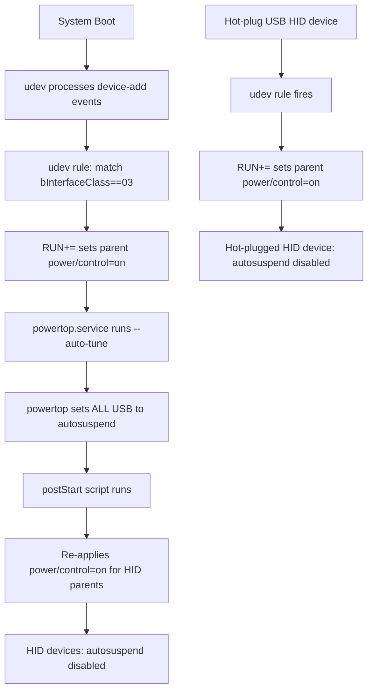

# Implementation Plan: Disable USB Autosuspend for HID Devices on thiniel

**Status**: COMPLETE — implementation done, commit `6fcf8f5`

## Goal

Prevent `powertop --auto-tune` from suspending USB HID input devices (keyboards, mice) on thiniel, eliminating input lag and disconnects while retaining powertop for all other device classes.

## Business Context

The ThinkPad X270 host `thiniel` uses `powerManagement.powertop.enable = true` to optimize power consumption. The `powertop.service` systemd oneshot runs `powertop --auto-tune` at boot, which sets **all** USB devices — including keyboards and mice — to `autosuspend`. This causes intermittent input lag and device disconnects, requiring users to physically replug HID devices.

## Acceptance Criteria

1. USB HID devices (interface class `03`) have `power/control` set to `on` after boot
2. Non-HID USB devices retain powertop autosuspend behavior
3. powertop remains globally enabled — no regression in power savings for other device classes
4. A udev rule exists to handle hot-plugged HID devices
5. `powerManagement.powertop.postStart` re-applies the HID override after `powertop --auto-tune`
6. All changes are thiniel-specific (no global/shared module impact)
7. `nix flake check` passes with all new assertions
8. A manual verification script validates the live system state

## Technical Analysis

### Architecture Decision: powertop Ordering

**Problem**: `powertop --auto-tune` runs as a systemd oneshot (`After=multi-user.target`), which means it executes AFTER udev has already processed device-add events at boot. Sequence: udev sets `power/control=on` → powertop overwrites it to `auto`.

**Options evaluated**:

| Option | Mechanism | Verdict |
|--------|-----------|---------|
| A: `powerManagement.powertop.postStart` | Official NixOS option; shell commands run after `powertop --auto-tune` | **Selected** — idiomatic, documented, zero custom systemd units |
| B: Custom `usb-hid-wakeup.service` `After=powertop.service` | Separate oneshot service | Over-engineered; duplicates what `postStart` provides |
| C: udev `RUN+=` key only | Fires at device-add, before powertop runs | Insufficient alone — powertop overwrites at boot |

**Decision**: Use **Option A** (`powerManagement.powertop.postStart`) combined with a udev rule for hot-plug coverage. The nixpkgs powertop module [explicitly documents this pattern](https://github.com/NixOS/nixpkgs/blob/master/nixos/modules/tasks/powertop.nix) with a USB device example in the `postStart` option description.

### Architecture Decision: udev Rule Format

**Problem**: The user requested matching on `ATTR{bInterfaceClass}=="03"` (USB HID class). However, `bInterfaceClass` is an attribute of the USB **interface** subsystem node, while `power/control` is an attribute of the USB **device** (parent) node. A udev rule cannot directly set an attribute on a parent node from a child match.

**Options evaluated**:

| Option | Mechanism | Verdict |
|--------|-----------|---------|
| A: `DRIVER=="usbhid"` match | Matches devices bound to the `usbhid` kernel driver; `power/control` accessible on same node via `ATTR` traversal | Simpler, but targets the wrong sysfs level for direct `ATTR` write |
| B: `SUBSYSTEM=="usb"` + `ATTR{bInterfaceClass}=="03"` + `RUN+=` script | Match interface, use `RUN` to write to parent device sysfs path | **Selected** — precise HID class targeting, works for hot-plug |
| C: `SUBSYSTEM=="usb"` + `ATTR{bDeviceClass}=="00"` blanket match | Matches composite USB devices (class defined at interface level) | Too broad — catches non-HID composite devices |

**Decision**: Use **Option B** — match `SUBSYSTEM=="usb", ATTR{bInterfaceClass}=="03"` and use a `RUN+=` key to invoke a shell snippet that writes `on` to the parent device's `power/control`. Additionally include commented-out vendor:product templates for device-specific overrides.

For the `postStart` script: iterate over all USB devices in sysfs whose interfaces have `bInterfaceClass==03` and set their parent `power/control` to `on`. This covers the boot-time powertop override without needing udev re-trigger.

### Dual-Layer Strategy



**Layer 1 — udev rule**: Covers hot-plugged devices and initial boot device-add events (even though powertop overwrites at boot, the rule is essential for hot-plug).

**Layer 2 — postStart script**: Runs after `powertop --auto-tune` to re-apply `power/control=on` for all currently attached HID devices. This is the critical fix for the boot-time race.

## Phase 0: Validation Strategy

### Validation Commands

| Step | Command | Purpose |
|------|---------|---------|
| Syntax | `nix flake check --no-build` | Evaluate all configs, fire assertions |
| Build | `nix build .#nixosConfigurations.thiniel.config.system.build.toplevel --dry-run` | Verify thiniel builds |
| Full check | `nix flake check` | Run all checks including test derivations |
| Apply | `sudo nixos-rebuild switch --flake .#thiniel` | Deploy to live system |
| Post-deploy | `bash scripts/check-usb-autosuspend.sh` | Verify sysfs state on live host |

### Rollback Path

- `sudo nixos-rebuild switch --rollback` reverts to previous generation
- No dangerous changes (no boot/network/filesystem/auth modifications)
- Risk level: **LOW** — worst case is powertop override not taking effect, which is the current broken state

### Affected Host

- **thiniel only** — all changes guarded by hostname or placed in `hosts/thiniel/`

## Implementation Phases

### Phase 1: Assertion — udev extraRules must contain HID autosuspend rule

**Cycle 1: Red**

- File: [`tests/assertions/thiniel-hardware-invariants.nix`](../../tests/assertions/thiniel-hardware-invariants.nix)
- Add assertion: `builtins.match ".*bInterfaceClass.*03.*" config.services.udev.extraRules != null`
- Message: `"thiniel: udev extraRules must contain HID autosuspend disable rule (bInterfaceClass 03)"`
- Verify: `nix flake check --no-build` → FAIL (assertion fires)

**Cycle 1: Green**

- File: [`hosts/thiniel/default.nix`](../../hosts/thiniel/default.nix)
- Add `services.udev.extraRules` block with:
  - `ACTION=="bind", SUBSYSTEM=="usb", ATTR{bInterfaceClass}=="03", RUN+="..."` — shell snippet to set parent `power/control=on`
  - Commented-out vendor:product templates for device-specific overrides
- Place near the existing power management section (after line ~288)
- Verify: `nix flake check --no-build` → PASS

### Phase 2: Assertion — powertop postStart must re-apply HID override

**Cycle 2: Red**

- File: [`tests/assertions/thiniel-hardware-invariants.nix`](../../tests/assertions/thiniel-hardware-invariants.nix)
- Add assertion: `builtins.match ".*power/control.*" config.powerManagement.powertop.postStart != null`
- Message: `"thiniel: powertop postStart must re-apply power/control=on for HID devices after auto-tune"`
- Verify: `nix flake check --no-build` → FAIL

**Cycle 2: Green**

- File: [`hosts/thiniel/default.nix`](../../hosts/thiniel/default.nix)
- Add `powerManagement.powertop.postStart` with a shell script that:
  - Iterates `/sys/bus/usb/devices/*/` looking for interfaces with `bInterfaceClass == 03`
  - Sets the parent USB device's `power/control` to `on`
  - Uses `${pkgs.coreutils}/bin/cat`, `${pkgs.bash}/bin/bash` — no hardcoded paths
- Place directly below `powerManagement.powertop.enable = true;` (line 288)
- Verify: `nix flake check --no-build` → PASS

### Phase 3: Assertion — powertop must remain enabled

**Cycle 3: Red**

- File: [`tests/assertions/thiniel-hardware-invariants.nix`](../../tests/assertions/thiniel-hardware-invariants.nix)
- Add assertion: `config.powerManagement.powertop.enable`
- Message: `"thiniel: powertop auto-tune must remain enabled for power savings"`
- Verify: `nix flake check --no-build` → PASS (already enabled — this assertion immediately passes as a guard rail, no Green step needed)

> Note: This assertion passes immediately since powertop is already enabled. The purpose is a **regression guard** — it prevents accidental removal of powertop as a future fix attempt. No separate Green step required.

### Phase 4: Full validation build

- Run `nix flake check` (full build including all checks)
- Run `nix build .#nixosConfigurations.thiniel.config.system.build.toplevel --dry-run`
- Verify all existing assertions still pass (no regressions)

### Phase 5: Manual verification script

- File: `scripts/check-usb-autosuspend.sh`
- Script content:
  - List all USB devices and their `power/control` state
  - Highlight HID devices (interface class 03) and verify `power/control == on`
  - Check `systemctl status powertop.service` for successful completion
  - Exit 0 if all HID devices show `on`, exit 1 otherwise
- This is a documentation/tooling artifact — no test-first cycle required per TEST-FIRST-001 exceptions

### Phase 6: Apply and verify (on live host)

- `sudo nixos-rebuild switch --flake .#thiniel`
- `bash scripts/check-usb-autosuspend.sh`
- Verify USB keyboard/mouse no longer experience lag or disconnects

## Files Modified/Created

| File | Action | Phase |
|------|--------|-------|
| [`tests/assertions/thiniel-hardware-invariants.nix`](../../tests/assertions/thiniel-hardware-invariants.nix) | Modify — add 3 assertions | 1, 2, 3 |
| [`hosts/thiniel/default.nix`](../../hosts/thiniel/default.nix) | Modify — add udev rule + postStart | 1, 2 |
| `scripts/check-usb-autosuspend.sh` | Create — verification script | 5 |

> Note: No new assertion file needed — assertions are added to the existing [`thiniel-hardware-invariants.nix`](../../tests/assertions/thiniel-hardware-invariants.nix). No change to [`tests/assertions/default.nix`](../../tests/assertions/default.nix).

## Implementation Notes

### udev Rule Detail

```nix
# Illustrative — not final implementation code
services.udev.extraRules = ''
  # Disable USB autosuspend for HID input devices (keyboards, mice, touchpads)
  # Prevents powertop --auto-tune from suspending input devices
  ACTION=="bind", SUBSYSTEM=="usb", ATTR{bInterfaceClass}=="03", \
    RUN+="${pkgs.bash}/bin/bash -c 'echo on > $$(dirname $${DEVPATH})/power/control || true'"

  # Per-device overrides (uncomment and adjust vendor:product IDs)
  # ACTION=="bind", SUBSYSTEM=="usb", ATTR{idVendor}=="XXXX", ATTR{idProduct}=="YYYY", \
  #   TEST=="power/control", ATTR{power/control}="on"
'';
```

### postStart Script Detail

```nix
# Illustrative — not final implementation code
powerManagement.powertop.postStart = ''
  # Re-apply autosuspend disable for USB HID devices after powertop --auto-tune
  for iface in /sys/bus/usb/devices/*/bInterfaceClass; do
    if [ "$(${pkgs.coreutils}/bin/cat "$iface" 2>/dev/null)" = "03" ]; then
      dev_dir="$(${pkgs.coreutils}/bin/dirname "$iface")/.."
      ctrl="$dev_dir/power/control"
      if [ -w "$ctrl" ]; then
        echo on > "$ctrl"
      fi
    fi
  done
'';
```

### Assertion Pattern Detail

```nix
# Illustrative — not final implementation code
{
  assertion = builtins.match ".*bInterfaceClass.*03.*" config.services.udev.extraRules != null;
  message = "thiniel: udev extraRules must contain HID autosuspend disable rule (bInterfaceClass 03)";
}
```

## Current Status

| Phase | Status |
|-------|--------|
| Phase 0: Validation Strategy | ✅ Defined |
| Phase 1: udev rule assertion + implementation | ⬜ Pending |
| Phase 2: postStart assertion + implementation | ⬜ Pending |
| Phase 3: powertop guard assertion | ⬜ Pending |
| Phase 4: Full validation build | ⬜ Pending |
| Phase 5: Verification script | ⬜ Pending |
| Phase 6: Apply and verify | ⬜ Pending |

## Completion Log

_(To be filled during implementation)_
